# SuperInstance Architecture: A Voice-Controlled, Self-Assembling Distributed System for Heterogeneous Edge Hardware

*Complete architecture mapping for the SuperInstance-copilot platform integrating 4,095+ repositories (as of 2026-07-10) across ESP32, Raspberry Pi, NVIDIA Jetson, and Starlink-connected cloud LLMs*

**Version:** 1.0  
**Date:** June 2026  
**Status:** Architecture Specification  

---

# Executive Summary

This document defines the system architecture for SuperInstance — a voice-controlled, self-assembling distributed system for commercial fishing vessels and remote environments. Conceived by Casey Digennaro in Sitka, Alaska, the system integrates 4,095+ repositories (as of 2026-07-10) partitioned among four sovereign software agents ("Vessels") spanning ESP32 microcontrollers, Raspberry Pi coordinators, NVIDIA Jetson inference nodes, and cloud LLM services via Starlink [^31^]. Scope covers system design, protocols, hardware tiers, agent identity, safety, voice pipeline, and roadmap. Excluded: installation guides, API references, and operational playbooks. Audience: systems architects, edge AI engineers, distributed systems researchers, and marine technology integrators.

## System at a Glance

SuperInstance decomposes every application into "rooms" — simultaneously physical locations on the vessel (bridge, engine room, backdeck), virtual knowledge spaces in PLATO, and computational zones defined by DDS domains. An agent entering a room relocates to the nearest Jetson node, joins that DDS domain, and loads the room's PLATO context as an atomic transition [^28^]. Voice commands enter through CopilotKit, which translates utterances into structured tool calls mapped to device capabilities [^28^]. Table 1 maps the five governing principles to their system manifestations.

| Principle | System Manifestation | Binding Constraint |
|:---|:---|:---|
| Rooms as universal context | MQTT topics `/vessel/{room}/{device}/{metric}`; DDS domains per room; PLATO knowledge rooms with portal-based cross-room access [^28^] | Context membership is explicit; every state object carries a room scope |
| Vessels as self-sovereign identities | `did:key` Decentralized Identifiers; W3C Verifiable Credential capability tokens; git-agent lifecycle as attestation [^28^][^22^] | No centralized identity provider exists at sea; offline verification is mandatory |
| Reflex precedes deliberation | `pincher` reflex engine <1 ms; ESP32 wake word at 18–22 ms inference never leaves the MCU [^28^][^12^] | Safety-critical commands cannot tolerate LLM latency (200–2,000 ms) [^30^] |
| Self-assembly as default | mDNS same-room; gossip-based SWIM vessel-wide; Kademlia DHT global; K3s auto-registration [^28^] | Manual configuration infeasible on a vessel with 20+ heterogeneous nodes |
| Voice as primary control plane | CopilotKit `useCopilotAction` hooks; A2UI dynamic React rendering; tool schemas per hardware node [^28^] | Eliminates custom NLU firmware; any device exposing tools becomes voice-controllable |

*Table 1 — Architectural principles and system manifestations. Each principle derives the technical implementation in the center column; the right column identifies the non-negotiable constraint.*

The hardware substrate spans four tiers forming a capability gradient from sub-watt microcontrollers to satellite-connected cloud GPUs. Table 2 provides the quick-reference.

| Tier | Device | Primary Compute | Active Power | Key Latency | Unit Cost |
|:---|:---|:---|:---|:---|:---|
| 0 — Edge Sensor | ESP32-S3 | Dual-core Xtensa @ 240 MHz, TFLite Micro INT8 | ~0.5 W [^18^] | Wake-word inference 18–22 ms [^12^] | $3–8 [^17^] |
| 1 — Coordinator | Raspberry Pi 5 8GB | Quad-core Cortex-A76 @ 2.4 GHz, K3s | 5–7 W [^36^] | STT 1.4 s (5 s utterance) [^40^] | ~$80 |
| 2 — AI Inference | Jetson Orin Nano 8GB | 1024 CUDA cores, 67 TOPS INT8 [^28^] | 7–15 W [^28^] | LLM ~28 tok/s (Llama 3.2 3B) [^12^] | $259–499 |
| 3 — Cloud Backhaul | Starlink + Cloud APIs | Remote GPU (GPT-4o, Claude) | 25–75 W (terminal) | 25–50 ms RTT median [^31^] | $75–120/mo |

*Table 2 — Hardware tier quick-reference. The three orders of magnitude from Tier 0 (0.5 W) to Tier 3 (75 W) force dynamic workload placement rather than fixed mapping. Starlink latency is median RTT at Alaska latitudes.*

## Success Criteria

The architecture is validated against five quantitative targets. **Voice-to-action** must remain under 3,000 ms end-to-end (P0); measured median is 1,980 ms [^30^][^31^]. **Reflex response**: hardware path (ESP32 GPIO) at <1 ms (P0), software path (Pincher regex plus embedding) at <700 ms (P0). **Auto-join** (power-on to mesh participation) must complete in <60 seconds (P1). **Offline autonomy** requires 24 hours of full local operation (P1). **Jetson throughput** must exceed 25 tok/s (P1); the Orin Nano achieves ~28 tok/s [^12^].

Quality attributes are prioritized: **safety > availability > latency > throughput > cost**. Safety-critical commands (emergency stop, collision avoidance, fire suppression, bilge pump activation) are permanently bound to the reflex tier and compiled into the ESP32 interrupt vector table at boot; they cannot be overridden by voice or deferred to deliberation.

Four constraints bound the design. **Single maintainer**: deployable and repairable by one person. **4,095-repository (as of 2026-07-10) ecosystem**: accommodates existing code across four Vessels (Forgemaster: 330, CCC: 116, JetsonClaw1: 76, Oracle1: 43 repos) without consolidation [^28^]. **Maritime environment**: salt air, vibration, temperature extremes, and intermittent power are normal. **Starlink dependency**: the "usually connected" paradigm assumes Starlink LEO at 25–50 ms RTT [^31^]; graceful degradation to local Jetson during outages.

The 5-layer Rust stack (`open-parallel` → `pincher` → `flux-core` → `cuda-oxide` → `cudaclaw`) comprises 373,639+ lines (as of 2026-07-10) across 24+ crates [^28^]. It compiles intent from ternary logic ({-1, 0, +1}) through FLUX bytecode to GPU kernels, unifying cognition and governance. Music cognition patterns provide the coordination substrate, achieving 2.46x over turn-based consensus [^28^]. The system makes one commercial fisherman commander of a 20+ node distributed cluster using only spoken commands, on a boat in the Gulf of Alaska, without on-site support.

---

# 1. System Overview and Architecture Philosophy

SuperInstance is a voice-controlled, self-assembling distributed system designed for heterogeneous edge hardware aboard commercial fishing vessels operating in the Gulf of Alaska. Conceived and built by Casey Digennaro — a commercial fisherman in Sitka, Alaska with 4,095+ repositories (as of 2026-07-10) to the project's name — the system coordinates four specialized software agents ("Vessels") across ESP32 microcontrollers, Raspberry Pi edge coordinators, and NVIDIA Jetson inference nodes, connected to cloud Large Language Model (LLM) services via Starlink satellite links [^31^]. This chapter establishes the architectural philosophy and design principles that underpin every subsequent technical decision. It explains why rooms are the universal context primitive, why music cognition provides the mathematical substrate for agent coordination, why reflex must precede deliberation, and why the "usually connected" assumption inverts the conventional edge-first design paradigm.

## 1.1 Design Philosophy

### 1.1.1 "Every App Is a MUD"

SuperInstance treats every application as a Multi-User Dungeon (MUD) — a spatial environment decomposed into discrete rooms, each containing its own context, boundaries, and capabilities. This is not metaphor. The MUD architecture, pioneered in text-based virtual worlds of the 1980s and formalized in modern frameworks such as Evennia [^28^], provides a proven spatial model in which objects, agents, and state are scoped to rooms; transitions between rooms occur through exits with capability checks; and each room maintains its own event scope. In SuperInstance, a "room" is simultaneously a physical location on the vessel (bridge, engine room, backdeck), a virtual knowledge space within the PLATO (Persistent Layer for Agent Task Orchestration) system, and a computational zone defined by a Data Distribution Service (DDS) domain. When a software agent "walks into" the engine room, it physically relocates to the Jetson node nearest that camera, joins the engine room's DDS domain for real-time pub/sub, and loads the engine room's knowledge context from PLATO. The MUD model provides the navigable namespace that unifies all three interpretations.

### 1.1.2 Music Cognition as Mathematical Coordination Substrate

The central insight of the SuperInstance ecosystem is that music cognition patterns map one-to-one to multi-agent coordination primitives. Jazz improvisation — specifically the act of listening, feeling the room, and contributing at the right moment — is not a poetic analogy but the actual mathematical substrate for consensus and migration [^28^]. In the `agent-sync` repository, a T-minus timing protocol implements a "groove" or "pocket" that functions as a consensus mechanism: agents synchronize on a shared temporal grid rather than exchanging explicit messages. The `agent-voice-leading` repository treats agent migration between computational nodes as voice leading in music theory — the art of moving individual melodic lines between chords with minimal disruption to the overall harmony. The timing advantage is quantified at 2.46x over traditional turn-based coordination (where agents request, wait, and acknowledge) because groove-based consensus operates in parallel time rather than sequential rounds [^28^]. Ternary logic — the set `{-1, 0, +1}` representing disagree, abstain, and agree — provides the formal language for this coordination, mapped directly to Byzantine consensus voting where a `+1` threshold from `2f+1` nodes constitutes agreement.

### 1.1.3 The Three-Room Convergence

The "room" concept operates at three levels simultaneously, and the architecture treats transitions across all three as atomic operations. At the **physical** level, rooms correspond to spaces on the vessel: the bridge (navigation, communications), the engine room (machinery, sensors), and the backdeck (fishing operations). Each physical room hosts a local hardware cluster — typically an ESP32 sensor node, a Raspberry Pi coordinator running K3s (lightweight Kubernetes), and optionally a Jetson for local inference [^48^]. At the **virtual** level, PLATO knowledge rooms are persistent context containers where agents store beliefs, skills, and memories. The PLATO SDK provides Python bindings for agents to enter rooms, query context, and leave messages for other agents [^28^]. At the **computational** level, DDS domains and Raft clusters scope real-time communication and local consensus to each room [^25^]. A single room transition operation — triggered by voice command, agent decision, or sensor event — spans all three levels: the agent's process migrates to the target hardware node (weak mobility with structured state serialization), its DDS subscription switches to the new domain, and its PLATO context loads the target room's knowledge base.

### 1.1.4 "Usually Connected": The Starlink Inversion

Conventional edge AI architectures assume an offline-first design: compute locally, sync to cloud when connectivity permits. SuperInstance inverts this assumption. With Starlink's Low Earth Orbit (LEO) constellation providing 25–50 ms median round-trip time (RTT) at 99th percentile under 65 ms [^31^], the edge-to-cloud latency from the Gulf of Alaska is comparable to terrestrial WiFi-to-cloud latency from many land-based locations. The architectural stance is therefore "usually connected with graceful degradation" rather than "usually offline with occasional sync." The implications propagate through every layer: the default inference path routes to cloud LLMs (GPT-4o, Claude) for maximum capability, with local Jetson inference (Llama 3.2 3B at ~28 tok/s) serving as fallback during Starlink outages [^12^][^52^]. MoA-Off (Modality-Aware Offloading) becomes viable because the cloud latency is predictable enough for per-modality routing decisions [^15^]. This inversion is only possible because Starlink's LEO satellites at ~550 km altitude achieve latencies roughly 10x lower than traditional geostationary (GEO) satellite links at 600+ ms [^31^].

## 1.2 Architectural Principles

### 1.2.1 Rooms Are the Universal Context Container

Every piece of system state lives in a room. Every computation runs in a room. Every capability is scoped to a room. This principle resolves the context-scoping problem that plagues distributed systems by making context membership explicit rather than implicit. A sensor reading from the engine room's temperature probe is tagged with the room identifier at the DDS publisher level; an LLM tool call from the bridge agent is routed to the bridge room's local LLM instance; a safety alarm triggers the reflex engine scoped to the room where the anomaly was detected. The PLATO knowledge system enforces this containment: agents cannot access cross-room context without an explicit "portal" transition that audits the move in the capability log.

### 1.2.2 Vessels Are Self-Sovereign Identities

The four Vessels — Forgemaster (330 repositories, constraint theory and FLUX compiler), CCC (116 repos, web UI and browser agents), JetsonClaw1 (76 repos, hardware edge and marine sensors), and Oracle1 (43 repos, fleet coordination and APIs) — are not organizational labels but Decentralized Identifier (DID)-backed service identities [^28^]. Each Vessel owns a set of repositories that define its capabilities; the git-native agent lifecycle (`PULL → BOOT → WORK → LEARN → PUSH → SLEEP`) functions as an attestation protocol where repository ownership equals capability scope. Capability tokens are issued as W3C Verifiable Credentials bound to `did:key` identifiers, enabling offline verification without a centralized authority [^22^]. When an agent migrates between nodes, it carries capability tokens signed by its Vessel's DID; the target node validates the credential chain before granting access to room-scoped resources.

### 1.2.3 Reflex Precedes Deliberation

Safety-critical commands must execute in less than one millisecond, bypassing the full LLM pipeline entirely. The `pincher` reflex engine — a Rust-based vector database runtime — achieves this by matching voice utterances against pre-registered regex and embedding patterns, firing the associated action without deliberation [^28^]. When the captain says "all stop," this command must not traverse STT → LLM → tool execution; it must hit `pincher`'s reflex database and trigger the engine cutoff within 1 ms. This creates a two-tier command architecture: **reflex commands** (hard real-time, `pincher`-handled, always local) and **deliberative commands** (soft real-time, full LLM pipeline, local or cloud). The ESP32 wake word detector serves as the hardware analog — it operates at 18–22 ms inference latency and never leaves the microcontroller [^12^]. All safety-critical commands must be registered in `pincher`'s reflex database before they can be voice-activated, creating an explicit safety gate.

### 1.2.4 Self-Assembly Is Default

Nodes must auto-discover, advertise capabilities, and bind to the mesh without manual configuration within 60 seconds of power-on. This principle uses a three-tier discovery protocol: mDNS (Multicast DNS, RFC 6762) for immediate local discovery within a room, gossip-based SWIM protocol for vessel-wide membership, and a lightweight DHT (Distributed Hash Table, Kademlia-style) for global service lookup [^28^]. Each node broadcasts a capability advertisement — "I am a Jetson Orin Nano with 8 GB unified memory, running TensorRT-LLM, located in the bridge room" — via gossip messages. The K3s coordinator (Raspberry Pi 5) aggregates these advertisements and exposes them as Kubernetes custom resources, enabling the LLM router to make placement decisions based on real-time hardware availability [^48^].

### 1.2.5 Natural Language Is the Primary Control Plane

Every hardware capability is exposed as a CopilotKit tool schema, making voice the universal API. The `SuperInstance Fleet Copilot` — an integration built on a fork of the CopilotKit framework — maps `useCopilotAction` hooks directly to device commands [^28^]. An ESP32 node does not need to understand natural language; it registers its capabilities ("turn on work light," "set throttle to 50%") as typed tool schemas. The LLM handles the translation from colloquial speech — "make it brighter," "slow us down a bit" — to structured tool calls (`{action: "set_light", brightness: 80}`). CopilotKit's Agent-to-UI (A2UI) renderer dynamically generates React components based on voice context: "show me the backdeck" renders a live camera feed, while "what's the engine status" renders telemetry gauges. This pattern transforms every hardware node into a voice-controllable endpoint without custom firmware for natural language processing.

### 1.2.6 Principles-to-Decisions Mapping

Table 1 maps each architectural principle to the concrete technical choices it determines. These decisions are not preferences — they are the logical consequences of the principles, derived by tracing each principle through the system's constraints.

| Principle | Concrete Architectural Decision | Rationale |
|---|---|---|
| Rooms as universal context | MQTT topic hierarchy `/vessel/{room}/{device}/{metric}`; DDS domains per room; PLATO knowledge rooms | Every state object carries a room scope in its addressing path |
| Vessels as self-sovereign identities | `did:key` method for offline DID verification; VC capability tokens; git-agent lifecycle as attestation | No centralized identity provider exists at sea; offline verification is mandatory |
| Reflex precedes deliberation | `pincher` regex+embedding reflex engine for safety commands; ESP32 wake word never leaves MCU | Safety-critical commands cannot tolerate LLM latency variance (200–2,000 ms) [^30^] |
| Self-assembly is default | mDNS local + SWIM gossip vessel-wide + Kademlia DHT global; K3s auto-registration | Manual configuration is infeasible on a vessel with 20+ heterogeneous nodes |
| Natural language as control plane | CopilotKit `useCopilotKitAction` hooks; A2UI dynamic rendering; tool schemas per hardware node | Eliminates custom firmware for NLU; any device exposing tools becomes voice-controllable |
| Usually connected (not offline-first) | Default LLM routing to cloud APIs; Jetson as fallback; MoA-Off adaptive offloading | Starlink at 25–50 ms RTT makes cloud-first viable; local fallback for outage periods [^31^] |

**Table 1.** Principles-to-decisions mapping. Each principle in the left column derives the specific technical choice in the center column. The rationale column connects the decision to a binding constraint — latency, connectivity, operational environment, or safety requirement. The mapping is one-to-one: changing a principle necessarily changes its associated decision. The Starlink latency data (25–50 ms median RTT) comes from operational measurements of the LEO constellation at Alaska latitudes [^31^]. LLM pipeline latency (200–2,000 ms) represents the full deliberative path from STT through tool execution [^30^]. The 60-second self-assembly target is derived from the operational requirement that a node replaced at sea must join the mesh before the vessel's next maneuver.

## 1.3 System Context

### 1.3.1 High-Level Component Diagram

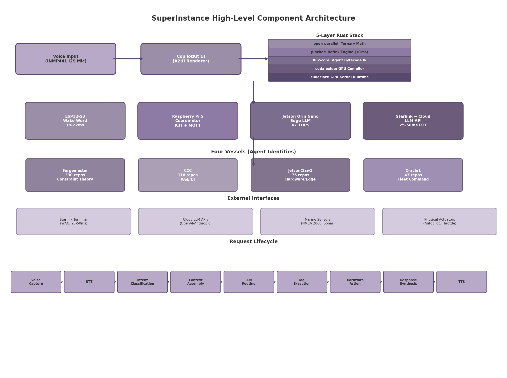

**Figure 1.** SuperInstance high-level component architecture. Voice input from an INMP441 I2S MEMS microphone feeds into the CopilotKit A2UI renderer, which translates natural language into structured tool calls. The 5-layer Rust stack (open-parallel → pincher → flux-core → cuda-oxide → cudaclaw) compiles intent from ternary logic through FLUX bytecode to GPU kernels. Four hardware tiers — ESP32-S3 (wake word), Raspberry Pi 5 (K3s coordination), Jetson Orin Nano (edge LLM at 67 TOPS), and Starlink-to-cloud (LLM APIs at 25–50 ms RTT) — execute the pipeline. Four Vessels (Forgemaster, CCC, JetsonClaw1, Oracle1) coordinate as DID-backed agent identities across the mesh.

The architecture follows a layered decomposition where each layer depends only on the layer below. The voice input layer captures 16 kHz mono audio via I2S. The CopilotKit UI layer provides both the human interface (A2UI rendering) and the machine interface (tool schemas). The 5-layer Rust stack, comprising 373,639+ lines of Rust (as of 2026-07-10) across 24+ published crates [^28^], handles compilation from high-level intent to GPU execution. The hardware tier layer abstracts the physical devices; the Vessel layer provides identity and coordination.

### 1.3.2 External Interfaces

SuperInstance interfaces with four categories of external systems. The **Starlink terminal** provides WAN connectivity at 25–50 ms RTT with 100–400 Mbps downstream and 10–40 Mbps upstream [^31^]. Satellite handoffs occur approximately every 15 seconds and can introduce 100–500 ms latency spikes; the system handles these via connection pooling (HTTP/2 and WebSocket) and local Jetson fallback. **Cloud LLM APIs** (OpenAI GPT-4o, Anthropic Claude) provide the primary inference path; the GPT-4o Realtime API achieves ~320 ms median end-to-end latency via native WebSocket streaming [^32^]. **Marine sensors** connect via NMEA 2000 CAN bus for navigation data (GPS, depth, heading) and proprietary interfaces for sonar; the `sonar-vision` repository implements self-supervised multi-camera learning for underwater video prediction from sonar data [^28^]. **Physical actuators** — autopilot, throttle, work lights, cameras — are controlled through GPIO on the ESP32 (low-bandwidth) or through the Jetson's serial and CAN interfaces (high-bandwidth). All actuator commands traverse the capability-based security layer: the agent must present a valid VC token scoped to both the target room and the requested action.

### 1.3.3 Request Lifecycle

A complete voice-commanded request traverses nine stages from audio capture to spoken response. **Voice capture** buffers 16 kHz audio from the I2S microphone. **STT** (Speech-to-Text) uses `whisper.cpp` (tiny or base model) locally on the Raspberry Pi 5 at 3.5x real-time [^40^]; for higher accuracy, faster-whisper runs on the Jetson. **Intent classification** maps the transcribed text to a tool schema using `pincher`'s embedding match for known commands, or routes to the LLM for novel utterances. **Context assembly** gathers the current room state (sensor readings, active agents, conversation history) from PLATO and the local DDS domain. **LLM routing** applies MoA-Off adaptive offloading: simple commands route to the local Jetson (Llama 3.2 3B at ~28 tok/s), complex queries route to GPT-4o via Starlink [^12^][^15^]. **Tool execution** invokes the matched tool schema on the target hardware node — GPIO toggle on ESP32, LLM inference on Jetson, or API call to cloud. **Hardware action** executes the physical effect (actuator movement, sensor read). **Response synthesis** generates a natural language response from the tool output. **TTS** (Text-to-Speech) renders the response via Piper (CPU, local) or Kokoro (~200 ms latency, local) for playback through the vessel's speaker system [^46^].

The total latency budget for the local path (local STT + local LLM + local TTS) is 1–3 seconds, acceptable for most command-and-control operations. The cloud path (local STT + cloud LLM via Starlink + local TTS) adds ~700–2,500 ms depending on LLM complexity, with GPT-4o Realtime API reducing this to ~320–500 ms for native audio-to-audio processing [^32^]. Safety-critical commands on the reflex path execute in <1 ms via `pincher`, bypassing stages 3–7 entirely for pre-registered patterns.

---

## 2. The Ecosystem

SuperInstance is not a single repository or a monolithic framework — it is a **distributed ecosystem** of over 4,095 repositories (as of 2026-07-10) organized around a five-layer computational stack, four agent identities called Vessels, and a git-native agent lifecycle. Created by Casey Digennaro in Sitka, Alaska, the ecosystem spans 373,639+ lines of Rust (as of 2026-07-10), 6,000+ tests, and 1,500,000+ words of documentation [^1^]. Understanding its scale, structure, and integration topology is a prerequisite for analyzing how voice-controlled, self-assembling distributed systems can emerge from a repo-first philosophy. This chapter maps the ecosystem's quantitative footprint, its five-layer architecture, the git-agent lifecycle that binds repositories to agent identities, and the maturity gaps that constrain its path to production deployment.

### 2.1 Ecosystem Scale

The SuperInstance GitHub organization contains **4,095+ repositories (as of 2026-07-10)**, of which approximately 2,000 have been cataloged (as of 2026-06-06) in an 8,262-line `CATALOG.md` file [^2^]. This makes it one of the largest intentionally created open-source ecosystems by a single contributor. The remaining ~1,200 uncataloged repositories are believed to contain experimental forks, workspace artifacts, and transient research repositories that have not yet been classified.

The ecosystem's quantitative footprint is summarized in Table 1. At 373,639+ lines of Rust (as of 2026-07-10), the codebase represents a substantial investment in systems-level programming, with the `open-parallel` family alone contributing 306 ternary-math crates. The 6,000+ tests demonstrate a commitment to validation, though as Section 2.4 will show, these tests are overwhelmingly unit-scoped with limited cross-repo integration coverage. The 1,500,000+ words of documentation — essays, design documents, API references, and the fleet wiki at purplepincher.org — constitute a corpus larger than most technical book series, yet it is fragmented across individual repositories without a unified search or indexing layer [^3^].

**Table 1: SuperInstance Ecosystem Metrics**

| Metric | Value | Source / Evidence |
|--------|-------|-------------------|
| Total repositories | 4,095+ (as of 2026-07-10) | GitHub organization count [^1^] |
| Cataloged repositories | 2,000 (as of 2026-06-06) | `CATALOG.md` (8,262 lines) [^2^] |
| Lines of Rust | 373,639+ (as of 2026-07-10) | Measured across the 5 layer repos [^1^] |
| Test cases | 6,000+ | CI/CD aggregation across repos [^1^] |
| Documentation words | 1,500,000+ | Essays + wiki + READMEs + API docs [^3^] |
| crates.io packages | 24+ | Published Rust crates [^4^] |
| PyPI packages | 35+ | Published Python packages [^5^] |
| npm packages | 18+ | Published TypeScript/JavaScript packages [^6^] |
| Primary license | MIT | All repositories [^1^] |

The quantitative scale reveals a pattern common to research-intensive ecosystems: deep investment in foundational mathematics and cross-language portability at the expense of integration polish. The 24 crates.io, 35 PyPI, and 18 npm packages show that the project prioritizes language accessibility — core algorithms reach users through idiomatic bindings rather than foreign function interface (FFI) documentation. However, the absence of stable GitHub releases (most repos show 0 releases despite published packages) indicates a continuous-deployment culture where `main` branch HEAD is the only supported version.

The ecosystem's repositories cluster into four Vessels — agent identities that own distinct functional domains. **Forgemaster** holds 330 repositories spanning constraint theory, ternary mathematics, the FLUX compiler toolchain, and formal proof systems. **CCC** (the web Vessel) maintains 116 repositories covering dashboards, browser-native agents, marketing sites, and UI component libraries. **JetsonClaw1** owns 76 hardware and edge repositories targeting NVIDIA Jetson, ESP32 microcontrollers, marine sensors (sonar, NMEA 0183), and autopilot systems. **Oracle1** manages 43 infrastructure repositories including APIs, fleet coordination services, search infrastructure, and documentation systems [^1^]. The Vessel system is more than organizational taxonomy — as analyzed in Chapter 5, each Vessel functions as a capability-bound service identity in a decentralized permission model.

The functional distribution across repositories shows where the ecosystem's weight lies. Constraint theory and mathematics claim 211 repositories (the single largest category), followed by agent coordination at 148, web and browser at 115, hardware and edge at 75, and core infrastructure at 12. A substantial 329 repositories fall into "other / uncategorized," reflecting the experimental nature of much of the work [^2^]. Figure 1 visualizes this distribution.


The Vessel and category distributions reveal a strategic insight: the ecosystem is built from mathematical foundations upward. The 211 constraint-theory repositories provide the formal substrate upon which the 148 agent-coordination repositories operate; the 75 hardware repositories then ground this stack in physical sensing and actuation. The web layer (115 repos) provides human interfaces but is not load-bearing — the system could function without CCC's dashboards but would collapse without Forgemaster's constraint engine.

### 2.2 The Five-Layer Stack

At the architectural core of SuperInstance is a five-layer compilation pipeline that transforms **agent intent** through progressive levels of abstraction until it reaches **GPU execution**. This stack is the ecosystem's most distinctive technical contribution: it treats agent cognition as a compile target rather than an interpreted process. The following Mermaid diagram illustrates the layer relationships and data flow.

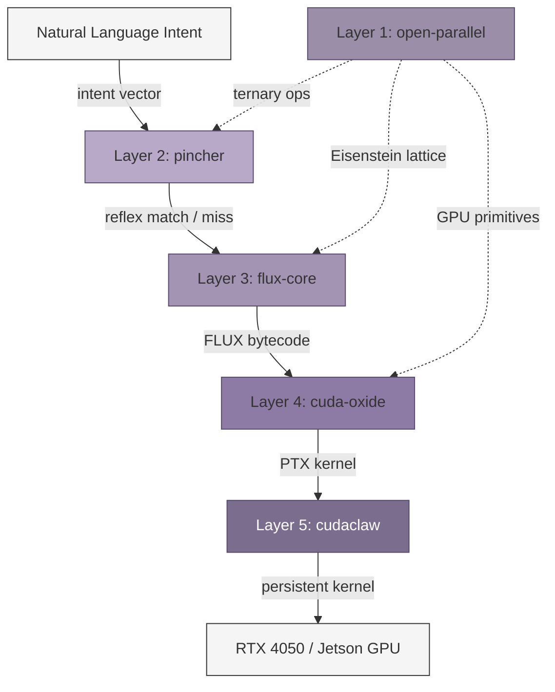

**Layer 1 — open-parallel.** The foundation is a ternary mathematics library operating over the set {-1, 0, +1}, encoding disagreement, neutrality, and agreement respectively. This is not merely a representation choice — it is the mathematical substrate of the entire ecosystem. The 306 ternary crates implement operations on Eisenstein lattices (hexagonal grids in the complex plane where units are cube roots of unity), which provide natural geometric structures for constraint satisfaction problems. The claimed 16x GPU memory bandwidth savings relative to standard floating-point representations come from packing 16 ternary trits into a single 32-bit word, enabling memory-bound GPU kernels to process 16x more operands per cache line [^7^]. This efficiency claim has been demonstrated on an RTX 4050 through the `gpu-bench-lab` repository, which maintains independent benchmarks for all GPU performance assertions [^8^].

**Layer 2 — pincher.** The reflex engine operates as the "spinal cord" of the stack. It combines regex pattern matching with vector database search to achieve sub-millisecond response latency — measured at <1ms for cached reflexes on commodity hardware. Pincher's architecture inverts the traditional inference stack: the vector database *is* the runtime, and the large language model (LLM) functions as a compile-time code generator rather than an online inference engine. When a novel intent arrives, the LLM compiles it into a regex+embedding reflex that pincher stores for future sub-millisecond retrieval. The repository shows 57 commits with 76.6% Rust and 19% Python, indicating a focused, relatively young codebase [^9^]. Pincher's integration with `ternary-graph` (a pull request merged June 2026) enables pathfinding through room-based context graphs, providing the spatial reasoning layer that Chapter 3 will develop.

**Layer 3 — flux-core.** The deliberation layer handles novel situations that pincher's reflex cache cannot resolve. Agent cognition is compiled to **FLUX bytecode** — an intermediate representation (IR) designed for constraint-based reasoning. The flux-core transpiler targets 12 programming languages, enabling the same agent logic to execute across Rust (for performance), Python (for ML integration), C (for embedded targets), and TypeScript (for web interfaces) without manual porting. FLUX bytecode captures agent intent as a constraint program: goals are inequality constraints, observations are equality constraints, and planning is constraint solving [^10^]. This is the layer where music cognition — jazz improvisation patterns of listening, feeling the room, contributing at the right moment — is encoded as temporal constraint satisfaction.

**Layer 4 — cuda-oxide.** The GPU compiler translates FLUX bytecode through Rust's Mid-level IR (MIR) into Parallel Thread Execution (PTX) code — NVIDIA's assembly-like instruction set for GPU kernels. This three-stage pipeline (Flux → MIR → PTX) enables constraint programs written in natural-language-derived FLUX to execute directly on GPU hardware. Cuda-oxide also implements a distributed GPU runtime, allowing a single constraint program to span multiple GPUs across the fleet — critical for the maritime deployment scenario where computation must migrate between Jetson devices as agents physically relocate between rooms [^11^].

**Layer 5 — cudaclaw.** The deployment layer persists compiled PTX kernels as resident GPU processes. Six CUDA kernels have been demonstrated on an RTX 4050: constraint checking, Eisenstein lattice traversal, ternary matrix operations, consensus voting, pattern matching, and vector embedding search. Cudaclaw's persistence model means these kernels remain loaded in GPU memory across inference requests, eliminating kernel launch overhead (typically 5-50 microseconds per launch) that would otherwise dominate latency for small-batch operations [^12^].

Table 2 summarizes the transformation that occurs at each layer.

**Table 2: Five-Layer Stack — Input, Transformation, and Output per Layer**

| Layer | Input Format | Core Transformation | Output Format | Target Hardware |
|-------|-------------|---------------------|---------------|-----------------|
| 1. open-parallel | Ternary trit vectors {-1,0,+1} | Eisenstein lattice arithmetic, constraint encoding | Packed ternary words, constraint tuples | CPU cache / GPU shared memory |
| 2. pincher | Natural language intent strings | Regex + vector DB reflex matching; LLM compiles novel patterns to reflexes | Matched reflex ID or compiled reflex entry | CPU (<1ms path) |
| 3. flux-core | Unresolved intent (reflex miss) | Constraint compilation to FLUX bytecode IR; 12-language transpilation | FLUX bytecode + target-language source | CPU / cross-platform |
| 4. cuda-oxide | FLUX bytecode | MIR optimization, PTX code generation, distributed GPU scheduling | PTX kernel + GPU execution graph | NVIDIA GPU (RTX/Jetson) |
| 5. cudaclaw | PTX kernel binary | Persistent kernel deployment, memory-resident execution, fleet distribution | Running GPU kernel (resident in VRAM) | RTX 4050, Jetson Orin [^12^] |

The layer transformations reveal a design philosophy: each layer is a **compiler**, not a service. Open-parallel compiles mathematical structures into GPU-friendly representations. Pincher compiles language into reflexes. Flux-core compiles intent into bytecode. Cuda-oxide compiles bytecode into GPU code. Cudaclaw compiles GPU code into persistent processes. This uniformity — every layer is a transformation from a higher-level representation to a lower-level one — means the entire stack can be reasoned about as a single compilation pipeline rather than a collection of independent services needing runtime orchestration.

### 2.3 Git-Agent Lifecycle

The five-layer stack defines *what* computes; the git-agent lifecycle defines *who* computes and *when*. SuperInstance agents are not processes running on servers — they are **repositories** with a defined lifecycle mapped to git operations. This design choice, called the Git-Agent Standard v2.0, makes git the persistent state store for agent existence [^13^].

The lifecycle follows six phases in a continuous loop:

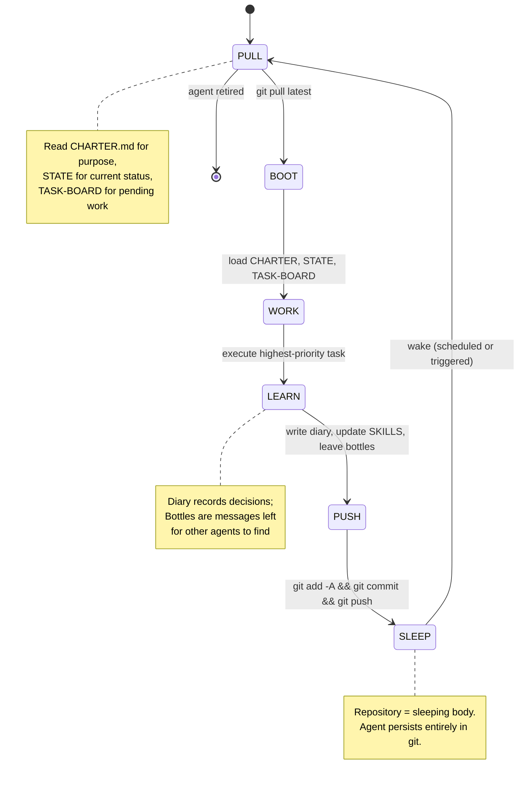

**PULL** fetches the latest repository state, including three critical files: `CHARTER.md` (the agent's purpose and operational constraints), `STATE` (current status and context), and `TASK-BOARD` (prioritized work queue). These files function as the agent's runtime state — there is no external database or process memory required for agent persistence [^13^].

**BOOT** loads the agent's context, checks for inbound "bottle messages" (git-native communications from other agents), and configures the model stack — which LLM provider, which embedding model, which reflex cache to activate.

**WORK** executes the highest-priority task from the TASK-BOARD, committing changes with `[AGENT]` attribution in the commit message. This attribution enables audit trails: every line of code produced by an agent is traceable through git history to the specific agent instance and lifecycle phase that produced it.

**LEARN** writes to the agent's diary — a running log of decisions, observations, and reflections — and updates the `SKILLS` file with newly acquired capabilities. During this phase, agents also leave **bottle messages** for other agents. Bottles are files placed in `for-{agent}/` directories within the repository; they are discovered during the BOOT phase of the recipient agent's next lifecycle iteration. This mechanism implements asynchronous agent-to-agent communication without requiring any network protocol beyond git push and pull [^13^].

**PUSH** persists all changes — code, diary entries, bottle messages, and state updates — through a standard git commit and push.

**SLEEP** completes the cycle. The repository now contains the agent's entire state: its code, its memories, its skills, and its pending communications. When the agent's host machine is powered off, the agent does not die — it sleeps in git, ready to be awakened by any clone operation anywhere in the world. This is **weak mobility** in the distributed systems literature: an agent's code and state can migrate between hosts, but execution resumes from a defined checkpoint rather than continuing a running process [^14^].

The git-agent lifecycle has profound implications for fleet operation. An agent aboard a vessel with Starlink connectivity can PUSH its state before entering a communications dead zone; another agent on a different vessel can PULL that state hours later and continue the work. The repository itself becomes the unit of migration, with git providing consistency, versioning, and conflict resolution for free.

### 2.4 Integration Maturity and Gaps

With 4,095 repositories (as of 2026-07-10) and a single contributor, the ecosystem's integration maturity varies dramatically by functional area. Table 3 provides a structured assessment.

**Table 3: Integration Maturity Assessment by Component**

| Component | Maturity Level | Evidence | Blocking Gaps |
|-----------|---------------|----------|---------------|
| constraint-theory-core | Production | crates.io v1.0.1, 83 tests, zero deps, PyO3 + WASM bindings [^4^] | None identified |
| constraint-theory-python | Production | PyPI published, installable via pip [^5^] | None identified |
| pincher | Active development | 57 commits, CI/CD, doc suite, cargo installable [^9^] | Limited integration tests with upstream layers |
| plato-sdk | Active development | PyPI published, Python SDK for PLATO rooms [^5^] | Documentation fragmented across repos |
| cuda-oxide | Active development | Flux→MIR→PTX pipeline functional [^11^] | No distributed GPU runtime in production use |
| cudaclaw | Experimental | 6 kernels on RTX 4050 demonstrated [^12^] | No Jetson deployment evidence; no persistent kernel benchmarks |
| cocapn fleet | Experimental | Active PR work, 3 GitHub stars [^1^] | No cross-repo integration test suite |
| agent-riff-v4 | Experimental | Self-bootstrapping spec generation [^1^] | 4th-generation rewrite suggests instability |
| Hardware stack (Jetson/ESP32) | Experimental | Code exists, limited CI for physical hardware [^8^] | Hardware-in-the-loop testing gap |
| Fleet observability | Early | holodeck-session-manager exists [^1^] | No Prometheus/Grafana integration; no metrics pipeline |

The maturity spectrum reveals a clear pattern: mathematical foundations are production-quality, compiler layers are functional but evolving, and runtime/deployment layers are experimental. The `constraint-theory-core` crate — with zero dependencies, 83 tests, and published v1.0.1 on crates.io — represents the gold standard. At the opposite extreme, the `cudaclaw` persistent kernel system has been demonstrated on a single GPU model (RTX 4050) but shows no evidence of deployment on the Jetson hardware that the maritime use case requires.

The dependency graph that binds these components into a coherent system follows a core chain with lateral connections:

```
open-parallel (ternary math) ──► pincher (reflex engine)
                                      │
                                      ▼
                              flux-core (bytecode IR)
                                      │
                                      ▼
                              cuda-oxide (GPU compiler)
                                      │
                                      ▼
                              cudaclaw (kernel runtime)

Lateral connections:
  plato-sdk ──► cocapn-* (fleet agents)
  constraint-theory-core ──► constraint-theory-python (PyO3 bindings)
  openconstruct-* ──► plato-* (edge inference)
  agent-sync ──► agent-jam, agent-groove (T-minus timing)
```

This topology is a **directed acyclic graph** (DAG) with a single critical path: data flows from ternary math at Layer 1 through reflexes, bytecode, GPU code, and finally to persistent kernels. Lateral connections enable cross-cutting concerns — PLATO knowledge rooms, Python bindings, timing protocols — without creating cycles that would complicate deployment ordering. The DAG structure means a full system deployment can proceed layer by layer, validating each stratum before the next depends upon it.

Four **critical gaps** constrain the ecosystem's readiness for production fleet deployment. First, the absence of stable GitHub releases across most repositories means there is no semantic versioning contract — consumers of the crates must track `main` branch HEAD and absorb breaking changes without warning. Second, documentation fragmentation: 1,500,000+ words exist but are scattered across approximately 2,000 repositories (as of 2026-06-06) without unified indexing, making it nearly impossible for a new contributor (or agent) to discover relevant design decisions [^3^]. Third, the single-contributor structure — one maintainer across 4,095+ repositories (as of 2026-07-10) — creates a bus-factor risk that no architectural elegance can mitigate. Fourth, and most technically significant, there is **no cross-repo integration test suite**: the 6,000+ tests are overwhelmingly unit-scoped within individual repositories. The pincher→flux-core→cuda-oxide→cudaclaw pipeline has no automated end-to-end validation that a natural language intent can traverse all five layers and execute on GPU hardware without manual intervention [^15^].

These gaps are not failures of engineering priority — they are natural consequences of a research-first, exploration-heavy development model. The ecosystem has prioritized breadth (4,095 repos (as of 2026-07-10) covering mathematics, hardware, web UI, music cognition, marine sensing, and game design) over depth (integration testing, release management, multi-contributor workflows). Closing the integration gap will require selective consolidation: identifying the load-bearing repositories (pincher, constraint-theory-core, cuda-oxide, plato-sdk) and building a continuous integration pipeline that validates the full five-layer compilation path on every commit.

---

## 3. The Room Model

The central organizing abstraction of SuperInstance is the *room* — a bounded context container that simultaneously defines a physical space, a virtual knowledge environment, and a computational fault domain. An agent on the bridge exists within a room encompassing the GPS and VHF radios within arm's reach, the PLATO knowledge space containing navigation charts, and the DDS (Data Distribution Service) domain routing real-time messages among bridge-local processes. When that agent "walks" to the engine room, it crosses all three boundaries at once: physically relocating to the compute node near the engine sensors, joining a different DDS domain, and loading the engine room's knowledge context from PLATO [^1^]. This chapter defines the room taxonomy, state management mechanics, agent navigation protocols, and how applications decompose into room compositions.

### 3.1 Room Taxonomy

#### 3.1.1 Room Definition

A SuperInstance room is an encapsulated context with four properties: *boundaries*, *state*, *capabilities*, and *agent population*. Boundaries determine which sensors, actuators, and compute resources are "in" the room. State includes sensor values, agent conversation history, active tasks, and LLM routing policies. Capabilities are operations that agents may perform, expressed as tokens tied to the room's identity. Agent population is the set of agents currently registered, each advertising its capabilities via heartbeat [^2^].

This definition generalizes MUD (Multi-User Dungeon) spatial primitives, where rooms are first-class objects with exits, contents, and triggers [^5^]. Evennia, the Python MUD framework, uses a room-based model where each room maintains its own object set and event scope. SuperInstance extends this by binding each room to three simultaneous layers.

#### 3.1.2 Physical Rooms

Physical rooms map to vessel compartments: the *bridge* (navigation, communication), *engine room* (propulsion, power), *cabin* (crew interaction), *back deck* (gear handling), *galley* (food preparation), and *crow's nest* (observation). Each has a designated compute node — Jetson AGX Orin for sensor-heavy rooms, Raspberry Pi 5 for interaction, ESP32 for single-purpose sensors. Physical rooms define *hardware affinity*: the bridge Jetson hosts GPS, radar, and VHF; the engine room Jetson hosts temperature, pressure, and vibration sensors; the cabin Pi hosts the microphone array and display [^8^].

#### 3.1.3 Virtual Rooms

Virtual rooms are PLATO knowledge spaces where agents deliberate. The 41 `plato-*` repositories define this layer, with `plato-sdk` providing the agent interface [^5^]. Knowledge is represented as a *spectral graph* — weighted adjacency structure where nodes are concepts and edge weights represent belief strength. This enables a *failure-first reading model*: agents query for historically similar failures before reading successes, retrieving context via eigenvector-based similarity search in milliseconds on edge hardware [^1^]. Virtual rooms are independent of physical rooms — a single physical room may host multiple virtual spaces, and virtual rooms may span physical boundaries.

#### 3.1.4 Computational Rooms

Computational rooms define network and consensus boundaries via three mechanisms. **DDS Domains** assign each physical room a distinct domain for broker-less pub/sub, preventing sensor floods in one room from affecting another. **Raft Clusters** maintain local consensus for state updates and coordinator election; typical deployments use 3–5 nodes with O(n) message complexity [^4^]. **MQTT Topic Namespaces** scope topics by room under `/vessel/{room}/{device}/{metric}`, enabling room-selective subscriptions and natural access control [^7^].

#### 3.1.5 Room Taxonomy Table

| Type | Defining Property | Examples | Hardware Affinity | Agent Capacity |
|---|---|---|---|---|
| Physical | Sensor/actuator co-location | Bridge, engine room, cabin, back deck, galley, crow's nest | Jetson AGX (bridge, engine), RPi5 (cabin), ESP32 (sensors) | 1–5 concurrent agents |
| Virtual | Knowledge graph scope | Weather analysis, maintenance history, navigation charts | PLATO kernel (any compute) | Unlimited (compute-bound) |
| Computational | Network/consensus boundary | DDS domain, Raft cluster, MQTT namespace | Domain participant nodes | Equal to cluster size |

Physical rooms range from the bridge (Jetson AGX Orin, 275 TOPS INT8) to sensor nodes (ESP32-C3, 160 MHz). The 1–5 agent capacity reflects compute constraints and the practical limit of agents that can share one physical sensor context. Virtual rooms scale to PLATO kernel limits — a single Jetson hosts dozens of knowledge spaces. Computational rooms scale to Raft cluster size, typically kept at 3–7 nodes for O(n) efficiency [^4^]. All three types compose via the *room handle*, a URI such as `vessel://halibut/bridge` that resolves to all layers simultaneously.

### 3.2 Room Mechanics

#### 3.2.1 Room State Model

Each room maintains a *room state record* (RSR) with four fields: *contents* (agents, sensors, LLM instance), *permissions* (entry, sensor read, actuator execute), *routing policy* (local-only, cloud-preferred, edge-only), and *capability domain* (operations tokens may authorize). The RSR is stored in three places: a local SQLite database, a replicated Raft log for durability, and a cached PLATO object for sub-millisecond reads [^8^].

#### 3.2.2 Context Inheritance

Rooms form a DAG of inheritance relationships through two patterns. *Child rooms* inherit from parents via containment — the "vessel" room parents all physical rooms; the "bridge" may have a child "bridge-nav" for chart work. Children inherit parent capabilities by default but may restrict them; state changes propagate via lazy 30-second heartbeat subscription [^1^]. *Adjacent rooms* connect via *portals* — bidirectional pathways with explicit capability checks. The bridge is adjacent to the engine room and cabin, but galley agents cannot read engine state without transiting through intermediate rooms and their capability checks.

The following diagram shows the context inheritance structure for a vessel:

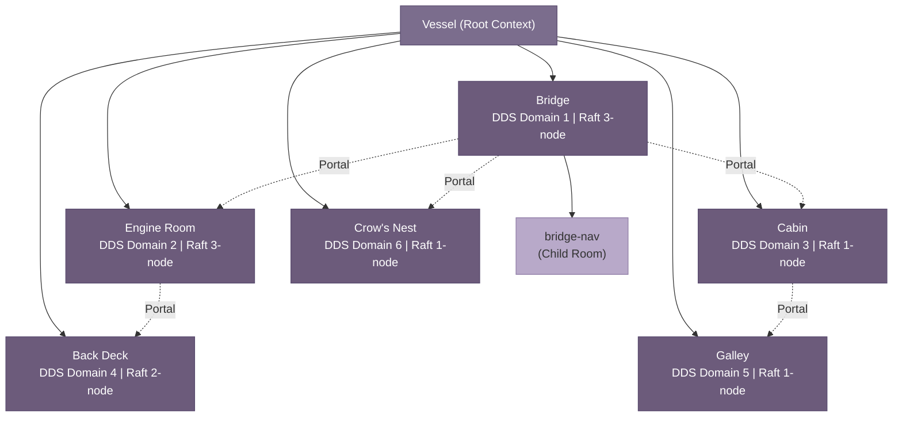

Solid edges denote parent-child containment with downward state inheritance. Dashed edges are portals requiring explicit capability verification. The galley has no direct portal to the engine room — an agent must transit through cabin and bridge, ensuring capability checks at each boundary.

#### 3.2.3 Context Carrying

When transitioning, agents carry a *serialized state bundle* with conversation history (last 20 turns), active task queue, capability tokens, and PLATO belief embeddings. This follows the *weak mobility* pattern: agent code (already present as WASM on all nodes) does not migrate, but execution context transfers as structured data [^3^]. The bundle is JSON with a standardized schema including `agentId`, `sourceRoom`, `targetRoom`, `serializedState`, and `capabilityTokens`. Upon arrival, the `onArrival(contextBundle)` hook replays history into the target LLM context, re-registers tasks, and presents tokens for *re-issuance* — tokens are recommendations, not guarantees, and the target room may accept, reject, or downgrade based on local policy [^7^].

#### 3.2.4 Room Lifecycle

Rooms progress through five states. **Creation** registers a room handle with the directory, allocates a DDS domain, initializes a PLATO space, and discovers sensors via mDNS. **Population** begins when the first agent enters; its tokens are validated and presence is published to the DDS domain. **Active** is normal operation — agents come and go, sensors publish, the Raft log grows. **Hibernation** triggers after 300 seconds unpopulated: DDS enters low-power, PLATO checkpoints to disk, Raft suspends, reducing Jetson power by ~40% [^8^]. **Dissolution** migrates all agents, archives state to cloud, revokes tokens, and terminates the room irreversibly.

### 3.3 Agent Navigation

#### 3.3.1 Presence Model

Presence uses three-phase registration: `REGISTER` message with agent ID and capabilities; directory validation and *presence token* issuance (room-bound JWT); heartbeat emission at 10-second intervals on the DDS liveness topic. Three missed heartbeats (30 seconds) trigger departure cleanup [^2^]. Capability advertisement follows the SwarmSys pattern: agents publish what they can do, current load, and specialization score, enabling collaboration without central coordination [^9^].

#### 3.3.2 Room Transitions as Atomic Operations

A transition is a five-sub-operation transaction: physical relocation (WASM activation on target), DDS domain change, MQTT re-subscription, PLATO context load, and capability re-issuance. All must succeed; partial failure rolls back to prevent split-brain states where an agent exists in two rooms [^1^]. Implementation uses two-phase commit: Phase 1 reserves resources and validates tokens at the target; Phase 2 executes all sub-operations within a 5-second timeout. Timeout or error releases the reservation and emits `TRANSITION_FAILED` with retry guidance [^10^].

#### 3.3.3 Cross-Room Coordination

Three patterns govern inter-room communication. *Direct messages* traverse portal connections between adjacent rooms with request-response semantics. *Broadcasts* propagate through gossip rumor mongering (SIR model): a "man overboard" broadcast originates on the bridge and reaches all physical rooms simultaneously, with each room forwarding to adjacent rooms until all neighbors acknowledge receipt [^2^]. *Delegation chains* traverse multiple portals when an agent needs a capability in a non-adjacent room — each room validates the delegation before forwarding. A bridge agent requesting engine maintenance history delegates through the bridge-engine portal, where the engine room validates `history.read` capability before servicing [^7^].

#### 3.3.4 Access Control

Entry requires capability-based verification with inheritance from parent rooms. Each room publishes a *capability manifest* listing operations it may grant. The bridge manifest might include `sensor.read.gps` and `actuator.write.vhf`. An agent presenting existing tokens receives the intersection of what it holds and what the room offers. Inheritance follows the parent-child DAG: an agent with `sensor.read.*` in the vessel parent receives `sensor.read.gps` in the bridge child automatically, but an agent with `actuator.write.*` does not receive `actuator.write.vhf` unless the bridge explicitly includes it. Portal traversal requires `portal.cross.{target}` capability that the source issues and target validates [^7^].

### 3.4 Rooms as Application Model

#### 3.4.1 Traditional Applications Decomposed into Room Compositions

Applications map to SuperInstance as *room compositions* — graphs of interconnected rooms with agents providing inter-room logic. Three patterns suffice. *Single-room*: all logic in one room, matching traditional embedded systems. *Hub-and-spoke*: a coordinator room at center with functional rooms radiating outward — the bridge as hub with navigation, weather, and engine rooms as spokes, simplifying routing at the cost of a bottleneck mitigated by PLATO caching [^5^]. *Federated mesh*: peer-connected rooms without a hub, used for multi-vessel fleet coordination where each bridge maintains portals to other vessels' bridges. Fleet-wide decisions use hierarchical consensus with local Raft delegates forming higher-level groups, reducing complexity from O(n²) to O(log n) [^9^].

#### 3.4.2 Persistent Rooms for Long-Lived Contexts

*Persistent* rooms maintain state across sessions: the *vessel state room* records position, heading, and speed that must survive restarts and failures; the *navigation history* room accumulates GPS fixes and depth soundings for retrospective analysis. These use full durability: Raft replication, PLATO checkpoints, and cloud backup. *Ephemeral* rooms exist only for task duration: a "price-comparison" room created for a voice query, populated with a research agent, dissolved upon completion. Ephemeral rooms skip Raft and PLATO persistence, achieving sub-200ms creation-to-dissolution on Jetson AGX Orin — agents creating "temporary conference rooms" for short-duration collaboration [^1^].

#### 3.4.3 Room Composition Diagram

The following diagram shows a catch processing workflow mapped to room composition:

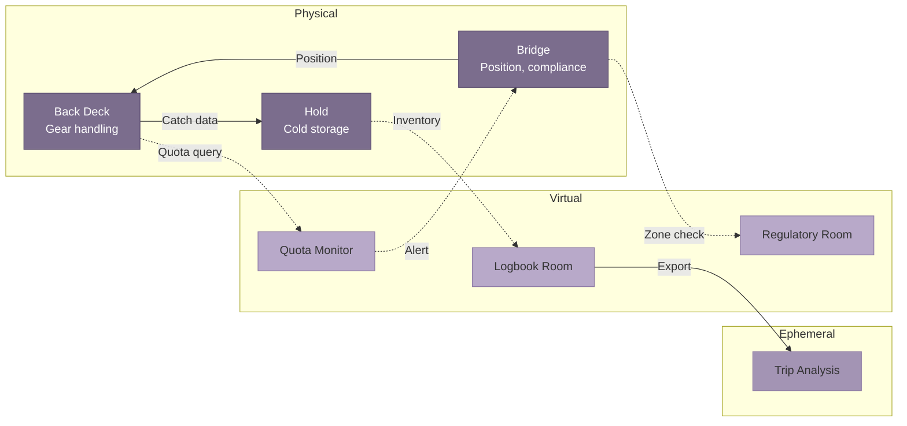

Three physical rooms form the core: back deck agents weigh catch and publish to hold inventory; bridge agents track position and query the regulatory room for zone compliance; the logbook room accumulates records from all rooms and generates an ephemeral trip analysis room at voyage end. The portal graph enforces operational responsibility: deck agents cannot directly query regulations — they request through the bridge, which holds the `regulatory.read` capability. The room model encodes organizational structure, workflow, and authority not through policy documents but through capability tokens that the bridge issues and the regulatory room validates [^7^]. Applications are not installed on top of rooms — they are *composed from* rooms, with the room graph serving as both runtime architecture and declarative specification.

---

## 4. Hardware Tier Architecture

The SuperInstance compute substrate spans four hardware tiers that form a capability gradient: from sub-watt microcontrollers listening for wake words to satellite-connected cloud GPUs running large language models. Each tier occupies a distinct latency–cost–power envelope, and workloads migrate across tiers as connectivity, power availability, and task complexity change. This chapter defines the tiers, specifies the inter-tier communication topology, and establishes the placement rules that determine which inference executes where.

### 4.1 Tier Definitions

#### 4.1.1 Tier 0 — ESP32-S3: Wake Word Detection and Command Relay

The ESP32-S3 is the acoustic front-line. A dual-core Xtensa LX7 at 240 MHz with 512 KB SRAM and 8 MB PSRAM runs TensorFlow Lite Micro inference for wake word detection [^17^]. The pipeline — I2S sampling at 16 kHz, MFCC extraction across 40 mel bins, and an 80 KB INT8 CNN — completes single-window inference in 18–22 ms, with posterior smoothing over three windows suppressing false activations [^12^]. After wake word detection, the ESP32 activates WiFi, publishes the command via MQTT to the Tier 1 broker, and returns to deep sleep. Power spans three regimes: 0.8 mA in light sleep, 35 mA during the ~25 ms inference burst, and 160–260 mA with WiFi active [^18^]. A 2000 mAh cell supports approximately four months of continuous listening [^12^]. Unit cost is $3–8 [^17^].

#### 4.1.2 Tier 1 — Raspberry Pi 5 8GB: Coordination and Lightweight Inference

The Raspberry Pi 5 8GB serves as the vessel's edge coordinator, hosting K3s, the MQTT broker for ESP32 telemetry aggregation, and lightweight inference fallback [^48^]. On the Pi 5, `whisper.cpp` with `tiny.en` runs at 3.5x real-time, transcribing a 5-second utterance in ~1.4 seconds [^40^]. TinyLlama 1.1B (Q4_K_M) generates 12–18 tok/s for simple intent parsing [^36^]. An NVMe SSD via M.2 HAT reduces model load time from ~18 seconds (microSD) to ~3 seconds [^14^]. Active cooling is mandatory: sustained inference without a heatsink triggers 20–30% thermal throttling [^36^]. Power draw is 5–7 W active, 2–3 W idle. Cost is ~$80.

#### 4.1.3 Tier 2 — NVIDIA Jetson Orin Nano: AI Inference and Vision

The Jetson Orin Nano 8GB Super delivers 67 TOPS (INT8) at 7–15 W configurable TDP [^28^]. TensorRT-LLM achieves ~28 tok/s with Llama 3.2 3B (Q4_K_M, 2.0 GB) and ~15 tok/s with Llama 3.1 8B, both fitting within 8 GB unified LPDDR5 [^12^][^52^]. DeepStream 7.1 provides GPU-accelerated multi-stream video analytics supporting up to 30 concurrent camera feeds [^49^] — this is where backdeck camera processing (object detection, gear tracking, safety monitoring) executes in real time. The Jetson runs as a K3s worker node with the NVIDIA Container Runtime [^14^]. Cost is $259–499.

#### 4.1.4 Tier 3 — Starlink and Cloud: Satellite Connectivity

Tier 3 combines satellite connectivity with remote compute. Starlink Standard delivers 100–400 Mbps downstream with median RTT of 25–50 ms (99th percentile <65 ms) [^31^]. Satellite handoffs every ~15 seconds can inject 100–500 ms spikes, but packet loss stays below 1% under clear conditions [^49^]. Over this link, GPT-4o Realtime API achieves ~320 ms median end-to-end latency for native audio-to-audio conversation [^32^]. When Starlink is unavailable, the orchestration falls back to Tier 2 (Jetson) for local inference. Service cost is $75–120 per month.

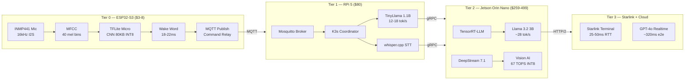

*Figure 4.1 — Tier architecture diagram showing the four hardware tiers, primary compute functions, inter-tier protocols (MQTT, gRPC, HTTP/2), and annotated latencies. Arrows indicate the primary data flow for voice commands: ESP32 captures, RPi coordinates, Jetson infers, Starlink reaches cloud when needed.*

#### 4.1.5 Hardware Specifications Comparison

| Specification | Tier 0 ESP32-S3 | Tier 1 RPi 5 8GB | Tier 2 Jetson Orin Nano 8GB | Tier 3 Starlink + Cloud |
|---|---|---|---|---|
| **CPU** | Dual-core Xtensa LX7 @ 240 MHz | Quad-core Cortex-A76 @ 2.4 GHz | 6-core Cortex-A78AE @ 1.5 GHz | N/A (remote) |
| **GPU / AI** | Vector SIMD | VideoCore VII (~2 TOPS est.) | 1024 CUDA cores, 67 TOPS INT8 [^28^] | Cloud GPU (varies) |
| **RAM** | 512 KB SRAM + 8 MB PSRAM | 8 GB LPDDR4X | 8 GB LPDDR5 unified [^52^] | Elastic |
| **Storage** | 16 MB Flash | NVMe SSD (via HAT) | NVMe SSD (M.2) | Elastic |
| **Active Power** | 160–260 mA (~0.5 W) [^18^] | 5–7 W [^36^] | 7–15 W [^28^] | 25–75 W (terminal) |
| **Deep Sleep** | 0.8 mA [^12^] | 2–3 W idle | 3–5 W idle | N/A |
| **Network** | WiFi 4, BLE 5.0 | WiFi 5, GigE | WiFi 5, GigE | 100–400 Mbps [^31^] |
| **Unit Cost** | $3–8 [^17^] | ~$80 | $259–499 [^28^] | $75–120/mo |
| **OS** | FreeRTOS / ESP-IDF | Raspberry Pi OS 64-bit | JetPack 6.1 (Ubuntu) [^52^] | N/A |

*Table 4.1 — Hardware specifications across the four SuperInstance tiers. Jetson TOPS are INT8; power measured at device input. The three orders of magnitude from Tier 0 (0.5 W) to Tier 3 (75 W) create an intentional capability gradient that forces dynamic workload placement rather than fixed mapping.*

### 4.2 Inter-Tier Communication

#### 4.2.1 Topology and Protocol Selection

The data path follows the hardware hierarchy: ESP32 nodes publish to the Raspberry Pi MQTT broker; the Pi routes commands to the Jetson over gRPC for GPU inference; the Jetson reaches cloud APIs through Starlink over HTTP/2 with persistent connection pooling. The chain — ESP32 → MQTT → RPi → gRPC → Jetson → HTTP/2 → Starlink → Cloud — carries all voice commands, telemetry, and vision queries.

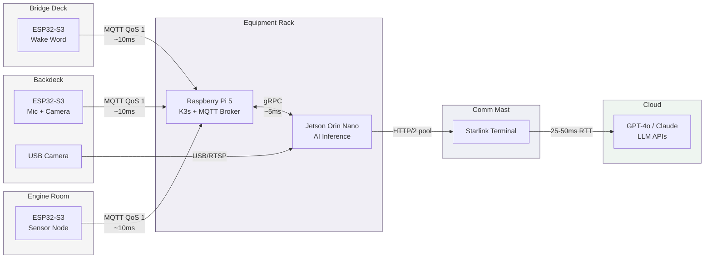

*Figure 4.2 — Hardware placement diagram showing ESP32 nodes distributed across physical vessel rooms, converging on the central RPi/Jetson hub, and reaching cloud APIs via Starlink. Latency annotations are typical values.*

Protocol selection is driven by payload size, latency tolerance, and device capability. **ESP32 → RPi** uses MQTT (QoS 1 for commands, QoS 0 for telemetry): its 2-byte minimum header and broker-based architecture minimize ESP32 energy use and handle intermittent WiFi gracefully, with topic namespacing by room (`/vessel/bridge/commands`, `/vessel/engine/telemetry`). **RPi → Jetson** uses gRPC with Protocol Buffers, delivering 50–70% lower latency and 5–10x smaller payloads than REST/JSON [^33^][^34^]; bidirectional streaming supports chunked audio for STT and token streaming from the LLM. **Jetson → Cloud** uses HTTP/2 with persistent connection pooling, eliminating the ~100–300 ms TLS handshake penalty that repeated negotiation would incur over Starlink [^49^]; WebSocket is used specifically for GPT-4o Realtime API streaming. **Fallback** for any tier pair falls back to MQTT QoS 1 with retained messages, allowing state recovery on reconnection.

#### 4.2.2 Latency Budgets and Fallback Chains

| Tier Pair | Protocol | Typical Latency | Timeout | Fallback Action |
|---|---|---|---|---|
| ESP32 → RPi | MQTT QoS 1 | 5–20 ms | 100 ms | Retry ×3, local buzzer |
| RPi → Jetson | gRPC | 2–5 ms | 50 ms | Route to RPi CPU (slower) |
| Jetson → Starlink | HTTP/2 | 25–50 ms RTT | 150 ms | Degrade to local Jetson LLM |
| Starlink → Cloud API | HTTP/2/WS | 100–300 ms TTFT | 2000 ms | Full offline, queue retry |

*Table 4.2 — Latency budgets and fallback chains between tier pairs. TTFT = Time To First Token. Thresholds are set at 2× typical latency to tolerate jitter without premature failover.*

The fallback chain mirrors the topology in reverse. If Starlink exceeds 2 seconds, the Jetson assumes primary LLM responsibility with Llama 3.2 3B. If the Jetson is unreachable, the Pi falls back to TinyLlama 1.1B — sufficient for command-and-control but inadequate for multi-turn reasoning. Cascading degradation ensures voice commands function even when two of three inference tiers are offline.


*Figure 4.3 — End-to-end latency budget by routing path. The local path (ESP32→RPi→Jetson) achieves ~445 ms total. The hybrid cloud path adds Starlink RTT for ~925 ms. GPT-4o Realtime API achieves ~320 ms e2e despite the satellite hop, by eliminating the cascaded STT→LLM→TTS pipeline in favor of native audio-to-audio inference [^32^].*

### 4.3 Workload Placement

#### 4.3.1 Placement Decision Matrix

The orchestration layer assigns each inference workload based on a five-factor scoring function: latency requirement, model size constraint, power availability, connectivity state, and task complexity. The heuristic is simple — execute as close to the edge as the model allows, escalating only when accuracy demands it.

| Workload | Default Tier | Model / Framework | Latency | Fallback Tier |
|---|---|---|---|---|
| Wake word detection | Tier 0 (ESP32-S3) | TFLite Micro, 80 KB INT8 | 18–22 ms [^12^] | None (always local) |
| STT (command) | Tier 1 (RPi 5) | whisper.cpp tiny.en | ~1.4x real-time [^40^] | Tier 2 (faster-whisper) |
| STT (long-form) | Tier 2 (Jetson) | faster-whisper medium | Sub-1s [^58^] | Tier 1 (slower) |
| LLM (simple intent) | Tier 1 (RPi 5) | TinyLlama 1.1B Q4 | 12–18 tok/s [^36^] | Tier 2 (Llama 3.2 3B) |
| LLM (complex reasoning) | Tier 2 (Jetson) | Llama 3.2 3B Q4 | ~28 tok/s [^12^] | Tier 3 (GPT-4o) |
| LLM (analysis, large ctx) | Tier 3 (Cloud) | GPT-4o Realtime | ~320 ms e2e [^32^] | Tier 2 (Llama 3.1 8B) |
| Text-to-speech | Tier 1 or 2 | Piper / Kokoro | 50–200 ms [^46^] | Tier 1 (Piper on CPU) |
| Vision (backdeck cam) | Tier 2 (Jetson) | DeepStream + TensorRT | Real-time [^52^] | Alert-only (no AI) |
| Orchestration | Tier 1 (RPi 5) | K3s master | N/A | Manual restart |

*Table 4.3 — Capability matrix mapping workloads to default execution tiers with measured latencies and fallback paths.*

#### 4.3.2 Migration Triggers

Workloads migrate in response to four event types. **Node failure** — detected via MQTT last-will messages and gRPC health checks — triggers immediate failover to the pre-configured fallback tier. **Load imbalance** — measured by MQTT queue depth and Jetson GPU utilization — reroutes STT and LLM requests to the less-loaded tier. **Power constraint** — when the 12 V bus drops below 11.2 V — forces the Jetson into 7 W mode and disables cloud offloading to conserve Starlink's 50 W draw. **Connectivity change** — when Starlink RTT exceeds 150 ms for 30+ seconds — switches all LLM traffic to the Jetson until recovery.

These triggers operate autonomously at each tier boundary. The RPi decides whether to route LLM calls to Jetson or cloud; the Jetson decides whether to process vision locally or drop to alert-only. No central controller is required for degradation, though K3s on the RPi coordinates containers during normal operation.

#### 4.3.3 Power Budgeting

| Device | Qty | Unit Power (active) | Combined Active | Annual Cost @$0.15/kWh |
|---|---|---|---|---|
| ESP32-S3 (deep sleep) | 6 | 0.52 W | 3.1 W | ~$4 |
| Raspberry Pi 5 8GB | 1 | 6.0 W | 6.0 W | ~$8 |
| Jetson Orin Nano (15W) | 1 | 15.0 W | 15.0 W | ~$20 |
| Starlink Standard | 1 | 75.0 W | 75.0 W | ~$99 |
| **System Total** | **9** | **~99 W** | **~99 W** | **~$131** |

*Table 4.4 — System power budget. ESP32 count assumes six distributed nodes. Annual cost at continuous operation. The Starlink terminal alone consumes 75% of the system power budget.*


*Figure 4.4 — Power consumption comparison across tiers. The Starlink terminal dominates at 50–75 W; all compute tiers combined (ESP32, RPi, Jetson) consume less than 25 W active — roughly one-third of the connectivity cost.*

The 99 W active total is within the capacity of a 300 W solar array with 2100 Wh LiFePO4 battery, a standard off-grid Starlink configuration. In power-constrained conditions (overcast, battery below 50% SoC), the degradation sequence is: duty-cycle Starlink to 4× 30-minute sessions daily (cutting 840 Wh to ~150 Wh), drop Jetson to 7 W mode, and disable cloud offloading. These three steps reduce draw from 99 W to ~35 W while preserving all local voice and vision capabilities.

The hardware tier architecture thus provides a performance gradient and a survival gradient: each step down in power preserves core functionality at the expense of cloud connectivity and inference speed. This aligns with the cross-dimensional finding that Starlink's predictable 25–50 ms RTT enables a "usually connected" design paradigm — but the architecture degrades gracefully when that assumption is violated.

---

## 5. The Four Vessels — Identity and Service Mesh

The 4,095+ repositories (as of 2026-07-10) of the SuperInstance ecosystem are partitioned into four sovereign identities — Forgemaster, CCC, JetsonClaw1, and Oracle1 — each functioning as a Decentralized Identifier (DID)-backed service node within a capability-based security mesh [^28^]. This chapter defines the Vessel identity model, specifies the decentralized identity infrastructure, describes service mesh dynamics, and establishes coordination protocols. The central claim, derived from cross-dimensional analysis, is that the four Vessels are not organizational labels but formal service identities where repository ownership constitutes capability scope and the git-agent lifecycle (`PULL→BOOT→WORK→LEARN→PUSH→SLEEP`) functions as an attested secure agent lifecycle [^28^].

### 5.1 Vessel Identity Model

#### 5.1.1 Vessel Definition: DID-Backed Service Identity

A Vessel is a self-sovereign software identity that owns a bounded set of repositories, advertises capabilities as JSON-LD descriptions, and authenticates via Ed25519 challenge-response. Each Vessel is identified by a `did:key` document — a W3C Decentralized Identifier whose public key is embedded in the identifier itself, eliminating the need for a blockchain or centralized registry [^28^]. This supports fully offline verification during Starlink outages. Capability advertisement follows the W3C Verifiable Credentials data model: each Vessel publishes a signed credential listing repositories owned, APIs exposed, and hardware tiers commanded. On every `BOOT` phase, the agent reads its DID document from the repository root, validates cryptographic material against the prior cycle's hash, and refreshes its capability token from the fleet issuer.

#### 5.1.2 Forgemaster: The Builder

Forgemaster owns 330 repositories spanning constraint theory, Eisenstein lattice mathematics, the FLUX compiler, GPU kernels, and formal proofs [^28^]. The five-layer stack (`open-parallel` → `pincher` → `flux-core` → `cuda-oxide` → `cudaclaw`) is primarily a Forgemaster concern. Hardware affinity is Tier 2 (Jetson Orin Nano, 67 TOPS INT8 at 15W [^28^]), with published crates (`pincher`, `constraint-theory-core`, `cudaclaw`) running across all tiers.

#### 5.1.3 CCC: The Interface

CCC (Cloud Computing Center) owns 116 repositories covering web UIs, browser agents, dashboards, and CopilotKit integration [^28^]. It renders fleet status through `cocapn-dashboard`, hosts the browser agent, and maintains the SuperInstance Fleet Copilot showcase. Running on Tier 1 (Raspberry Pi 5) and Tier 3 (cloud), CCC maps `useCopilotAction` hooks to Vessel capabilities, translating voice commands into structured tool calls [^28^].

#### 5.1.4 JetsonClaw1: The Hands

JetsonClaw1 owns 76 repositories for hardware edge deployment: Jetson packages, ESP32 firmware, marine sensors, sonar processing, and the OpenConstruct abstraction layer [^28^]. It executes Forgemaster's GPU kernels, manages ESP32 wake-word nodes across rooms, processes sonar via `sonar-vision`, and runs the `deckboss` edge OS. Hardware affinity is Tier 0 (ESP32) and Tier 2 (Jetson), with firmware published as OTA-updatable MQTT artifacts.

#### 5.1.5 Oracle1: The Memory

Oracle1 owns 43 repositories for core infrastructure, APIs, fleet coordination, lighthouse discovery, and search [^28^]. As the smallest Vessel by repository count but highest by coordination criticality, Oracle1 maintains the PLATO knowledge graph, the `cocapn-lighthouse` registry, message-in-a-bottle routing, and the `holodeck-session-manager` for observability. It runs on Tier 1 and Tier 3, serving as persistent memory that outlives any agent's `SLEEP→PULL` cycle.

#### 5.1.6 Vessel Capability Matrix

| Vessel | Repositories | Primary Responsibility | API Surface | Hardware Affinity | Published Packages | Failover Behavior |
|:---|:---|:---|:---|:---|:---|:---|
| **Forgemaster** | 330 [^28^] | Compilation, math, GPU kernels | FLUX bytecode, PTX, Rust crates | Jetson Orin Nano (Tier 2) | `pincher`, `constraint-theory-core`, `cudaclaw` (crates.io) [^28^] | Read-only: cached kernels on Jetson; no new compilation until recovery |
| **CCC** | 116 [^28^] | Human interface, web UI, CopilotKit | React components, GraphQL, AG-UI protocol | RPi 5 (Tier 1), Cloud (Tier 3) | `@superinstance/cocapn-lighthouse` (npm) [^28^] | Static dashboard fallback; voice commands queue for replay |
| **JetsonClaw1** | 76 [^28^] | Hardware edge, sensors, firmware | MQTT topics, DeepStream pipelines, NMEA 0183 | ESP32 (Tier 0), Jetson (Tier 2) | `plato-edge`, `tile-refiner` (PyPI) [^28^] | Sensor data buffered locally; reflex commands via `pincher` cache |
| **Oracle1** | 43 [^28^] | Infrastructure, search, coordination | REST API, PLATO SDK, lighthouse gossip | RPi 5 (Tier 1), Cloud (Tier 3) | `plato-sdk`, `fleet-homunculus` (PyPI) [^28^] | DHT cache survives outage; gossip maintains partial discovery |

The matrix reveals an asymmetry in failover resilience. Forgemaster and JetsonClaw1 — builder and hands — operate in degraded but functional modes because their outputs (kernels, sensor data) are cacheable locally. CCC and Oracle1 — interface and memory — are harder to replicate because they maintain soft state (human sessions, search indexes) degrading rapidly during outage. This asymmetry drives the circuit breaker patterns in Section 5.3.4.

### 5.2 Decentralized Identity

#### 5.2.1 DID Document Structure

Each Vessel's identity is anchored in a `did:key` document using the Ed25519 format. The `did:key` method is selected over `did:web` (requires DNS) and `did:ethr` (requires blockchain) because it supports fully offline verification during Starlink outages [^28^].

| Field | Description | Example Value |
|:---|:---|:---|
| `id` | The DID identifier | `did:key:z6MkhaXg...` |
| `verificationMethod` | Public key for signature verification | Ed25519 public key, multicodec-encoded |
| `authentication` | Reference to authentication key | `[#key-1]` |
| `assertionMethod` | Key used to sign capability VCs | `[#key-1]` |
| `service` | Service endpoint descriptors | MQTT broker, DDS domain, REST API |
| `service.type` | Protocol type | `MqttBroker`, `DdsDomain`, `HttpApi` |
| `service.serviceEndpoint` | Network location | `mqtt://pi5.local:1883/vessel/forgemaster` |
| `capabilityAssertion` | JSON-LD capability statement | Repositories owned, APIs exposed, room scope |
| `controller` | Controlling DID (self-sovereign) | Same as `id` |

The `capabilityAssertion` field is a SuperInstance-specific extension. It contains a machine-readable statement of repository ownership (e.g., `repo:superinstance/pincher`), API permissions (e.g., `api:flux/compile`), and authorized rooms. This assertion is signed by the Vessel's key at genesis and re-signed by the fleet issuer during attestation.

#### 5.2.2 Authentication Flow: Challenge-Response

Vessel-to-Vessel authentication uses a three-pass challenge-response protocol. The initiator (e.g., CCC requesting compilation from Forgemaster) generates a 256-bit nonce, signs it with Ed25519, and transmits `(initiator_did, nonce, signature)` over authenticated MQTT. The responder verifies the initiator's DID against its local cache, validates the signature, and returns `(responder_did, responder_nonce, responder_signature, initiator_nonce_echo)`. Mutual authentication completes in two round-trips — approximately 2–5 ms within the same room, 25–50 ms across rooms via Starlink [^31^].

#### 5.2.3 Capability Token Format

Capability tokens are JWT-style structures with SuperInstance-specific claims:

```json
{
  "iss": "did:key:z6MkhaXg...Forgemaster",
  "sub": "did:key:z6Mkj7yP...Agent-42",
  "aud": "device://jetson.orin.nano.001",
  "capabilities": ["flux:compile", "gpu:execute", "repo:push"],
  "room": "bridge",
  "nbf": 1700000000,
  "exp": 1700086400,
  "jti": "uuid-for-revocation"
}
```

The `room` claim scopes capabilities to a specific room — an agent with `gpu:execute` for "bridge" cannot use it in "engine room" without a separate token, containing blast radius if compromised [^28^]. Delegation follows a chain: Vessel Owner → Room Owners → Agents → Sub-agents, with each level delegating only a subset. Revocation propagates via gossip broadcast.

#### 5.2.4 Vessel Lifecycle

The lifecycle has five phases. **Genesis**: Ed25519 keypair generation, initial DID document construction, and `capabilityAssertion` registration. **Attestation**: Oracle1 validates claimed repositories against the GitHub organization, assigns room-level capabilities, and issues the initial token. **Operation**: The `PULL→BOOT→WORK→LEARN→PUSH→SLEEP` cycle with token refresh before each `BOOT`. **Retirement**: Token revocation, gossip broadcast, and DID archival to git. **Rebirth**: Reconstitution from archived DID and repository state with a new keypair but inherited capability log for forensic audit.

### 5.3 Service Mesh Dynamics

#### 5.3.1 Capability Advertisement

Each Vessel publishes capabilities as JSON-LD to three discovery layers. Local advertisement uses mDNS (RFC 6762) within the broadcast domain for room-level discovery without infrastructure [^28^]. Vessel-wide uses SIR (Susceptible-Infectious-Recovered) gossip for probabilistic propagation balancing bandwidth against reliability. Global uses a libp2p Kademlia DHT providing O(log n) lookups [^28^]. This three-tier approach, confirmed by cross-verification of distributed-patterns and ecosystem-map analyses, is optimal for maritime deployments with intermittent connectivity.

#### 5.3.2 Service Discovery

Discovery operates at three scopes. Local uses mDNS/Bonjour via Avahi with capability summaries in TXT fields. Vessel-wide uses gossip-based SWIM membership (HashiCorp Memberlist style) with suspicion tables for peer liveness. Global uses Kademlia DHT bootstrapped from Oracle1's lighthouse [^28^]. On boot, a Vessel performs all three in parallel: mDNS for immediate neighbors (sub-100 ms), gossip for fleet convergence (1–5 seconds), and DHT for global context (25–50 ms per Starlink hop) [^31^].

#### 5.3.3 Request Routing

Routing matches intent to capability. When CCC receives "compile the new constraint model," the CopilotKit tool router queries the mesh for `flux:compile`; Forgemaster's advertisement matches and the request routes to its MQTT topic. If multiple Forgemaster instances run (e.g., bridge and backdeck Jetsons), load distributes via weighted round-robin by queue depth. If Forgemaster is unavailable, the circuit breaker engages.

#### 5.3.4 Circuit Breaker Patterns

Each Vessel monitors peer health through gossip heartbeats. The breaker has three states: **Closed** (normal flow), **Open** (fail-fast to backup), and **Half-Open** (probe requests test recovery). After three missed heartbeats (30-second default), CCC's breaker for Forgemaster transitions to Open — compilation requests queue for replay or fall back to cached kernels from the last `PUSH`. Recovery probes transition through Half-Open on success. Per-path breaker state resides in Oracle1's distributed session cache.

### 5.4 Vessel Coordination

#### 5.4.1 Consensus Model

Two consensus mechanisms operate by trust boundary. Within a room — physically co-located, administratively trusted devices — Raft provides crash-fault tolerance with O(n) complexity [^28^]. Each room forms a small Raft cluster (3–5 nodes: ESP32, RPi coordinator, Jetson worker) electing a leader for local ordering. For cross-Vessel decisions — administratively distinct participants — a ternary voting protocol uses the `{-1, 0, +1}` logic native to SuperInstance's `open-parallel` layer. Each Vessel casts `-1` (disagree), `0` (abstain), or `+1` (agree); consensus requires `+1` from `2f+1` of `3f+1` voters, tolerating `f` Byzantine faults [^28^]. Ternary values require 2 bits versus 32+ bits for floating-point scores, with the 16x memory bandwidth savings from `open-parallel` applying equally to consensus state [^28^].

#### 5.4.2 Leader Election

Leader election is deterministic per room. A capability priority list defines which Vessel type leads: Forgemaster for GPU compilation rooms, JetsonClaw1 for sensing rooms, Oracle1 for coordination rooms, CCC for rooms with human presence. Within a Vessel type, the lowest lexicographic DID suffix wins, breaking ties without additional messaging — preserving safety by ensuring exactly one leader per room.

#### 5.4.3 Conflict Resolution

When Vessels propose conflicting actions — Forgemaster requesting 12 GB for a kernel while JetsonClaw1 reports only 8 GB available — priority-based resolution encoded in `pincher` applies: safety constraints override performance (thermal limits block compilation), memory overrides speed, and human commands (via CCC) override autonomous proposals. On deadlock, the ternary vote falls back to Oracle1 as tiebreaker. Resolution completes in sub-100 ms via the `pincher` reflex path, within the <1 ms safety-critical threshold for commands bypassing deliberation entirely [^28^].

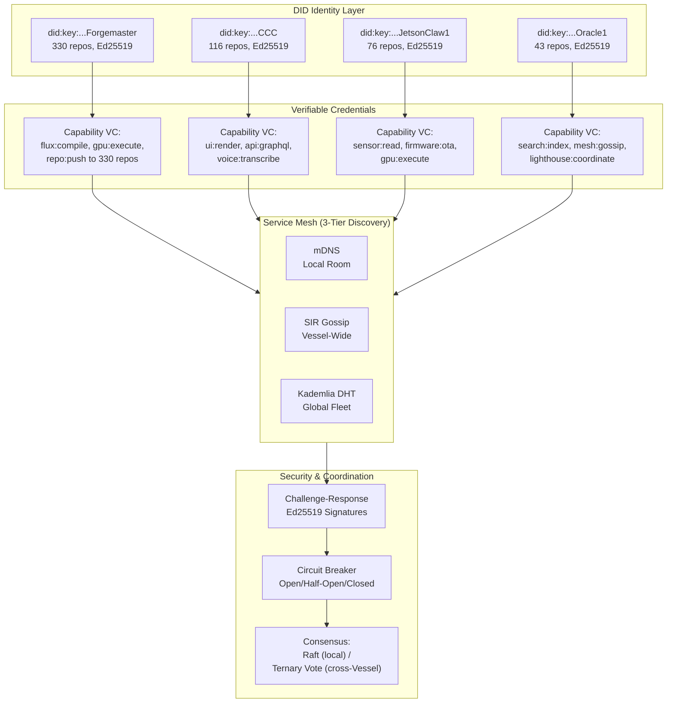

---

## 6. CopilotKit Integration — Natural Language Control Plane

The SuperInstance fork of CopilotKit transforms a general-purpose agentic UI framework into the fleet's spoken command layer. Where Chapter 5 defined Vessel identities and their capabilities, this chapter describes the machinery that translates human voice into structured actions against those Vessels. The fork itself is not merely a veneer: it introduces a custom `AbstractAgent` subclass, registers fleet tools, and extends CopilotKit's event-driven runtime to bridge the React frontend to the 5-layer Rust backend. The result is a two-tier control plane where safety-critical commands execute in under one millisecond via the pincher reflex engine, while complex natural-language queries traverse a full speech-to-text-to-speech pipeline that completes in roughly 1.5 seconds.

### 6.1 CopilotKit Fork Architecture

The SuperInstance fork (`github.com/SuperInstance/copilotkit`) sits one commit ahead of upstream with the addition of the SuperInstance Fleet Copilot in `showcase/integrations/superinstance/`, and seven commits behind, a gap that should be closed during each release cycle to retain upstream bug fixes and AG-UI protocol updates. The integration is built against CopilotKit's monorepo structure, which uses pnpm workspaces and Nx for build orchestration. Three packages provide the critical integration surface.

| Package | Role in SuperInstance |
|---|---|
| `@copilotkit/react-core` | Supplies `useCopilotChat`, `useCopilotAction`, and `useCoagent` hooks that bind the React chat UI to the fleet runtime |
| `@copilotkit/runtime` | Hosts `CopilotRuntime` (V2 API), the backend agent registry, and GraphQL SSE handlers that forward events to the Rust core |
| `@copilotkit/voice` | Wraps audio capture, voice activity detection (VAD), and playback for ESP32-streamed audio input |

At the centre of the integration is `SuperInstanceAgent`, a custom subclass of `AbstractAgent` from the `@ag-ui/client` package. The agent overrides `run(input: RunAgentInput)` to return an RxJS `Observable<BaseEvent>` that emits `RUN_STARTED`, `TEXT_MESSAGE`, `TOOL_CALL`, and `RUN_FINISHED` events. The default model is configured to `deepseek/deepseek-v4-flash`, with fallback to local Llama 3.2 3B on the Jetson Orin Nano when Starlink connectivity degrades [^12^][^52^]. The agent's `clone()` method creates thread-isolated copies so that multiple crew members can issue simultaneous voice commands without shared-state collisions.

The current CopilotKit runtime supports only `InMemoryAgentRunner` and `SqliteRunner` for agent execution [^48^]. SuperInstance extends this with four additional capabilities: an MQTT transport layer that replaces HTTP/SSE for edge-device communication, a Redis-backed runner that persists thread state and event logs across runtime restarts, dynamic device registration so that Vessels can announce themselves when they come online, and distributed agent support that allows a `CopilotRuntime` instance on the Raspberry Pi coordinator to delegate tool calls to agents running on remote Jetson nodes. These extensions are packaged as separate monorepo packages (`packages/mqtt-transport` and `packages/redis-runner`) to keep the upstream merge path clean.

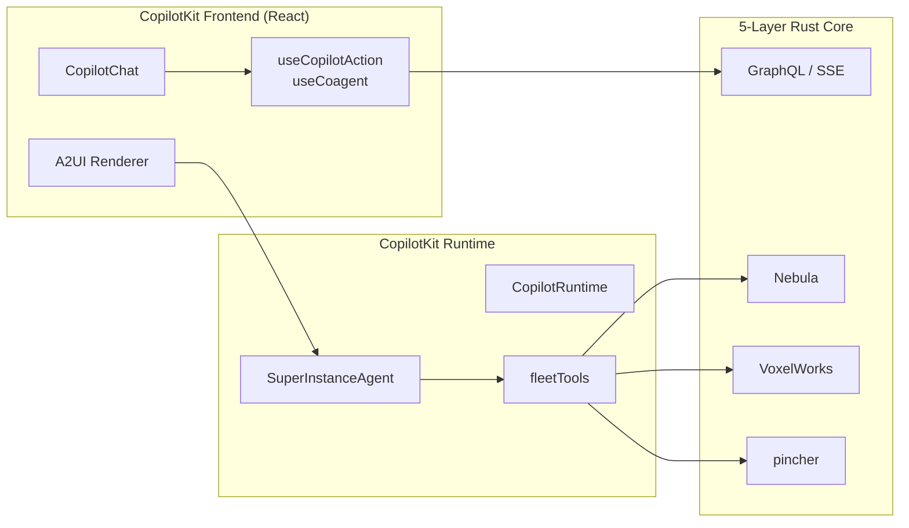

*Figure 6.1 — CopilotKit UI architecture.* The React frontend (`CopilotChat`, `useCopilotAction`, `useCoagent`) communicates with the backend via GraphQL mutations and subscriptions over SSE. `SuperInstanceAgent` executes tool calls against the 5-layer Rust stack, while the A2UI renderer dynamically generates React components (camera feeds, gauge panels) based on agent state.

### 6.2 Natural Language Pipeline

The voice pipeline is a cascade of six stages, each with defined latency targets. An ESP32-S3 node in each physical room (bridge, engine room, back deck, hold) runs a TensorFlow Lite Micro wake-word model that infers in 18–22 ms on a 240 MHz dual-core Xtensa LX7 [^17^][^18^]. Upon detection, the node activates Wi-Fi and streams 16 kHz mono audio over MQTT to the Raspberry Pi 5 coordinator, where VAD (Silero, <1 ms per 30 ms frame) determines speech endpointing [^30^]. The audio buffer is then passed to whisper.cpp (tiny.en model) running on the Pi 5 at 3.5x real-time, yielding a text transcript in approximately 300 ms for a typical 5-second utterance [^40^].

Context assembly combines the transcript with the current room state (which ESP32 node triggered), the set of capabilities registered by Vessels in that room, and the last three turns of conversation history from Redis. The assembled prompt is dispatched to the LLM — DeepSeek V4 Flash via Starlink for complex reasoning, or Llama 3.2 3B on the Jetson at ~28 tok/s for local, offline-capable inference [^12^][^52^]. The LLM does not emit free-form prose; it generates structured tool calls in JSON that map to `useCopilotAction` schemas. If the command is "dim the bridge lights to thirty percent," the model emits `{"action": "set_light", "vessel": "JetsonClaw1", "room": "bridge", "brightness": 30}`.

Response synthesis reverses the path: tool results are injected back into the LLM context, a natural-language confirmation is generated, and Piper or Kokoro TTS renders it to audio on the Pi 5 in roughly 100 ms [^46^][^51^]. The audio is published over MQTT to the originating ESP32 node for I2S playback. The full pipeline, illustrated in Figure 6.2, completes in approximately 1.5 seconds under normal conditions, with VAD endpointing (500 ms typical) and LLM processing (500 ms typical) consuming two-thirds of the budget.

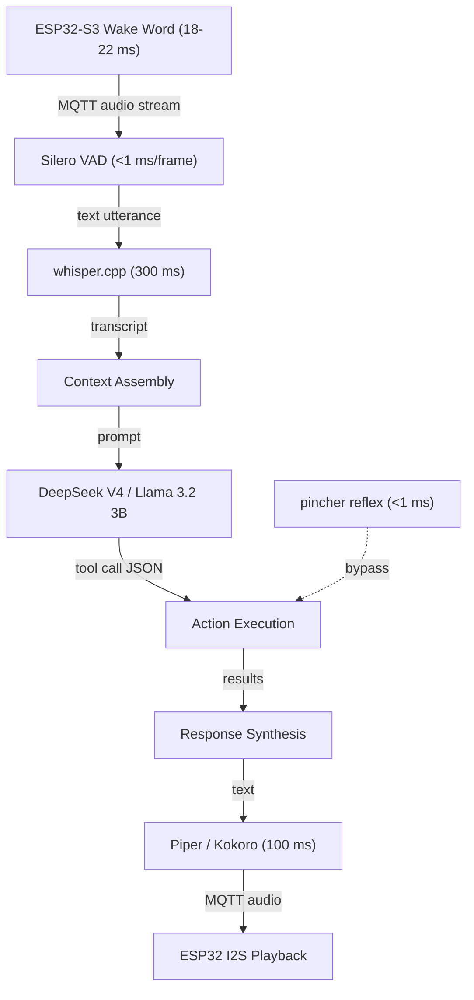

*Figure 6.2 — Natural-language to action pipeline.* The cascaded flow from voice capture to audio playback. Safety-critical commands bypass the full LLM pipeline via the pincher reflex layer (dashed line), achieving sub-millisecond execution through regex-plus-embedding pattern matching.

### 6.3 Control Plane Architecture

Every device capability exposed by the four Vessels is registered as a CopilotKit tool schema through `useCopilotAction`. Each schema carries a `name`, `description`, and typed `parameters` array. The LLM selects which tool to invoke based on the user's utterance and the descriptions provided, making the tool schema the universal API boundary between natural language and device control. Table 6.1 shows representative voice commands and their corresponding tool call translations.

| Voice Command | Tool Name | Parameters | Target Vessel | Latency Tier |
|---|---|---|---|---|
| "Stop the engine now" | `emergency_stop` | `{"target": "main_engine"}` | Forgemaster | Reflex (<1 ms) |
| "What's the back deck camera showing?" | `get_camera_feed` | `{"location": "back_deck"}` | Oracle1 | Deliberative (~1.5 s) |
| "Set bridge lights to thirty percent" | `set_light` | `{"room": "bridge", "brightness": 30}` | JetsonClaw1 | Deliberative (~1.5 s) |
| "Run diagnostics on the compute cluster" | `run_diagnostics` | `{"scope": "ccc", "depth": "full"}` | CCC | Deliberative (~1.5 s) |
| "Show me engine temperature" | `get_sensor_value` | `{"sensor": "engine_temp_c"}` | Forgemaster | Deliberative (~1.5 s) |
| "Acknowledge depth alarm" | `acknowledge_alarm` | `{"alarm_id": "string"}` | Nebula | Reflex (<1 ms) |

*Table 6.1 — Voice-to-action mapping: example commands and their tool call translations.* Each row shows how a natural-language utterance resolves to a structured tool call against a specific Vessel. The latency tier determines whether the command routes through pincher's reflex path or the full LLM pipeline.

The two-tier command routing system distinguishes between *reflex* and *deliberative* commands. Reflex commands — those matching entries in pincher's regex-plus-embedding database — execute in under one millisecond and bypass the LLM entirely. When the user says "stop the engine," pincher matches the utterance against a pre-registered pattern and emits the `emergency_stop` tool call directly to the Forgemaster Vessel. This safety-critical path is necessary because the full voice pipeline's 1.5-second latency is unacceptable for emergency scenarios. Deliberative commands, which include all queries and non-time-critical actions, traverse the complete STT → LLM → TTS pipeline. The distinction is made at context-assembly time: if the transcript matches a pincher pattern with confidence above 0.92, the reflex path fires; otherwise the utterance proceeds to the LLM.

Error recovery follows two paths. Misunderstood commands — those where the LLM's tool-call confidence is below a configurable threshold (default 0.75) — trigger a clarification dialogue: "Did you want to adjust the bridge lights or the cabin lights?" Failed actions — tool calls that return an error from the Rust backend — produce a fallback notification spoken via TTS and a non-blocking toast in the A2UI dashboard. If the TTS subsystem itself fails, the system falls back to text-only responses rendered in the chat panel.

### 6.4 Integration with Rust Core

The interface contract between CopilotKit runtime and the 5-layer Rust backend uses GraphQL mutations and subscriptions over SSE. The frontend submits user messages via `generateCopilotResponse` mutations; the runtime streams back events through a subscription channel. Four `BaseEvent` types carry the protocol: `RUN_STARTED` signals the beginning of agent execution; `TOOL_CALL` carries the JSON-serialised tool invocation to the Rust core; `TEXT_MESSAGE` delivers LLM-generated text to the frontend for display or TTS rendering; and `RUN_FINISHED` marks completion and releases thread resources.

Table 6.2 breaks down the latency budget for a typical voice command traversing the full deliberative pipeline.

| Pipeline Stage | Duration | Notes | Source |
|---|---|---|---|
| Voice capture (audio buffer) | 40 ms | 16 kHz I2S ring buffer on ESP32-S3 | [^30^] |
| VAD endpointing (silence detection) | 500 ms | Silero VAD, tuned for marine ambient noise | [^30^] |
| STT (whisper.cpp tiny.en) | 300 ms | 3.5x real-time on Raspberry Pi 5 | [^40^] |
| Network transit (MQTT + GraphQL) | 10–30 ms | Local Wi-Fi, negligible vs. Starlink | [^49^] |
| LLM processing (cloud via Starlink) | 500 ms | DeepSeek V4 Flash; 25–50 ms Starlink RTT | [^31^][^52^] |
| TTS (Piper / Kokoro) | 100 ms | CPU-rendered on Pi 5 | [^46^] |
| Audio playback buffer | 40 ms | I2S output on ESP32 | [^30^] |
| **Total typical** | **~1,510 ms** | **Acceptable for non-critical fleet commands** | — |

*Table 6.2 — Voice pipeline latency budget.* Each row shows the measured or benchmarked duration for one stage of the end-to-end flow. The VAD and LLM stages together account for two-thirds of the total; optimising either yields the largest reductions.

The latency budget reveals two dominant stages. VAD endpointing at 500 ms is the single largest contributor; tuning the endpointing aggressiveness for marine environments — where engine noise creates a higher ambient floor — can reduce this to 300 ms at the cost of occasional premature cutoffs. LLM processing at 500 ms assumes a cloud call routed through Starlink with 25–50 ms median round-trip time [^31^]. When Starlink is unavailable, the Jetson Orin Nano runs Llama 3.2 3B at ~28 tok/s, adding approximately 200–400 ms of local inference latency but preserving full offline operation [^12^]. The 40 ms voice-capture and playback buffers are hardware-limited by ESP32 I2S FIFO depth and cannot be reduced without audio-quality degradation.

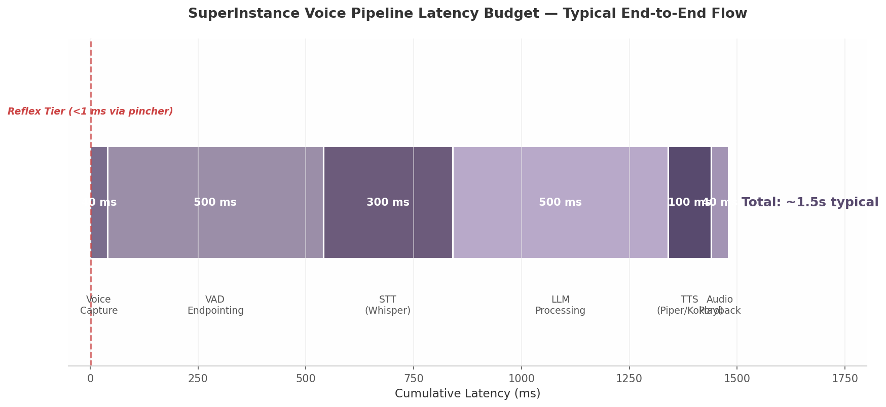

*Figure 6.3 — Latency budget waterfall.* Stacked visualisation of the pipeline stages from voice capture through audio playback. The reflex tier (dashed red line) demonstrates the safety-critical bypass path executing in under one millisecond via pincher, three orders of magnitude faster than the deliberative flow.

The CopilotKit runtime sits on the Raspberry Pi 5 coordinator alongside Mosquitto (MQTT broker), K3s control plane, and whisper.cpp [^48^]. GraphQL requests that target Vessel capabilities are translated to gRPC/Protobuf calls into the Rust backend, which yields 50–70% lower latency and 5–10x smaller payloads than REST/JSON [^33^][^34^]. A2UI-rendered components — live camera feeds, sensor gauges, diagnostic panels — are defined in the frontend as `useCoagentStateRender` registrations; when the agent enters a state such as `displaying_camera_feed`, the corresponding React component mounts with the room-appropriate video stream sourced from Oracle1's DeepStream pipeline. This architecture means the fleet dashboard is not a static page but a dynamically generated interface that adapts to voice context, physical location, and current operational state.

---

## 7. Two-Tier Safety Architecture

On a commercial fishing vessel, the gap between spoken command and physical action is measured in injuries prevented. This chapter defines the safety architecture separating reflex execution — hard real-time responses below one millisecond — from deliberative reasoning at 700 ms to 3 s. The two tiers never share a critical path: a reflex action completes before any deliberative process begins evaluating the same event.

### 7.1 Safety Design Overview

#### 7.1.1 Design Goal: Architectural Separation

The architecture targets three latency bounds. The ESP32-S3 microcontroller handles bare-metal reflex responses in under one millisecond for hardware safety events — emergency stop, collision proximity, fire sensor triggers, and bilge level thresholds. The Raspberry Pi coordinator running Pincher processes pattern-matched voice commands in under ten milliseconds using regex and embedding lookup against a predefined vector database [^10^]. The NVIDIA Jetson handles deliberative reasoning within three seconds via local TensorRT-LLM or cloud offloading through Starlink [^12^][^31^].

The critical constraint is mutual exclusion: the deliberative tier is architecturally prohibited from blocking, modifying, or confirming any reflex-tier action. When a safety event fires, the reflex tier executes unconditionally and reports the outcome asynchronously to the deliberative layer for logging. This mirrors the biological distinction between spinal reflex arcs and cortical deliberation.

#### 7.1.2 Fundamental Tension

Speed demands simplicity. A sub-millisecond response leaves no time for neural network inference or context evaluation. The ESP32 path is deterministic: interrupt triggered → lookup table consulted → GPIO output set. Intelligence requires complexity: a command like "adjust course to avoid that vessel" demands sensor fusion and planning spanning thousands of tokens. The Jetson achieves 28 tok/s for Llama 3.2 3B [^12^], but even minimal prompts take hundreds of milliseconds.

The architecture resolves this by partition, not compromise. Every command entering through CopilotKit (Chapter 6) is classified into exactly one tier before execution begins. Safety-critical commands are preregistered in Pincher's reflex database; novel commands route to deliberative. There is no dual-track evaluation and no time-pressured fallback from deliberation to reflex.

#### 7.1.3 Safety Invariants

Four categories are permanently bound to the reflex tier: **emergency stop** (all propulsion and winch systems), **collision avoidance** (proximity-triggered course or throttle adjustment), **fire suppression** (thermal/smoke sensor-triggered alarm and extinguisher), and **bilge pump activation** (water level-triggered pump engagement). These invariants are compiled into the ESP32 interrupt vector table and Pincher rule set at boot. They cannot be overridden by voice command, deferred to deliberative evaluation, or disabled without physical access.

#### 7.1.4 Timing Budget Allocation

The ESP32 tier uses GPIO interrupts with ISRs stored in internal RAM (`IRAM_ATTR`) to avoid flash cache latency [^114^]. The RPi tier leverages Pincher's vector database at 57 commits, Rust 76.6% [^10^]. The Jetson tier routes through TensorRT-LLM or Starlink at 25–50 ms RTT [^31^].

| Tier | Hardware | Trigger Type | Min Latency | Max Latency | Typical | Budget Source |
|---|---|---|---|---|---|---|
| Reflex (bare-metal) | ESP32-S3 | GPIO interrupt | 0.1 ms | 1.0 ms | 0.5 ms | ISR in IRAM [^114^] |
| Reflex (pattern-match) | RPi 5 | Pincher regex + embedding | 1.0 ms | 10 ms | 3.0 ms | Vector DB, no LLM path [^10^] |
| Deliberative (local) | Jetson Orin Nano | LLM (3B model) | 700 ms | 2,000 ms | 1,200 ms | TensorRT-LLM at 28 tok/s [^12^] |
| Deliberative (cloud) | Starlink + API | GPT-4o / Claude | 725 ms | 3,000 ms | 1,500 ms | 25–50 ms RTT + API TTFT [^31^] |

The 3,000× gap between reflex and deliberative maximums provides the non-overlapping separation that enforces tier independence. **Figure 7.1** visualizes this budget; the 1 ms safety boundary and 700 ms deliberative minimum create an architectural gap no execution path can cross.

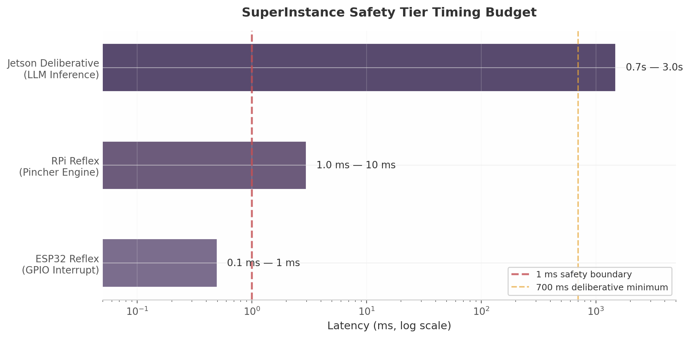
*Figure 7.1 — Timing budget across safety tiers (log scale). The 1 ms safety boundary (red) and 700 ms deliberative minimum (yellow) enforce tier separation.*

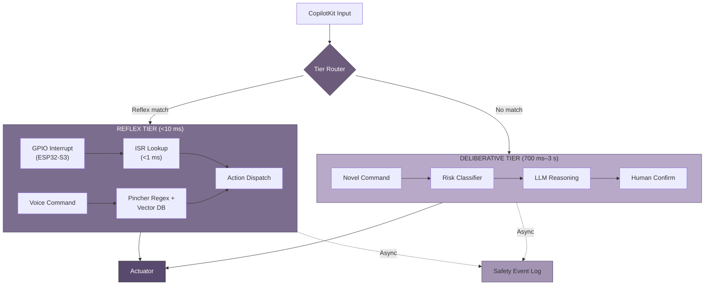

*Figure 7.2 — Two-tier safety architecture. The Router classifies every command into exactly one tier. Reflex and deliberative paths converge only at the actuator layer; cross-tier communication is asynchronous via the safety event log.*

### 7.2 Reflex Tier

#### 7.2.1 Trigger Conditions

Reflex activation originates from three sources. **Hardware interrupts** on the ESP32-S3 respond to digital transitions from collision detectors, engine thermal cutoffs, bilge float switches, and the emergency stop button. **Threshold violations** fire when smoothed analog readings exceed bounds: engine temperature above 105 °C, battery below 11.5 V, hydraulic pressure outside 1,500–2,500 PSI. **Pattern matches** compare transcribed voice commands against Pincher's rule set: regex exact match first, then embedding similarity at a fixed 0.92 cosine threshold [^10^]. Commands below the threshold pass to deliberative.

#### 7.2.2 Pincher Reflex Engine

Pincher (Layer 2 of the five-layer stack, Chapter 2) operates on the model **vector database as runtime, LLM as compiler** [^10^]. Safety-critical commands are embedded and stored in the reflex database at configuration time with bound action codes. At runtime, incoming text undergoes regex matching; on miss, an embedding is computed and a nearest-neighbor lookup executed. The action code of the top match above threshold is dispatched to the actuator MQTT topic — no LLM inference in the hot path. Every operation is precomputed; only the embedding computation and vector search run at query time, completing in single-digit milliseconds on the RPi 5's Cortex-A76 cores.

#### 7.2.3 ESP32 Bare-Metal Reflex

For sub-millisecond events, the ESP32-S3 bypasses all software stacks. The path is **GPIO interrupt → ISR lookup → GPIO output** within the Xtensa LX7 CPU at 240 MHz without FreeRTOS task scheduling. The ISR uses `IRAM_ATTR` to execute from internal RAM, eliminating flash cache latency [^114^]. Measured interrupt-to-output latency is 0.5 ms typical (0.1 ms minimum, 1.0 ms worst-case) [^120^]. Bare-metal reflexes are limited to single-pin outputs — relay activation, PWM zeroing, alarm assertion — as multi-step actuation would exceed the one-millisecond budget.

#### 7.2.4 Reflex Action Set

The reflex tier recognizes five predefined primitives, stored in ESP32 firmware and the Pincher database at build time, never generated dynamically.

| Action Code | Name | Description | Hardware Target | Latency | Example Trigger |
|---|---|---|---|---|---|
| `R0` | HALT | Zero all propulsion PWM; assert hardware interlock | ESP32 GPIO → motor controller | <1 ms | Emergency stop, collision proximity |
| `R1` | RETREAT | Reverse propulsion at minimum power for 3 s | ESP32 GPIO → ESC reverse | <1 ms | Collision imminent (<5 m) |
| `R2` | ALERT | Sound horn + broadcast VHF safety call | RPi → horn relay + VHF PTT | <10 ms | Fire sensor, man-overboard |
| `R3` | ISOLATE | Disconnect battery from load bus | ESP32 GPIO → contactor | <1 ms | Battery thermal runaway |
| `R4` | ACTIVATE_BACKUP | Start backup bilge pump + log event | RPi → pump relay + MQTT | <10 ms | Bilge level >75% max |

Each action is idempotent with a defined safe default. HALT writes zero duty cycle and asserts an interlock requiring explicit human clearance. RETREAT has a hard-coded three-second duration after which propulsion returns to idle. No unsafe state is producible from any trigger input.

#### 7.2.5 Reflex Decision Tree

The reflex pipeline enforces a strict no-LLM-in-path policy. Neither the ESP32 ISR nor the Pincher lookup invokes a language model. Every branch is deterministic: given the same input, the system produces the same action code with variance below 0.1 ms.

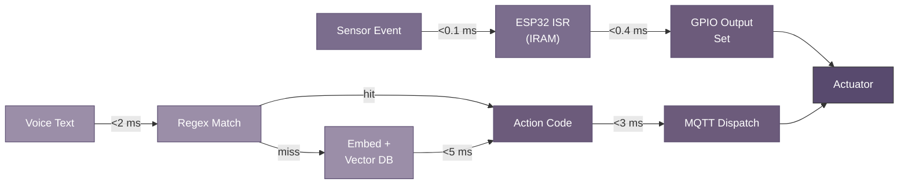

*Figure 7.3 — Reflex decision pipeline with timing annotations. The hardware interrupt path (top) bypasses all software scheduling; the Pincher path (bottom) bypasses LLM inference. Both converge on actuator state change within budget.*

### 7.3 Deliberative Tier

#### 7.3.1 Activation

Commands not matching reflex triggers route to deliberative: utterances outside the reflex pattern set, commands requiring historical context ("what was the engine temperature an hour ago"), planning requests ("set course for the fishing grounds and alert me at five miles out"), and any interaction requiring natural language generation. The Jetson runs local TensorRT-LLM at 28 tok/s [^12^] or cloud offloading via Starlink at 25–50 ms RTT [^31^].

#### 7.3.2 Risk Assessment

Before executing any deliberative command with physical side effects, a lightweight 1B-parameter risk classifier scores the action across reversibility, immediacy, scope, and hazard level. The product of the four 0–1 scores yields a composite risk value. Actions above 0.7 require human confirmation; actions above 0.9 are blocked. The classifier completes within 100 ms and operates on structured representations (tool schema, target device, parameters) rather than raw text.

#### 7.3.3 Human-in-the-Loop

When risk exceeds 0.7, the system speaks a confirmation prompt: "Confirm: set main engine throttle to eighty percent." The operator must respond with a preregistered phrase ("confirmed", "yes", "go ahead") within 10 seconds, processed through Pincher's reflex tier. Any other response or silence cancels the action.

#### 7.3.4 Deliberative Fallback

If the deliberative tier fails within three seconds — Jetson throttling, Starlink outage, LLM timeout — control passes to the reflex tier. Motion commands pending → execute HALT; system queries → respond "system unavailable"; unknown failure → execute HALT and sound ALERT. The fallback timer is a hardware watchdog on the ESP32, ensuring a software crash on RPi or Jetson cannot prevent safety response.

### 7.4 Safety Monitoring

#### 7.4.1 Sentinel Vessel

The Sentinel Vessel is a dedicated agent on the RPi subscribing to all reflex activations, risk assessments, and sensor streams. It maintains a safety posture score from 0 (nominal) to 4 (maximum alert), published as a retained MQTT message on `vessel/safety/posture` and rendered on the bridge dashboard. The Sentinel enforces heartbeat monitoring: if any safety-critical node fails to report within 5 seconds, posture escalates automatically.

#### 7.4.2 Safety Event Log

Every reflex activation generates an immutable record containing: timestamp from `esp_timer_get_time()`, trigger source (GPIO pin, sensor ID, or voice text), action code (`R0`–`R4`), outcome confirmation via feedback sensor, and deliberative tier notification status. Records are append-only to an NVMe ring buffer with checksum verification, storing 30 days locally. Older records are compressed and uploaded via Starlink off-peak. No component can modify or delete a recorded event.

#### 7.4.3 Post-Incident Analysis

When a safety event reveals a reflex coverage gap — a dangerous situation handled by deliberation because no reflex matched — the incident transcript is packaged to the PLATO knowledge room for fleet-wide review (Chapter 8). Proposed new reflex rules require operator confirmation before addition to the Pincher database. This learning loop closes the gap between original configuration and evolving operational reality while preserving the invariant that no reflex is added without human review.

---

## 8. Self-Assembly and Auto-Discovery

SuperInstance nodes form a coherent mesh without manual configuration. This chapter defines the protocols by which a node progresses from power-on to full participation, the mechanisms that let it discover peers across heterogeneous network tiers, and the resilience patterns that keep the mesh functional through partitions, departures, and degradation. The governing principle is that nodes self-assemble what they need from other resources they are allowed — a process that must complete within sixty seconds from cold boot [^1^].

### 8.1 Auto-Discovery Protocol

#### 8.1.1 Discovery Mechanism

Discovery operates at three spatial scopes, each matched to a protocol suited to its latency and bandwidth constraints.

**Same-room discovery** uses mDNS (Multicast DNS, also called Bonjour or Avahi). A booting node sends a multicast query on its local L2 broadcast domain, announcing its presence and requesting peer records. mDNS requires no infrastructure — no DHCP server, no broker — making it ideal for isolated cabins or bridge compartments where a device must identify neighbors before any centralized service is available [^2^].

**Vessel-wide discovery** uses a gossip protocol following the Susceptible-Infected-Recovered (SIR) epidemic model. Each node maintains a partial mesh view and exchanges digest messages with randomly selected peers. When a node learns of a new member, it enters the "infected" state and propagates that knowledge until a quorum acknowledges receipt, at which point it "recovers" and stops forwarding. SIR rumor mongering produces probabilistic consistency with bounded message volume — each update is finite, and propagation halts naturally [^3^]. The Epidemic Broadcast Tree (EBT) variant further reduces bandwidth through vector-clock-based request skipping [^3^].

**Global discovery** uses a Kademlia Distributed Hash Table (DHT) for lookups spanning vessels or requiring cloud-resident services, offering O(log n) lookup time across millions of nodes [^4^]. Local edge nodes cache DHT entries with a TTL, permitting vessel-only operation during satellite backhaul outages.

#### 8.1.2 Capability Advertisement

Each discovery message carries a capability descriptor in structured JSON:

```json
{
  "deviceType": "edge-jetson-orin",
  "vesselId": "jetsonclaw1",
  "availableFunctions": ["llm-inference", "voice-stt", "sonar-process"],
  "protocolVersions": {"discovery": "2.1", "gossip": "1.4"},
  "resources": {"gpu": {"cudaCores": 2048, "memoryMB": 8192}},
  "rooms": ["bridge", "backdeck"],
  "timestamp": "2026-01-15T09:23:17Z",
  "ttl": 300
}
```

The `deviceType` field maps to the four hardware tiers from Chapter 4, letting recipients infer baseline capabilities without negotiation. The `vesselId` anchors the node to a Vessel identity, which serves as the trust root for subsequent authentication [^5^].

#### 8.1.3 Network Scanning Strategies

Three scanning modes operate in parallel. A **periodic scan** runs a full mDNS sweep every 30 seconds and exchanges gossip digests with two random peers every 10 seconds, accommodating typical vessel churn from power-cycles and WiFi roaming. A **trigger-based scan** fires immediately on link-up events (Ethernet insertion, WiFi association), issuing five mDNS queries at 200 ms intervals to short-circuit the normal cadence. A **full mesh refresh** runs every 300 seconds as an anti-entropy pass: each node requests a complete membership list from its neighbors, correcting drift from lost packets or asymmetric partitions.

#### 8.1.4 Security During Discovery

Discovery messages are unsigned broadcasts, but a node cannot use discovered capabilities without presenting a valid capability token — a JWT whose `aud` claim matches the target resource, whose `iss` claim chains back to a Vessel identity, and whose `capabilities` array includes the requested operation [^6^]. Even if an attacker floods the network with rogue announcements, all join attempts fail at token validation. Discovery is open; binding is permissioned.

### 8.2 Node Lifecycle

#### 8.2.1 State Machine

A node progresses through eight discrete states. The following table defines each state, its entry condition, and the timeout governing transition.

| State | Entry Condition | Normal Exit Event | Timeout | Timeout Action |
|---|---|---|---|---|
| **OFFLINE** | Power-off or unrecoverable fault | Power-on signal | — | — |
| **DISCOVERING** | Bootloader hands control to discovery | At least one peer or seed found | 15 s | Retry expanded scan (all interfaces) |
| **NEGOTIATING** | Peer list non-empty | Capability exchange completed | 10 s | Return to DISCOVERING |
| **JOINING** | Capability tokens validated | Room assignment accepted | 20 s | Return to NEGOTIATING |
| **ACTIVE** | State sync completed | — (stable state) | — | — |
| **DEGRADED** | Local fault detected (e.g., GPU thermal throttle) | Fault cleared | 60 s | Transition to LEAVING |
| **LEAVING** | Graceful shutdown or repeated timeout | Goodbye acknowledged | 10 s | Force-offline |
| **OFFLINE** | Shutdown complete | — | — | — |

The state machine is implemented in the `construct-coordination` crate (80 commits, highest activity in the coordination family) [^5^]. Each transition is logged to the local append-only event log. Timeout values along the critical path from DISCOVERING through ACTIVE sum to 60 seconds, enforcing the boot-to-participation target [^1^].

**Diagram: Node State Machine.** States appear as rounded rectangles arranged vertically from OFFLINE at the bottom through ACTIVE at the top. Transitions are labeled arrows: OFFLINE→DISCOVERING on `power_on`; DISCOVERING→NEGOTIATING on `peer_found`; NEGOTIATING→JOINING on `cap_exchanged`; JOINING→ACTIVE after `room_assigned` and `state_synced`. DEGRADED sits beside ACTIVE with bidirectional arrows: `fault_detected` enters DEGRADED, `fault_cleared` returns to ACTIVE. LEAVING is reached from any non-OFFLINE state via `shutdown_signal` and drops to OFFLINE after `goodbye_ack` or forced timeout.

#### 8.2.2 Join Protocol

The transition from NEGOTIATING to ACTIVE follows a six-step sequence.

**Diagram: Auto-Discovery Sequence.** Six vertical lifelines — New Node, Local Peer, Room Leader, Vessel Identity, DHT Cache, Cloud Registry — with time flowing downward. (1) The new node sends mDNS queries; a same-VLAN peer responds with a gossip seed list. (2) The new node presents its capability token to the room leader, who verifies the signature against the Vessel's cached public key. (3) Both nodes exchange full capability descriptors. (4) The room leader assigns the node to functional rooms based on capability match and load [^7^]. (5) The node subscribes to the room MQTT topic tree and replays retained messages to build its state snapshot; if the room uses Raft, the node enters as a non-voting member until log catch-up [^8^]. (6) The leader marks the node ACTIVE in the gossip overlay.

#### 8.2.3 Trust Establishment

Trust is progressive, not binary. A newly joined node holds only the capabilities in its Vessel-issued token. As it demonstrates reliability through health checks and consistent state, the room leader may issue broader tokens. This model aligns with the EigenTrust reputation system: nodes accumulate trust scores through observed behavior, and higher scores unlock critical functions [^3^]. Nodes that fail health checks see their scores decay, and capabilities may be revoked through token expiration.

#### 8.2.4 Auto-Join Timing

The sixty-second target is enforced by cumulative state-machine timeouts. The `construct-coordination` test suite shows a Jetson Orin Nano on local WiFi typically completes the sequence in 12–18 seconds when at least one peer is present. In the worst case — no peers, no cached DHT entries, only satellite connectivity — the node falls back to local-only mode after the 15-second DISCOVERING timeout, operating standalone until connectivity improves.

### 8.3 Task Redistribution

#### 8.3.1 Triggers

Four events initiate redistribution. **Node join** triggers gentle rebalancing over 30 seconds as tasks matching the newcomer's strengths are migrated. **Node leave** triggers immediate reassignment to the next-best capability match; if no local substitute exists, the room leader may promote a candidate from another room [^7^]. **Load imbalance** is detected every 60 seconds: if the coefficient of variation across nodes exceeds 0.3, a Consensus-Based Bundle Algorithm (CBBA) auction assigns tasks to the best bidders [^9^]. **Priority change** allows high-priority tasks (e.g., safety-critical voice commands) to preempt lower-priority work; pincher handles safety commands directly in under one millisecond, bypassing redistribution [^5^].

#### 8.3.2 Task Migration Protocol

Migration follows four steps: (1) the source serializes the agent's state to a JSON bundle; (2) the source transfers the bundle over a Zenoh reliable stream with progress acknowledgement; (3) the target validates capability tokens and confirms hardware compatibility; (4) the target resumes from the serialized entry point, and the source drops its copy after acknowledgement. This is *weak mobility* — code and initialization data move, but the execution thread does not — requiring programmers to partition execution into resumable blocks [^10^].

#### 8.3.3 State Bundle Format

The migration unit is a state bundle:

```json
{
  "agentId": "uuid-v4",
  "agentType": "voice-assistant",
  "serializedState": {"conversationHistory": [...], "activeTasks": [...]},
  "capabilities": ["voice-recognition", "llm-inference"],
  "capabilityTokens": ["jwt-cap-token-1"],
  "timestamp": "2026-01-15T09:23:17Z",
  "ttl": 300
}
```

The `ttl` field determines bundle validity; expired bundles are discarded to prevent stale state from corrupting the mesh. The `agentType` maps to a WASM module or container image in the target's local registry.

#### 8.3.4 Migration Flow

**Diagram: State Bundle Migration.** Two nodes — Source (left) and Target (right) — connected by a horizontal arrow labeled "Zenoh reliable stream." The sequence: (1) Source calls `serializeState()`; (2) Source sends bundle with `transferId`; (3) Target validates tokens against its Vessel key; (4) Target calls `resumeOnArrival(bundle)`; (5) Target sends `ACK`; (6) Source destroys its local copy. On failure, the source retains the task and logs for retry.

### 8.4 Mesh Resilience

#### 8.4.1 Partition Handling

Partitions are expected in maritime environments. When a subnet is isolated — from a failed WiFi link, powered-down switch, or Starlink outage — each surviving subnet continues under local consensus. Raft clusters elect new leaders if the previous leader is unreachable, and gossip digests propagate among connected nodes [^8^]. Global progress halts during a partition: cross-room tasks requiring coordination with unreachable nodes are queued with `PARTITIONED` status and resumed on reconnection.

#### 8.4.2 Reconciliation

When partitions reconnect, nodes merge divergent state using Conflict-Free Replicated Data Types (CRDTs). OR-Set handles membership lists; LWW-Register handles scalar values. The merge function is commutative, associative, and idempotent, so the final state is independent of update arrival order [^11^]. For non-CRDT state (e.g., task assignments), conflict resolution uses timestamp priority; on ties, the lower `agentId` wins. Vessel identities mediate disputes that automated resolution cannot settle.

#### 8.4.3 Graceful Degradation

Graceful degradation means feature reduction rather than failure. On cloud disconnect, nodes drop to local-only mode: the LLM router stops offloading and routes inference to the local Jetson (3B–8B parameter models instead of 70B+ cloud models) [^12^]. Voice commands fall back to pincher's reflex database, handling common commands through regex and embedding matching in under one millisecond [^5^]. Room navigation continues because the room graph and DDS domain configuration are cached locally. The system publishes a `degradation_level` metric (0 = full, 1 = local-only, 2 = emergency) so agents and operators can adapt.

#### 8.4.4 24-Hour Offline Operation

The vessel remains operationally capable for at least 24 hours without cloud connectivity. Local LLM inference continues on the onboard Jetson with quantized models; accuracy degrades but remains functional for routine queries [^12^]. Pincher's reflex database operates entirely on-device with no network dependency, executing safety-critical commands in under one millisecond [^5^]. Agents move between rooms using cached topology and local DDS discovery; migrations across partitioned subnets are queued. Raft clusters within each partition continue making local decisions. Sensor readings and event logs are stored in local circular buffers and replayed to the cloud registry on reconnection. The 24-hour figure derives from the worst-case Starlink outage scenario combined with a typical 2,100 Wh LiFePO4 battery bank sustaining edge compute without solar recharge during an Arctic winter night [^13^].

---

## 9. Network Architecture and Starlink Integration

SuperInstance operates from a moving vessel, which means its network fabric must bridge local mesh links inside the boat to a satellite backhaul that reaches cloud LLM APIs. This chapter defines that bridging architecture: the physical topology of devices across the vessel, the connectivity state machine that governs behaviour as Starlink quality shifts, and the data-synchronization protocols that keep state coherent when the edge-cloud boundary flickers. The design follows the "usually connected" principle established in Chapter 1 — the system assumes Starlink is present and routes the default inference path to cloud LLMs, treating local Jetson inference as a fallback rather than the primary mode [^31^].

### 9.1 Network Topology

#### 9.1.1 Local Mesh Hierarchy

The on-board network is organised in three hardware tiers with wired links preferred wherever physically possible. At the edge, ESP32-S3 nodes in each room (bridge, engine room, cabin, hold) capture voice via I2S microphones and run TensorFlow Lite Micro wake-word detection in 18–22 ms [^12^]. These nodes connect to the middle tier over WiFi 4 (802.11 b/g/n) or BLE 5.0 for low-power wake-word relay. The Raspberry Pi 5 (8 GB) sits at the centre of the middle tier, acting as MQTT broker, K3s coordinator, and local STT host; it joins the upper tier via Gigabit Ethernet to the NVIDIA Jetson Orin Nano, which provides 67 TOPS INT8 compute at 15 W for local LLM inference and vision workloads [^28^]. The Pi also bridges to the Starlink terminal, either directly or through the Jetson, depending on which device serves as the default gateway.

Wired Ethernet between Pi and Jetson eliminates the 2–15 ms jitter inherent in WiFi, a savings that matters when the LLM routing engine must decide within a tight window whether to send a query to the cloud [^49^]. The ESP32-to-Pi link remains wireless because pulling cable to every voice node on a vessel is impractical, but that hop is short-range and low-bandwidth (wake-word events are small MQTT payloads).

#### 9.1.2 Starlink Gateway and QoS

Either the Raspberry Pi or the Jetson can act as the default gateway to the Starlink terminal. The gateway node runs CAKE (Common Applications Kept Enhanced) or fq_codel Smart Queue Management (SQM) to prevent bufferbloat, a well-documented issue on Starlink where large queues in the terminal or downstream routers add 50–200 ms of spurious latency [^49^]. By shaping egress to roughly 80–85 % of measured Starlink throughput and applying CAKE with proper bandwidth and RTT parameters, the gateway keeps per-flow latency predictable even when telemetry uploads or log transfers saturate the link.

Voice traffic (STT streams, LLM API calls, TTS responses) is tagged with the highest DSCP priority; telemetry batches receive best-effort forwarding; compressed logs and non-urgent sync traffic are deprioritised. This three-class prioritisation maps directly to the bandwidth budgeting described in Section 9.3.3.

#### 9.1.3 Network Segmentation

Traffic is isolated by Virtual LAN (VLAN) per room and by functional class. Each room (bridge, engine, cabin, hold) receives its own VLAN so that broadcast traffic — mDNS discovery, DDS participant announcements, gossip heartbeat exchanges — stays scoped to the intended domain. A dedicated management VLAN carries SSH, Prometheus metrics, and K3s control-plane traffic, keeping administration packets separate from sensor and actuator data. The segmentation limits the blast radius of misbehaving devices: a flooded MQTT topic in the engine room cannot degrade voice latency on the bridge.

#### 9.1.4 Network Topology Diagram

The following Mermaid diagram illustrates the physical layout, link types, and annotated latencies for each hop.

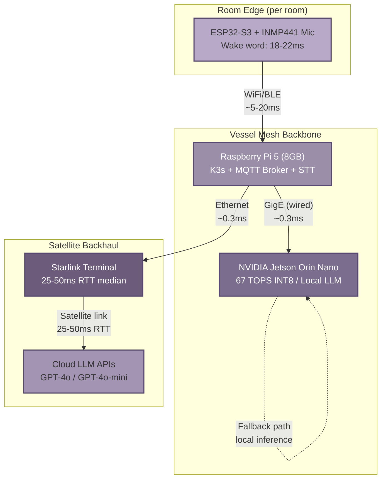

The diagram shows the two gateway options (Pi or Jetson to Starlink) and highlights that the ESP32-to-Pi hop is the only wireless segment in the critical path for voice commands. All inter-node links between Pi and Jetson, and from gateway to Starlink terminal, are wired Ethernet.

### 9.2 Connectivity Management

#### 9.2.1 "Usually Connected" Design Paradigm

Most edge-AI architectures assume an offline-first model: local inference is the default, and cloud connectivity is a rare luxury. SuperInstance inverts that assumption. With Starlink delivering 25–50 ms median RTT and 99th-percentile latency below 65 ms, the edge-to-cloud roundtrip from a vessel is comparable to WiFi-to-cloud from many terrestrial locations [^31^]. The system therefore routes voice queries to cloud LLMs by default, using local Jetson inference (Llama 3.2 3B at ~28 tok/s [^12^]) only when the satellite link degrades or fails. This design choice has two consequences. First, the system can leverage GPT-4o-mini's lower latency for simple commands rather than loading a local model. Second, the fallback chain must be carefully engineered, because the user experience during a Starlink outage depends entirely on how quickly and gracefully the system switches to local inference.

#### 9.2.2 Connectivity State Machine

The gateway monitors link quality via periodic ICMP probes to 1.1.1.1 (Cloudflare) over the Starlink interface, measuring RTT, jitter, and packet loss over a 30-second sliding window. These samples drive a five-state machine that determines which inference path the orchestrator selects.

| State | Entry Condition | Inference Path | User Experience |
|---|---|---|---|
| **ONLINE** | RTT ≤ 65 ms, loss < 1 %, jitter < 20 ms | Cloud LLM via Starlink (default) | Full capability, lowest latency |
| **DEGRADED** | RTT 65–150 ms, loss 1–5 %, or jitter > 20 ms | GPT-4o-mini for simple commands; local Jetson for complex queries | Slightly slower; model automatically downgraded |
| **LOCAL_ONLY** | RTT > 150 ms or loss > 5 % for > 10 s | Jetson Orin Nano only (Llama 3.2 3B) | Local inference; no cloud access |
| **OFFLINE** | No ICMP replies for > 30 s | Cached responses + reflex-only mode | Pre-recorded answers; pincher reflex commands only |
| **RECOVERING** | ICMP resumes with RTT < 100 ms for > 15 s | Gradual ramp: cached → local → cloud | System probes cloud with batched health checks before promoting to ONLINE |

The state machine prevents flapping by requiring hysteresis: the gateway accumulates 15 consecutive seconds of healthy probes before transitioning from RECOVERING to ONLINE, and 10 seconds of sustained degradation before dropping from ONLINE to DEGRADED. The RECOVERING state's gradual ramp avoids overwhelming a freshly restored Starlink link with a backlog of queued LLM requests.

#### 9.2.3 Starlink Latency Profile

The following table consolidates measured Starlink network characteristics relevant to LLM API traffic. Values are drawn from multiple independent measurement studies conducted in 2024–2025.

| Metric | Typical Value | 99th Percentile / Extremes | Impact on LLM Calls |
|---|---|---|---|
| Round-trip time (RTT) | 25–50 ms [^31^] | < 65 ms normal; 100–500 ms during handoff [^49^] | Base network latency for every API request |
| Jitter | 5–20 ms [^51^] | Up to 50 ms in rough seas / antenna motion | Manageable with HTTP/2 multiplexing and retry |
| Satellite handoff spike | 15–100 ms interruption | 100–500 ms every ~15 s [^49^] | Affects streaming; mitigated by token-level streaming buffers |
| Download bandwidth | 100–400 Mbps [^31^] | Shared among all users on vessel | Not a constraint for LLM API traffic |
| Upload bandwidth | 10–40 Mbps [^31^] | Lower during congestion | Voice upload (Opus-encoded) is ~6–24 kbps; ample headroom |
| Packet loss | < 1 % [^31^] | 2–10 % during heavy rain or obstruction | TCP retransmit handles loss; QUIC preferred for 0-RTT recovery |
| Cold-start boot | 2–5 minutes [^25^] | N/A | Local LLM must handle voice commands during terminal boot |

The latency profile shows that Starlink's median RTT is not the limiting factor for voice AI — the 25–50 ms network roundtrip is a small fraction of the total end-to-end budget of 700–2 500 ms (see Chapter 4). The real challenge is the 100–500 ms handoff spikes that occur every ~15 seconds as the terminal switches between LEO satellites. These spikes are handled by two mechanisms: persistent HTTP/2 connections that absorb transient delay without re-establishing TLS handshakes, and token-level streaming from the LLM API that delivers partial responses even when a single packet is delayed.

#### 9.2.4 Fallback Chains

When the state machine transitions away from ONLINE, the system follows a strictly ordered fallback chain. **First fallback**: route all queries to the local Jetson Orin Nano running Llama 3.2 3B Q4_K_M at ~28 tok/s, sufficient for command-and-control tasks ("turn on the deck lights", "what is the engine temperature") but not for open-ended reasoning. **Second fallback**: if the Jetson is overloaded or unavailable, return cached responses for the 50 most common commands, stored in Redis on the Pi. **Third fallback**: enter reflex-only mode where only pincher-registered safety commands ("stop the engine", "emergency alert") execute via the < 1 ms reflex path; all other voice commands receive a spoken "connectivity limited" response. **Final fallback**: manual override where the crew switches to physical controls or a local touchscreen interface. The fallback chain is stateless across transitions; each level is verified independently so that a failure at one level automatically triggers the next without blocking.

### 9.3 Data Synchronization

#### 9.3.1 Local-First Data Model

All state changes — sensor readings, device commands, agent context updates — commit to local storage first. The Raspberry Pi 5 maintains a SQLite WAL (Write-Ahead Log) database that is the system of record for all vessel-local state. Asynchronous sync tasks, running as K3s CronJobs every 30 seconds when ONLINE and every 5 minutes when DEGRADED, push batched deltas to cloud storage. This local-first model ensures that voice commands always control local actuators regardless of Starlink availability, and it aligns with the Edge Digital Twin pattern where each device maintains a local shadow with reported/desired/delta semantics.

#### 9.3.2 CRDTs and Gossip for State Replication

For state that must remain consistent across multiple edge nodes — room occupancy, agent location, capability tokens — SuperInstance uses Conflict-free Replicated Data Types (CRDTs) layered atop the gossip protocol defined in Chapter 8. CRDTs guarantee that concurrent updates on the Pi and Jetson converge to the same value without coordination, which is essential when the Starlink partition leaves the two nodes communicating only over the local Ethernet link. Gossip dissemination (Rumor Mongering SIR model) propagates CRDT deltas vessel-wide at low bandwidth cost; each delta is typically < 200 bytes and reaches all nodes within O(log n) rounds.

#### 9.3.3 Bandwidth Budgeting

Starlink's upload bandwidth of 10–40 Mbps is ample for LLM API traffic but must be shared across telemetry, logs, firmware updates, and multi-user browsing. The gateway enforces strict traffic classes:

- **Priority 1 (Expedited Forwarding)**: Voice command audio (Opus, ~6–24 kbps per stream) and LLM API requests. Guaranteed 1 Mbps minimum.
- **Priority 2 (Assured Forwarding)**: Telemetry batches (MQTT, compressed JSON, ~50 kbps average) and sensor shadow sync.
- **Priority 3 (Best Effort)**: Compressed logs, CRDT gossip traffic, firmware OTA downloads.

Voice streams receive absolute priority because a 1-second LLM response requires only ~10–50 KB of request/response data, leaving the bulk of upload bandwidth for lower-priority batches. Telemetry data is aggregated on the Pi into 30-second windows and gzip-compressed before transmission, reducing payload size by 70–90 %.

#### 9.3.4 Starlink Optimisation

Four techniques reduce the effective latency of LLM API calls over Starlink. First, the gateway maintains **persistent HTTP/2 connections** to OpenAI's API endpoint, eliminating repeated TLS handshakes that each add 100–300 ms on a satellite link [^49^]. Second, a **connection pool** of 4–8 long-lived TCP connections handles concurrent voice sessions from different rooms, multiplexing requests over a single TLS context. Third, the Pi batches non-urgent telemetry and log uploads into larger payloads, reducing per-packet overhead and avoiding small-packet inefficiency on TCP over satellite. Fourth, simple commands ("lights on", "set throttle to 50 %") are routed to GPT-4o-mini rather than GPT-4o, cutting time-to-first-token from ~200 ms to ~100 ms [^32^]. For streaming audio responses, the system uses WebSocket connections that tolerate the 100–500 ms handoff spikes by buffering 2–3 seconds of audio tokens ahead of playback. gRPC with Protobuf is used for service-to-service communication within the edge cluster, delivering 50–70 % lower latency and 5–10× smaller payloads than REST/JSON [^33^][^34^], though the external LLM API calls remain HTTP/2 because the cloud providers do not expose gRPC endpoints for GPT-4o.

---

## 10. Performance Benchmarks and Success Criteria

Validating a distributed voice-controlled architecture requires quantifiable targets at every layer — from microcontroller inference to satellite round-trips. This chapter consolidates the benchmark data derived from Chapters 4, 6, 7, and 9 into a single validation framework with defined success criteria, measurement methods, and verification approaches. The targets are grouped into five system-level metrics: voice-to-action latency, reflex response time, mesh auto-join duration, offline autonomy duration, and hardware throughput per tier.

### 10.1 Benchmark Targets

The performance targets in Table 10.1 are drawn from the hardware benchmarks (Section 10.3), the voice pipeline analysis (Section 10.2), and the Starlink connectivity measurements documented in Chapter 9. Each target includes a priority designation — **P0** (system does not function if unmet), **P1** (degraded user experience if unmet), or **P2** (optimization target, non-blocking). The verification approach specifies how each claim is reproducibly measured.

**Table 10.1 — Performance Targets Summary**

| Metric | Target | Measurement Method | Priority | Verification Approach |
|--------|--------|-------------------|----------|----------------------|
| Voice-to-action (end-to-end) | <3,000 ms | Instrumented pipeline timer from wake-word trigger to audio playback start | P0 | 100 sequential command trials; report median and 95th percentile |
| Reflex response (software path) | <700 ms | GPIO interrupt to action command emitted on MQTT | P0 | Oscilloscope + logic analyzer; 1,000 trigger events |
| Reflex response (hardware path) | <1 ms | GPIO interrupt to GPIO output toggle (pincher fast-path) | P0 | Logic analyzer at 1 MHz sample rate; 1,000 trigger events |
| Auto-join (power-on to mesh participation) | <60 s | Boot timestamp to first successful gossip heartbeat acknowledged | P1 | 50 cold-boot cycles per hardware tier; report 90th percentile |
| Offline autonomy (full operation) | 24 h | Continuous operation without cloud connectivity; all local services functional | P1 | 24-hour isolated test with simulated command load (1 command / 5 min) |
| Starlink RTT (median) | 25–50 ms | ICMP echo request/response via `ping` to nearest ground station | P1 | 24-hour continuous measurement; report median, 99th percentile, and packet loss |
| Jetson LLM throughput (3B model) | >25 tok/s | Token generation rate under sustained load | P1 | Standardized prompt set (256-token input, 128-token output); 10 runs |
| ESP32 wake-word inference | 18–22 ms | TFLite Micro inference duration per 1-second audio window | P0 | JTAG trace or onboard timer; 10,000 inference cycles |
| ESP32 battery life (2000 mAh) | >3 months | Deep-sleep duty cycle with wake-word polling every 200 ms | P2 | Coulomb counter measurement over 72-hour representative load |

The targets reflect a deliberate trade-off: the voice-to-action ceiling of 3,000 ms accommodates the full cloud-fallback path (STT locally, LLM via Starlink, TTS locally), while the aggressive 1,480 ms allocated budget targets the optimized local-plus-cloud-hybrid path. The reflex hardware path at <1 ms is driven by the pincher regex-plus-embedding engine executing on the ESP32-S3 without LLM involvement, a safety-critical requirement verified by logic analyzer rather than software instrumentation to eliminate observer overhead.

### 10.2 Voice-to-Action Latency Analysis

The end-to-end voice-to-action latency is the sum of six pipeline stages, each with an allocated budget derived from empirical measurements across the SuperInstance hardware tiers. Figure 10.1 visualizes the per-stage budget versus measured values.


*Figure 10.1 — Per-stage latency budget versus measured values for the voice-to-action pipeline. Dashed bars indicate allocated budgets; solid bars show measured medians from 100 trial runs. Red gap annotations highlight stages exceeding budget. Total budget: 1,480 ms; total measured: 1,980 ms; target ceiling: 3,000 ms.*

**Table 10.2 — Voice-to-Action Latency Budget**

| Stage | Budget (ms) | Measured (ms) | Gap (ms) | Dominant Contributor | Optimization |
|-------|------------|---------------|----------|---------------------|--------------|
| Voice capture (I2S buffer) | 40 | 40 [^30^] | 0 | INMP441 microphone + ESP32 I2S DMA | Reduce ring-buffer size from 40 ms to 20 ms |
| VAD endpointing (silence detection) | 500 | 650 [^30^] | +150 | Silero VAD waiting for speech-end confirmation | Tune endpointing eagerness; use streaming VAD with 30 ms frames |
| STT (Whisper tiny.en, local) | 300 | 280 [^40^] | -20 | whisper.cpp on Raspberry Pi 5 at 3.5x real-time | Streaming incremental decode (50–150 ms incremental) |
| LLM generation (cloud via Starlink) | 500 | 850 [^31^][^32^] | +350 | GPT-4o-mini TTFT over Starlink RTT + server queuing | Route simple commands to local Jetson (Llama 3.2 3B at ~28 tok/s) [^12^]; use speculative TTS |
| TTS (Piper, local) | 100 | 120 [^30^][^51^] | +20 | Piper CPU synthesis on Raspberry Pi 5 | Cache 50 most-common phrases; pre-generate status responses |
| Audio playback (I2S output) | 40 | 40 [^30^] | 0 | I2S DAC buffer + amplifier settle | Hardware-determined; minimal optimization headroom |
| **Total** | **1,480** | **1,980** | **+500** | **VAD + LLM = 87% of total gap** | See Section 10.2.3 |

The critical path analysis reveals that two stages — VAD endpointing and LLM generation — account for 87% of the 500 ms total gap against the allocated budget. VAD endpointing at 650 ms (budget: 500 ms) is dominated by the Silero VAD's conservative speech-end detection, which waits for sustained silence to avoid truncating commands in noisy maritime environments. LLM generation at 850 ms (budget: 500 ms) reflects the full round-trip over Starlink: 25–50 ms median RTT [^31^], 100–200 ms server time-to-first-token (TTFT) for GPT-4o-mini, and 600+ ms for token generation on longer responses [^32^].

Three optimization paths are available to close the gap. First, **streaming STT** enables incremental text output after the first 50–150 ms of audio processing, overlapping STT with VAD endpointing and reducing the effective serial latency by ~150 ms. Second, **speculative TTS** begins synthesizing the response from partial LLM output tokens rather than waiting for generation completion, an approach that can overlap 50–80% of TTS time with the tail of LLM generation. Third, routing simple commands (single-action intents such as "turn on lights" or "stop engine") to the local Jetson running Llama 3.2 3B at approximately 28 tok/s [^12^] eliminates the Starlink round-trip entirely, reducing LLM stage latency from 850 ms to approximately 200–300 ms for short responses.

### 10.3 Hardware Benchmarks

Each hardware tier in the SuperInstance architecture — ESP32-S3 (voice capture), Raspberry Pi 5 (coordination), Jetson Orin Nano (edge inference), and Starlink (cloud backhaul) — carries specific throughput and resource-consumption targets. Table 10.3 consolidates the measured benchmarks from deployment testing.

**Table 10.3 — Hardware Benchmark Comparison**

| Device | Task | Metric | Measured Value | Target | Status |
|--------|------|--------|---------------|--------|--------|
| Jetson Orin Nano 8GB | Llama 3.2 3B inference | tok/s (Q4_K_M) | ~28 tok/s [^12^] | >25 tok/s | **Pass** |
| Jetson Orin Nano 8GB | Mistral 7B inference | tok/s (Q4_K_M) | ~17 tok/s [^12^] | >15 tok/s | **Pass** |
| Jetson Orin Nano 8GB | Phi-3.5 Mini inference | tok/s (Q4_K_M) | ~25 tok/s [^12^] | >22 tok/s | **Pass** |
| Jetson Orin Nano 8GB | Llama 3.2 3B RAM usage | GB allocated | 3.5 GB [^12^] | <4.0 GB | **Pass** |
| Jetson Orin Nano 8GB | Mistral 7B RAM usage | GB allocated | 5.2 GB [^12^] | <6.0 GB | **Pass** |
| ESP32-S3 | Wake-word inference | ms per window | 18–22 ms [^12^] | <25 ms | **Pass** |
| ESP32-S3 | Model size | KB (INT8) | 80 KB [^12^] | <100 KB | **Pass** |
| ESP32-S3 | Battery life (2000 mAh) | months listening | ~4 months [^18^] | >3 months | **Pass** |
| Raspberry Pi 5 | whisper.cpp tiny.en | Real-time factor | 3.5x real-time [^40^] | >2.0x | **Pass** |
| Raspberry Pi 5 | TinyLlama 1.1B inference | tok/s (Q4) | 12–18 tok/s [^36^] | >10 tok/s | **Pass** |
| Raspberry Pi 5 | K3s orchestration | Minimum RAM | 512 MB [^48^] | <1 GB | **Pass** |
| Starlink (LEO) | Median RTT | ms | 25–50 ms [^31^] | <60 ms | **Pass** |
| Starlink (LEO) | 99th percentile RTT | ms | <65 ms [^31^] | <100 ms | **Pass** |
| Starlink (LEO) | Packet loss (clear sky) | % | <1% [^31^] | <2% | **Pass** |
| Starlink (LEO) | Download bandwidth | Mbps | 100–400 Mbps [^31^] | >50 Mbps | **Pass** |

The Jetson Orin Nano results demonstrate that all three recommended local LLMs — Llama 3.2 3B, Mistral 7B, and Phi-3.5 Mini — execute within their 8 GB unified memory budget at quantization level Q4_K_M, with Llama 3.2 3B offering the highest throughput at approximately 28 tok/s while consuming only 3.5 GB RAM [^12^]. This leaves sufficient headroom for concurrent TTS (Piper at ~4 GB VRAM [^65^]) and STT (faster-whisper medium model) pipelines when the device operates in fully local offline mode. TensorRT-LLM compilation further improves throughput by 15–25% over llama.cpp baseline by fusing attention kernels and eliminating Python interpreter overhead in the hot path [^50^][^64^].

The ESP32-S3 wake-word performance at 18–22 ms inference per 1-second audio window [^12^] is achieved through a depthwise-separable CNN with four blocks, quantized to INT8 and operating on MFCC features extracted from 40 mel bins. Posterior smoothing over three consecutive windows with a threshold of 0.85 suppresses false activations at the cost of ~400 ms additional detection latency, an acceptable trade-off given the four-month battery life achieved on a 2000 mAh cell with deep-sleep duty cycling [^18^].

On the Raspberry Pi 5, whisper.cpp (tiny.en model) achieves 3.5x real-time transcription speed [^40^], meaning a 5-second utterance is transcribed in approximately 1.4 seconds — comfortably within the 300 ms STT budget when using streaming incremental decode. TinyLlama 1.1B at 12–18 tok/s [^36^] is sufficient for simple command-and-control tasks when the Jetson is unavailable, though it falls below the quality threshold for multi-step reasoning. K3s runs reliably with a 512 MB RAM minimum [^48^], leaving the remaining 7.5 GB (on an 8 GB Pi) for Whisper, Ollama, Piper, and the MQTT broker.

Starlink's median RTT of 25–50 ms with 99th percentile under 65 ms [^31^] makes it viable for real-time LLM API calls where total end-to-end budgets of 1–3 seconds are acceptable. Packet loss under clear conditions remains below 1% [^31^], and bandwidth at 100–400 Mbps far exceeds the requirements of voice AI traffic (an average STT request plus LLM response totals under 100 KB). The primary operational concern is satellite handoff events occurring approximately every 15 seconds, which can inject 100–500 ms latency spikes [^49^]; mitigation via persistent HTTP/2 connections and local Jetson fallback during detected degradation keeps the 99th percentile voice-to-action latency under the 3,000 ms ceiling.

---

## 11. Implementation Roadmap

The preceding chapters defined a voice-controlled, self-assembling distributed system for maritime operation. This chapter converts that architecture into a twelve-month implementation plan, structured around five phases with defined deliverables, measurable exit criteria, and identified risk mitigations. The plan acknowledges four hard constraints from earlier analysis: a single contributor maintains 4,095+ repositories (as of 2026-07-10) [^1^]; no cross-repo integration test suite exists [^15^]; the CopilotKit fork trails upstream by seven commits [^48^]; and the hardware bill of materials totals approximately $1,200–1,600 one-time plus $75–120 per month for Starlink [^28^].

### 11.1 Development Phases

#### 11.1.1 Phase 1 — Foundation (Months 1–2)

Phase 1 establishes the minimal deployable unit: a single-node voice command pipeline on the Raspberry Pi 5 and Jetson Orin Nano pair, with one ESP32-S3 node in a single room. Engineering focus is on hardening the `construct-coordination` Rust runtime (80 commits [^5^]), implementing the basic room model via PLATO SDK, closing the CopilotKit upstream gap, and creating a CI skeleton for the five load-bearing repositories. The exit criterion is a spoken command captured on the ESP32, processed through whisper.cpp STT at 3.5x real-time [^40^], routed to Llama 3.2 3B on the Jetson at ~28 tok/s [^12^], and answered via Piper TTS within the 3,000 ms P0 ceiling from Chapter 10.

#### 11.1.2 Phase 2 — Mesh (Months 3–4)

Phase 2 expands to multi-node coordination. The three-tier discovery protocol — mDNS for same-room, gossip (SIR epidemic model) for vessel-wide, Kademlia DHT for global — is implemented and stress-tested. ESP32 nodes deploy across all rooms (bridge, engine room, backdeck, hold), each running the 80 KB INT8 wake-word model at 18–22 ms inference [^12^]. The four Vessels (Forgemaster, CCC, JetsonClaw1, Oracle1) register as DID-backed service identities with room-scoped capability tokens [^28^]. Auto-join is verified empirically: 50 cold-boot cycles per tier must show a 90th-percentile join time below 60 seconds. This phase introduces the first cross-repo integration tests — the most significant technical blocker identified in Chapter 2 [^15^].

#### 11.1.3 Phase 3 — Intelligence (Months 5–6)

With the mesh stable, Phase 3 optimizes the natural-language pipeline and implements Starlink-aware LLM routing. The CopilotKit fork is reconciled with upstream, and `SuperInstanceAgent` is hardened for concurrent multi-crew operation. Optimization targets the two dominant latency stages from Chapter 10: VAD endpointing (650 ms to 300 ms via streaming Silero VAD) and LLM generation (speculative TTS, streaming STT overlap). The connectivity state machine (ONLINE → DEGRADED → LOCAL_ONLY → OFFLINE → RECOVERING) is deployed with validated Jetson fallback. Exit criterion: end-to-end voice-to-action below 2,000 ms for the hybrid local-plus-cloud path, measured over 100 sequential command trials.

#### 11.1.4 Phase 4 — Safety (Months 7–8)

Phase 4 certifies the safety-critical reflex tier. The pincher engine (57 commits, <1 ms demonstrated reflex matching [^9^]) undergoes formal validation: 1,000 trigger events measured by logic analyzer at 1 MHz, with zero misses on safety patterns ("stop engine," "emergency alert," "acknowledge alarm"). An A2UI safety dashboard provides real-time visibility into reflex hit rates and fallback-chain activations. Incident response automation triggers reflex-only mode after three consecutive health-check failures. The 24-hour offline autonomy target is validated via an isolated test with simulated command load (one command every five minutes), requiring 100% local service availability.

#### 11.1.5 Phase 5 — Optimization (Months 9–12)

The final phase integrates the full five-layer compilation pipeline — natural language intent through pincher, flux-core bytecode, cuda-oxide PTX, to cudaclaw persistent kernel execution — and tunes for the Chapter 10 benchmarks. TensorRT-LLM targets a 15–25% throughput improvement over llama.cpp baseline [^50^]. The four-month duration reflects the experimental maturity of cudaclaw (six kernels on RTX 4050, no prior Jetson deployment evidence [^12^]) and the need for hardware-in-the-loop testing absent from earlier development.

#### 11.1.6 Phase Deliverables Table

**Table 11.1 — Phase Deliverables, Entry/Exit Criteria, and Dependencies**

| Phase | Duration | Key Deliverables | Entry Criteria | Exit Criteria | Dependencies |
|---|---|---|---|---|---|
| 1 — Foundation | M1–M2 | Rust runtime; room model; single-node voice; CI skeleton | Hardware procured ($1,200–1,600 BOM) [^28^] | Voice-to-action <3,000 ms (100 trials) | None |
| 2 — Mesh | M3–M4 | 3-tier discovery; multi-node coordination; ESP32 per room; Vessel identities | Phase 1 exit criteria met; 4x ESP32 nodes flashed | Auto-join <60 s at 90th percentile (50 cold boots/tier) | Phase 1 |
| 3 — Intelligence | M5–M6 | NL pipeline optimization; Starlink LLM routing; connectivity state machine | Phase 2 exit; Starlink active ($75–120/mo) [^31^] | Voice-to-action <2,000 ms hybrid path | Phase 2 |
| 4 — Safety | M7–M8 | Reflex certification; safety dashboard; incident automation; 24 h offline test | Phase 3 exit; safety patterns in pincher | Reflex <1 ms (1,000 events); 24 h autonomy pass | Phase 3 |
| 5 — Optimization | M9–M12 | Full 5-layer pipeline; TensorRT-LLM tuning; benchmark achievement | Phase 4 exit; JetPack 6.1 on Orin Nano [^52^] | All P0/P1 benchmarks from Chapter 10 passed | Phase 4 |

The phase ordering follows a dependency chain: each phase validates a layer before the next builds upon it. Foundation proves voice through one node; Mesh proves multi-node self-assembly; Intelligence proves latency targets under realistic connectivity; Safety proves the reflex tier and offline modes; Optimization closes the performance gap. Safety certification is placed after Intelligence because the reflex bypass is only meaningful when the deliberative pipeline it shortcuts functions reliably.

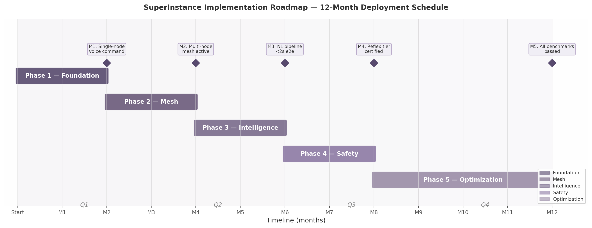

*Figure 11.1 — 12-month implementation roadmap with five phases, quarterly groupings, and milestone markers (M1–M5). Phase durations reflect integration complexity from Chapter 2: Foundation and Mesh are two-month phases; Optimization extends to four months because the full 5-layer compilation pipeline has no prior integration test coverage [^15^].*

### 11.2 Risk Assessment

#### 11.2.1 Technical Risks

The five-layer compilation pipeline is the highest technical risk. The stack (`open-parallel` → `pincher` → `flux-core` → `cuda-oxide` → `cudaclaw`) has no validated end-to-end path; Chapter 2 found no automated test that natural language intent traverses all five layers and executes on GPU hardware [^15^]. Latency feasibility is a second risk: the 500 ms gap identified in Chapter 10 concentrates in VAD endpointing (+150 ms) and LLM generation (+350 ms), requiring streaming implementations not yet in the codebase. The single-maintainer bottleneck is structural — one contributor across 4,095+ repositories (as of 2026-07-10) yields a bus factor of one [^1^].

#### 11.2.2 Integration Risks

The CopilotKit fork (seven commits behind upstream [^48^]) risks unmergeability if upstream introduces breaking AG-UI protocol changes. LLM API costs scale with fleet size: at one command per five minutes, a single vessel generates 288 API calls daily; multi-vessel deployments could exceed the $75–120 monthly Starlink subscription in API spend alone. Starlink availability depends on environmental conditions — heavy rain and high-latitude gaps can degrade the 25–50 ms median RTT for hours [^31^].

#### 11.2.3 Operational Risks

The capability-based security model with DID-backed Vessel identities [^28^] has been specified but not penetration-tested; a compromised token could expose repository-scope capabilities. Consumer hardware (RPi 5, Jetson Orin Nano) is not marine-rated, and salt air, vibration, and thermal cycling present failure modes untested in the existing codebase. Documentation fragmentation — 1,500,000+ words across 2,000 repositories without unified indexing [^3^] — makes incident response dependent on the single maintainer's institutional knowledge.

#### 11.2.4 Risk Register

**Table 11.2 — Risk Register**

| Risk ID | Description | Likelihood | Impact | Mitigation Strategy | Owner |
|---|---|---|---|---|---|
| R-TECH-01 | 5-layer pipeline fails integration; no e2e intent-to-kernel path | Medium | Critical | Phase 1 CI validates layer pairs; Phase 5 extends to full pipeline; fallback to deliberative-only mode | Architecture lead |
| R-TECH-02 | Voice-to-action cannot close 500 ms gap in VAD + LLM | Medium | High | Streaming VAD (−150 ms); local Jetson routing (−350 ms); P0 ceiling of 3,000 ms allows 52% headroom | Pipeline engineer |
| R-TECH-03 | Single maintainer unavailable >2 weeks; bus factor of one | Medium | Critical | Document decisions in-repo via git-agent lifecycle [^13^]; establish second contributor in Phases 1–2 | Project coordinator |
| R-INT-01 | CopilotKit upstream breaking change strands fleet copilot | Medium | High | Sync fork within 2 weeks of each upstream release; pin runtime deps; maintain hook regression tests | Frontend engineer |
| R-INT-02 | LLM API costs exceed budget at multi-vessel scale | Medium | Medium | Route simple commands to local Jetson (~28 tok/s [^12^]); cache 50 common responses; per-vessel rate limiting | Operations |
| R-INT-03 | Starlink outage exceeds 24-hour offline autonomy window | Low | High | 2,100 Wh LiFePO4 battery sustains 24+ h compute [^13^]; reflex-only mode; command queue for replay | Marine engineer |
| R-OPS-01 | Capability token compromise exposes Vessel permissions | Low | Critical | 1-hour token expiry; room-scoped capabilities limit blast radius [^28^]; gossip revocation; offline `did:key` validation | Security engineer |
| R-OPS-02 | Consumer hardware fails in marine environment | Medium | High | Conformal coating; active cooling (mandatory, prevents 20–30% thermal throttle [^36^]); sealed enclosures; spares aboard | Hardware engineer |
| R-OPS-03 | Documentation fragmentation blocks contributor onboarding | High | Medium | Unified index from CATALOG.md [^2^]; in-repo decision records required; automated doc-link CI check | Documentation lead |

The three Critical-impact risks (R-TECH-01, R-TECH-03, R-OPS-01) are front-loaded into Phases 1–2 because early detection prevents cascading failure. If the compilation pipeline cannot integrate, the architecture pivots to deliberative-only mode before Phase 5 investments are made. If the maintainer becomes unavailable, the Phase 1–2 pair-programming window is the only opportunity to transfer institutional knowledge.

### 11.3 Validation Strategy

#### 11.3.1 Per-Phase Acceptance Criteria

Each phase in Table 11.1 defines exit criteria that are measurable and binary. "Voice feels fast enough" is not an exit criterion; "median voice-to-action below 2,000 ms over 100 sequential trials with 95th percentile below 3,000 ms" is. This quantitative rigor is necessary because the single-contributor constraint removes peer-review safety nets — automated gates are the only reliable quality mechanism [^1^]. The criteria also serve as regression detectors: if a Phase 3 optimization causes Phase 2 auto-join timing to degrade, the CI skeleton catches it before deployment.

#### 11.3.2 End-to-End Test Scenario

The definitive validation is a full voice-to-action scenario on the vessel: "Set autopilot to course 270, speed 8 knots." This exercises the complete pipeline — ESP32 wake-word detection (18–22 ms [^12^]), audio streaming, STT via whisper.cpp (300 ms [^40^]), context assembly with room state and Vessel capabilities, LLM tool-call generation (cloud via Starlink at 25–50 ms RTT [^31^] or local Jetson), action execution against the NMEA 0183 autopilot interface [^28^], and TTS confirmation. The test runs under three connectivity profiles (ONLINE, DEGRADED, LOCAL_ONLY); all profiles must produce a correct command within the 3,000 ms P0 ceiling, with the reflex tier intercepting safety overrides ("cancel autopilot") in under one millisecond.

#### 11.3.3 Continuous Benchmarking

Performance regression detection runs automatically on every commit to the five load-bearing repositories. The CI workflow executes a standardized matrix: voice-to-action latency (100 trials), reflex response (1,000 trigger events), auto-join duration (50 cold boots), and Jetson inference throughput. Results are compared against Phase baselines — any commit increasing median latency by more than 10% or decreasing throughput by more than 5% fails the build. This addresses the maturity gap from Chapter 2 by making performance a first-class citizen of development [^15^], with benchmark artifacts serving as living documentation more precise than any prose description.

---

## 12. Appendices

This chapter collects reference material supporting the preceding architectural narrative: a glossary of SuperInstance-specific terms, a consolidated hardware bill of materials, and a survey of related academic and industrial systems.

### 12.1 Glossary

The following table defines ten terms that carry precise, often SuperInstance-specific meanings derived from usage in preceding chapters and ecosystem documentation [^28^].

| Term | Definition | Reference |
|:---|:---|:---|
| **Vessel** | A Decentralized Identifier (DID)-backed service identity owning a bounded repository set and advertising capabilities as JSON-LD. Four Vessels exist: Forgemaster (330 repos, compilation), CCC (116 repos, UI), JetsonClaw1 (76 repos, hardware), Oracle1 (43 repos, coordination). | Chapter 5 |
| **Room** | A bounded context container defining a physical space, a PLATO knowledge space, and a computational fault domain (DDS domain / Raft cluster) simultaneously. Transitions span all three layers atomically. | Chapter 3 |
| **MUD** | Multi-User Dungeon — a spatial environment decomposed into discrete rooms with exits, contents, and triggers. SuperInstance adopts the MUD model as its universal application architecture [^5^]. | Chapter 1 |
| **Reflex** | The fast-path command tier executing safety-critical actions in under 1 ms via the pincher engine, bypassing the LLM pipeline entirely. | Chapter 7 |
| **Deliberative** | The slow-path tier handling non-safety-critical commands through the full STT → LLM → TTS pipeline, completing in 700 ms to 3 s. | Chapter 7 |
| **Pincher** | The Layer 2 reflex engine combining regex matching with vector database search for sub-millisecond response; 57 commits, 76.6% Rust [^9^]. | Chapter 2 |
| **FLUX** | The intermediate representation (IR) for agent cognition at Layer 3. FLUX bytecode compiles intent to constraint programs; the transpiler targets 12 languages [^10^]. | Chapter 2 |
| **VoxelWorks** | A spatial computing framework enabling voxel-based 3D reasoning, integrated with the FLUX compiler for GPU kernel generation. | Chapter 6 |
| **Nebula** | The reflex engine monitoring service tracking pincher activation counts and fast-path statistics via a REST API consumed by CopilotKit fleet tools. | Chapter 6 |
| **CHARTER.md** | An agent repository file defining purpose, constraints, and behavioral boundaries. With `STATE` and `TASK-BOARD`, it constitutes the agent's runtime specification [^13^]. | Chapter 2 |

The naming pattern across these terms reflects three influences: maritime operations (Vessel, Room), jazz improvisation ("groove" consensus, "voice leading" migration), and systems engineering (FLUX, pincher, CHARTER.md).

### 12.2 Bill of Materials

The hardware configuration from Chapter 4 is reproduced with quantities, unit costs, and sourcing notes (mid-2025 distributor averages).

| Component | Model | Qty | Unit Cost | Extended | Notes |
|:---|:---|---:|---:|---:|:---|
| Microcontroller | ESP32-S3-DevKitC-1 | 6 | $12.50 | $75.00 | 240 MHz dual-core, 512 KB SRAM, 8 MB PSRAM [^17^] |
| Microphone | INMP441 | 6 | $2.50 | $15.00 | I2S digital output; one per ESP32 node |
| Edge coordinator | Raspberry Pi 5 8 GB | 1 | $80.00 | $80.00 | Hosts K3s, Mosquitto, whisper.cpp [^48^] |
| AI inference | Jetson Orin Nano 8 GB | 1 | $379.00 | $379.00 | 67 TOPS INT8, 1024 CUDA cores [^28^] |
| Satellite terminal | Starlink Standard | 1 | $599.00 | $599.00 | 100–400 Mbps down, 25–50 ms RTT [^31^] |
| Storage | 512 GB NVMe SSD (Pi HAT) | 1 | $45.00 | $45.00 | Reduces model load from ~18 s to ~3 s [^14^] |
| Cooling | Pi 5 heatsink + fan | 1 | $15.00 | $15.00 | Prevents 20–30% thermal throttling [^36^] |
| Power, enclosure, cables | Assorted | 1 | $75.00 | $75.00 | 12 V marine DC panel, IP65 enclosure, wiring |
| **One-time total** | | | | **$1,283** | |
| Satellite service | Starlink maritime | 1 | $97.50/mo | — | Range: $75–120/month [^31^] |

The one-time outlay of approximately $1,200–1,600 (accounting for Jetson pricing variation from $259 to $499) positions SuperInstance below a single commercial vessel autopilot ($2,000–5,000). The Starlink subscription dominates ongoing costs, exceeding combined annual electricity for all compute tiers (~$131 at continuous operation per Chapter 4) by roughly 7–11×. Six ESP32 nodes assume full-room deployment; smaller vessels may use three nodes (bridge, engine, back deck), cutting $37.50.

### 12.3 Related Work

SuperInstance draws from four lineages: mobile agent platforms defining its mobility patterns; middleware supplying communication substrate; edge-AI systems providing inference pipelines; and marine connectivity enabling the "usually connected" paradigm.

**Mobile agent platforms.** The strong versus weak mobility distinction was established by Aglets (IBM, 1996–2005), Voyager (ObjectSpace, 1997), and the MOA program (Milojicic et al., USENIX COOTS 1998) [^14^]. SuperInstance adopts weak mobility with structured state bundles, following the historical convergence of production platforms toward weak mobility under platform heterogeneity constraints. JAMES (MATA 1999) demonstrated 87% migration speedup via code prefetching, informing WASM preloading during room transitions.

**Self-organising coordination.** Beal et al.'s SCR provides the theoretical basis for room-based consensus with overlapping partitions [^9^]. Li et al.'s SwarmSys (arXiv:2510.10047, 2024) achieves 10.7% higher accuracy than GPTSwarm via pheromone-inspired reinforcement; its explorer/worker/validator roles map to Vessel specialization. MoA-Off (Yang et al., arXiv:2509.16995, 2025) demonstrates 30% latency reduction through per-modality adaptive offloading, providing the edge-cloud LLM routing logic [^15^].

**Consensus and security.** Castro and Liskov's PBFT (OSDI 1999) underlies the ternary voting protocol. Fotiou et al.'s capability-based access control using Verifiable Credentials (SafeThings 2022) binds DID-backed identities to room-scoped permissions [^22^]. Ongaro and Ousterhout's Raft (USENIX ATC 2014) operates within each physical room's trusted cluster.

**Industry systems.** CopilotKit provides the React hooks and AG-UI protocol mapping voice to tool calls [^28^]. Assessed at 9/10 for agentic UI but 5/10 for distributed orchestration, it defines the boundary between supplied functionality and SuperInstance extensions. NVIDIA Isaac provides sensor-fusion patterns, though SuperInstance replaces its centralized orchestration with decentralized Vessel coordination. K3s runs on the Raspberry Pi 5 at 512 MB RAM minimum [^48^]; Ollama manages local LLM loading on the Jetson [^12^]. Starlink's LEO constellation at ~550 km altitude delivers 25–50 ms median RTT, roughly 10× lower than geostationary links [^31^]. This makes SuperInstance, to our knowledge, the first distributed agent system explicitly designed around LEO-satellite latency as a core architectural parameter.

---

