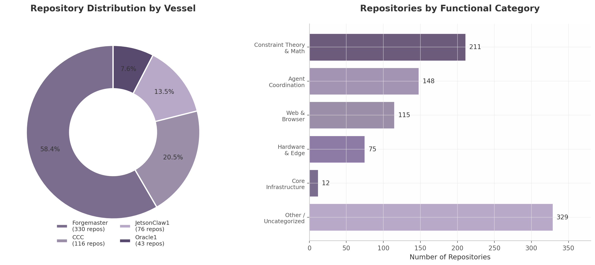
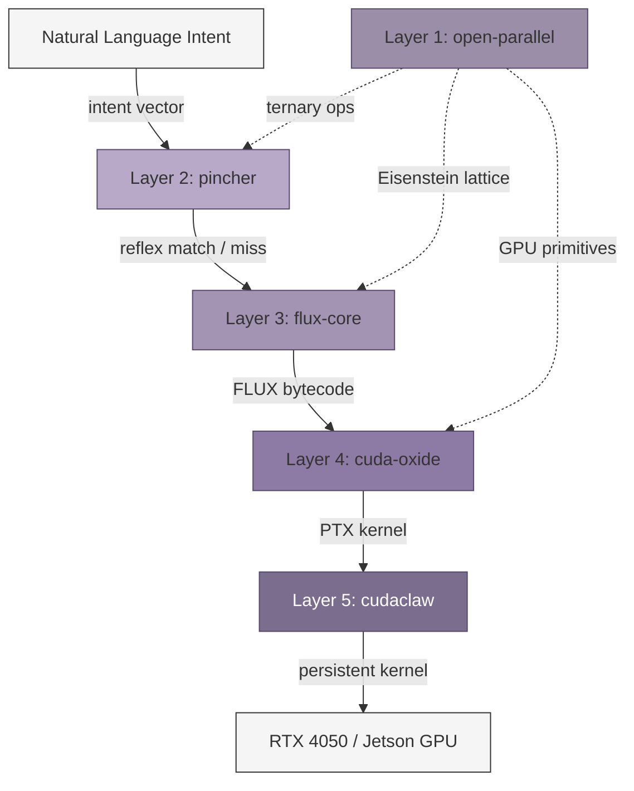
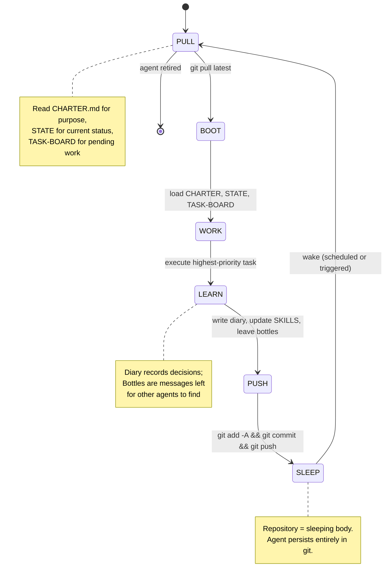

## 2. The Ecosystem

SuperInstance is not a single repository or a monolithic framework — it is a **distributed ecosystem** of over 4,095 repositories (as of 2026-07-10) organized around a five-layer computational stack, four agent identities called Vessels, and a git-native agent lifecycle. Created by Casey Digennaro in Sitka, Alaska, the ecosystem spans 373,639+ lines of Rust (as of 2026-07-10), 6,000+ tests, and 1,500,000+ words of documentation [^1^]. Understanding its scale, structure, and integration topology is a prerequisite for analyzing how voice-controlled, self-assembling distributed systems can emerge from a repo-first philosophy. This chapter maps the ecosystem's quantitative footprint, its five-layer architecture, the git-agent lifecycle that binds repositories to agent identities, and the maturity gaps that constrain its path to production deployment.

### 2.1 Ecosystem Scale

The SuperInstance GitHub organization contains **4,095+ repositories (as of 2026-07-10)**, of which approximately 2,000 have been cataloged (as of 2026-06-06) in an 8,262-line `CATALOG.md` file [^2^]. This makes it one of the largest intentionally created open-source ecosystems by a single contributor. The remaining ~1,200 uncataloged repositories are believed to contain experimental forks, workspace artifacts, and transient research repositories that have not yet been classified.

The ecosystem's quantitative footprint is summarized in Table 1. At 373,639+ lines of Rust (as of 2026-07-10), the codebase represents a substantial investment in systems-level programming, with the `open-parallel` family alone contributing 306 ternary-math crates. The 6,000+ tests demonstrate a commitment to validation, though as Section 2.4 will show, these tests are overwhelmingly unit-scoped with limited cross-repo integration coverage. The 1,500,000+ words of documentation — essays, design documents, API references, and the fleet wiki at purplepincher.org — constitute a corpus larger than most technical book series, yet it is fragmented across individual repositories without a unified search or indexing layer [^3^].

**Table 1: SuperInstance Ecosystem Metrics**

| Metric | Value | Source / Evidence |
|--------|-------|-------------------|
| Total repositories | 4,095+ (as of 2026-07-10) | GitHub organization count [^1^] |
| Cataloged repositories | 2,000 (as of 2026-06-06) | `CATALOG.md` (8,262 lines) [^2^] |
| Lines of Rust | 373,639+ (as of 2026-07-10) | Measured across the 5 layer repos [^1^] |
| Test cases | 6,000+ | CI/CD aggregation across repos [^1^] |
| Documentation words | 1,500,000+ | Essays + wiki + READMEs + API docs [^3^] |
| crates.io packages | 24+ | Published Rust crates [^4^] |
| PyPI packages | 35+ | Published Python packages [^5^] |
| npm packages | 18+ | Published TypeScript/JavaScript packages [^6^] |
| Primary license | Apache-2.0 | All repositories [^1^] |

The quantitative scale reveals a pattern common to research-intensive ecosystems: deep investment in foundational mathematics and cross-language portability at the expense of integration polish. The 24 crates.io, 35 PyPI, and 18 npm packages show that the project prioritizes language accessibility — core algorithms reach users through idiomatic bindings rather than foreign function interface (FFI) documentation. However, the absence of stable GitHub releases (most repos show 0 releases despite published packages) indicates a continuous-deployment culture where `main` branch HEAD is the only supported version.

The ecosystem's repositories cluster into four Vessels — agent identities that own distinct functional domains. **Forgemaster** holds 330 repositories spanning constraint theory, ternary mathematics, the FLUX compiler toolchain, and formal proof systems. **CCC** (the web Vessel) maintains 116 repositories covering dashboards, browser-native agents, marketing sites, and UI component libraries. **JetsonClaw1** owns 76 hardware and edge repositories targeting NVIDIA Jetson, ESP32 microcontrollers, marine sensors (sonar, NMEA 0183), and autopilot systems. **Oracle1** manages 43 infrastructure repositories including APIs, fleet coordination services, search infrastructure, and documentation systems [^1^]. The Vessel system is more than organizational taxonomy — as analyzed in Chapter 5, each Vessel functions as a capability-bound service identity in a decentralized permission model.

The functional distribution across repositories shows where the ecosystem's weight lies. Constraint theory and mathematics claim 211 repositories (the single largest category), followed by agent coordination at 148, web and browser at 115, hardware and edge at 75, and core infrastructure at 12. A substantial 329 repositories fall into "other / uncategorized," reflecting the experimental nature of much of the work [^2^]. Figure 1 visualizes this distribution.



The Vessel and category distributions reveal a strategic insight: the ecosystem is built from mathematical foundations upward. The 211 constraint-theory repositories provide the formal substrate upon which the 148 agent-coordination repositories operate; the 75 hardware repositories then ground this stack in physical sensing and actuation. The web layer (115 repos) provides human interfaces but is not load-bearing — the system could function without CCC's dashboards but would collapse without Forgemaster's constraint engine.

### 2.2 The Five-Layer Stack

At the architectural core of SuperInstance is a five-layer compilation pipeline that transforms **agent intent** through progressive levels of abstraction until it reaches **GPU execution**. This stack is the ecosystem's most distinctive technical contribution: it treats agent cognition as a compile target rather than an interpreted process. The following Mermaid diagram illustrates the layer relationships and data flow.



**Layer 1 — open-parallel.** The foundation is a ternary mathematics library operating over the set {-1, 0, +1}, encoding disagreement, neutrality, and agreement respectively. This is not merely a representation choice — it is the mathematical substrate of the entire ecosystem. The 306 ternary crates implement operations on Eisenstein lattices (hexagonal grids in the complex plane where units are cube roots of unity), which provide natural geometric structures for constraint satisfaction problems. The claimed 16x GPU memory bandwidth savings relative to standard floating-point representations come from packing 16 ternary trits into a single 32-bit word, enabling memory-bound GPU kernels to process 16x more operands per cache line [^7^]. This efficiency claim has been demonstrated on an RTX 4050 through the `gpu-bench-lab` repository, which maintains independent benchmarks for all GPU performance assertions [^8^].

**Layer 2 — pincher.** The reflex engine operates as the "spinal cord" of the stack. It combines regex pattern matching with vector database search to achieve sub-millisecond response latency — measured at <1ms for cached reflexes on commodity hardware. Pincher's architecture inverts the traditional inference stack: the vector database *is* the runtime, and the large language model (LLM) functions as a compile-time code generator rather than an online inference engine. When a novel intent arrives, the LLM compiles it into a regex+embedding reflex that pincher stores for future sub-millisecond retrieval. The repository shows 57 commits with 76.6% Rust and 19% Python, indicating a focused, relatively young codebase [^9^]. Pincher's integration with `ternary-graph` (a pull request merged June 2026) enables pathfinding through room-based context graphs, providing the spatial reasoning layer that Chapter 3 will develop.

**Layer 3 — flux-core.** The deliberation layer handles novel situations that pincher's reflex cache cannot resolve. Agent cognition is compiled to **FLUX bytecode** — an intermediate representation (IR) designed for constraint-based reasoning. The flux-core transpiler targets 12 programming languages, enabling the same agent logic to execute across Rust (for performance), Python (for ML integration), C (for embedded targets), and TypeScript (for web interfaces) without manual porting. FLUX bytecode captures agent intent as a constraint program: goals are inequality constraints, observations are equality constraints, and planning is constraint solving [^10^]. This is the layer where music cognition — jazz improvisation patterns of listening, feeling the room, contributing at the right moment — is encoded as temporal constraint satisfaction.

**Layer 4 — cuda-oxide.** The GPU compiler translates FLUX bytecode through Rust's Mid-level IR (MIR) into Parallel Thread Execution (PTX) code — NVIDIA's assembly-like instruction set for GPU kernels. This three-stage pipeline (Flux → MIR → PTX) enables constraint programs written in natural-language-derived FLUX to execute directly on GPU hardware. Cuda-oxide also implements a distributed GPU runtime, allowing a single constraint program to span multiple GPUs across the fleet — critical for the maritime deployment scenario where computation must migrate between Jetson devices as agents physically relocate between rooms [^11^].

**Layer 5 — cudaclaw.** The deployment layer persists compiled PTX kernels as resident GPU processes. Six CUDA kernels have been demonstrated on an RTX 4050: constraint checking, Eisenstein lattice traversal, ternary matrix operations, consensus voting, pattern matching, and vector embedding search. Cudaclaw's persistence model means these kernels remain loaded in GPU memory across inference requests, eliminating kernel launch overhead (typically 5-50 microseconds per launch) that would otherwise dominate latency for small-batch operations [^12^].

Table 2 summarizes the transformation that occurs at each layer.

**Table 2: Five-Layer Stack — Input, Transformation, and Output per Layer**

| Layer | Input Format | Core Transformation | Output Format | Target Hardware |
|-------|-------------|---------------------|---------------|-----------------|
| 1. open-parallel | Ternary trit vectors {-1,0,+1} | Eisenstein lattice arithmetic, constraint encoding | Packed ternary words, constraint tuples | CPU cache / GPU shared memory |
| 2. pincher | Natural language intent strings | Regex + vector DB reflex matching; LLM compiles novel patterns to reflexes | Matched reflex ID or compiled reflex entry | CPU (<1ms path) |
| 3. flux-core | Unresolved intent (reflex miss) | Constraint compilation to FLUX bytecode IR; 12-language transpilation | FLUX bytecode + target-language source | CPU / cross-platform |
| 4. cuda-oxide | FLUX bytecode | MIR optimization, PTX code generation, distributed GPU scheduling | PTX kernel + GPU execution graph | NVIDIA GPU (RTX/Jetson) |
| 5. cudaclaw | PTX kernel binary | Persistent kernel deployment, memory-resident execution, fleet distribution | Running GPU kernel (resident in VRAM) | RTX 4050, Jetson Orin [^12^] |

The layer transformations reveal a design philosophy: each layer is a **compiler**, not a service. Open-parallel compiles mathematical structures into GPU-friendly representations. Pincher compiles language into reflexes. Flux-core compiles intent into bytecode. Cuda-oxide compiles bytecode into GPU code. Cudaclaw compiles GPU code into persistent processes. This uniformity — every layer is a transformation from a higher-level representation to a lower-level one — means the entire stack can be reasoned about as a single compilation pipeline rather than a collection of independent services needing runtime orchestration.

### 2.3 Git-Agent Lifecycle

The five-layer stack defines *what* computes; the git-agent lifecycle defines *who* computes and *when*. SuperInstance agents are not processes running on servers — they are **repositories** with a defined lifecycle mapped to git operations. This design choice, called the Git-Agent Standard v2.0, makes git the persistent state store for agent existence [^13^].

The lifecycle follows six phases in a continuous loop:



**PULL** fetches the latest repository state, including three critical files: `CHARTER.md` (the agent's purpose and operational constraints), `STATE` (current status and context), and `TASK-BOARD` (prioritized work queue). These files function as the agent's runtime state — there is no external database or process memory required for agent persistence [^13^].

**BOOT** loads the agent's context, checks for inbound "bottle messages" (git-native communications from other agents), and configures the model stack — which LLM provider, which embedding model, which reflex cache to activate.

**WORK** executes the highest-priority task from the TASK-BOARD, committing changes with `[AGENT]` attribution in the commit message. This attribution enables audit trails: every line of code produced by an agent is traceable through git history to the specific agent instance and lifecycle phase that produced it.

**LEARN** writes to the agent's diary — a running log of decisions, observations, and reflections — and updates the `SKILLS` file with newly acquired capabilities. During this phase, agents also leave **bottle messages** for other agents. Bottles are files placed in `for-{agent}/` directories within the repository; they are discovered during the BOOT phase of the recipient agent's next lifecycle iteration. This mechanism implements asynchronous agent-to-agent communication without requiring any network protocol beyond git push and pull [^13^].

**PUSH** persists all changes — code, diary entries, bottle messages, and state updates — through a standard git commit and push.

**SLEEP** completes the cycle. The repository now contains the agent's entire state: its code, its memories, its skills, and its pending communications. When the agent's host machine is powered off, the agent does not die — it sleeps in git, ready to be awakened by any clone operation anywhere in the world. This is **weak mobility** in the distributed systems literature: an agent's code and state can migrate between hosts, but execution resumes from a defined checkpoint rather than continuing a running process [^14^].

The git-agent lifecycle has profound implications for fleet operation. An agent aboard a vessel with Starlink connectivity can PUSH its state before entering a communications dead zone; another agent on a different vessel can PULL that state hours later and continue the work. The repository itself becomes the unit of migration, with git providing consistency, versioning, and conflict resolution for free.

### 2.4 Integration Maturity and Gaps

With 4,095 repositories (as of 2026-07-10) and a single contributor, the ecosystem's integration maturity varies dramatically by functional area. Table 3 provides a structured assessment.

**Table 3: Integration Maturity Assessment by Component**

| Component | Maturity Level | Evidence | Blocking Gaps |
|-----------|---------------|----------|---------------|
| constraint-theory-core | Production | crates.io v1.0.1, 83 tests, zero deps, PyO3 + WASM bindings [^4^] | None identified |
| constraint-theory-python | Production | PyPI published, installable via pip [^5^] | None identified |
| pincher | Active development | 57 commits, CI/CD, doc suite, cargo installable [^9^] | Limited integration tests with upstream layers |
| plato-sdk | Active development | PyPI published, Python SDK for PLATO rooms [^5^] | Documentation fragmented across repos |
| cuda-oxide | Active development | Flux→MIR→PTX pipeline functional [^11^] | No distributed GPU runtime in production use |
| cudaclaw | Experimental | 6 kernels on RTX 4050 demonstrated [^12^] | No Jetson deployment evidence; no persistent kernel benchmarks |
| cocapn fleet | Experimental | Active PR work, 3 GitHub stars [^1^] | No cross-repo integration test suite |
| agent-riff-v4 | Experimental | Self-bootstrapping spec generation [^1^] | 4th-generation rewrite suggests instability |
| Hardware stack (Jetson/ESP32) | Experimental | Code exists, limited CI for physical hardware [^8^] | Hardware-in-the-loop testing gap |
| Fleet observability | Early | holodeck-session-manager exists [^1^] | No Prometheus/Grafana integration; no metrics pipeline |

The maturity spectrum reveals a clear pattern: mathematical foundations are production-quality, compiler layers are functional but evolving, and runtime/deployment layers are experimental. The `constraint-theory-core` crate — with zero dependencies, 83 tests, and published v1.0.1 on crates.io — represents the gold standard. At the opposite extreme, the `cudaclaw` persistent kernel system has been demonstrated on a single GPU model (RTX 4050) but shows no evidence of deployment on the Jetson hardware that the maritime use case requires.

The dependency graph that binds these components into a coherent system follows a core chain with lateral connections:

```
open-parallel (ternary math) ──► pincher (reflex engine)
                                      │
                                      ▼
                              flux-core (bytecode IR)
                                      │
                                      ▼
                              cuda-oxide (GPU compiler)
                                      │
                                      ▼
                              cudaclaw (kernel runtime)

Lateral connections:
  plato-sdk ──► cocapn-* (fleet agents)
  constraint-theory-core ──► constraint-theory-python (PyO3 bindings)
  openconstruct-* ──► plato-* (edge inference)
  agent-sync ──► agent-jam, agent-groove (T-minus timing)
```

This topology is a **directed acyclic graph** (DAG) with a single critical path: data flows from ternary math at Layer 1 through reflexes, bytecode, GPU code, and finally to persistent kernels. Lateral connections enable cross-cutting concerns — PLATO knowledge rooms, Python bindings, timing protocols — without creating cycles that would complicate deployment ordering. The DAG structure means a full system deployment can proceed layer by layer, validating each stratum before the next depends upon it.

Four **critical gaps** constrain the ecosystem's readiness for production fleet deployment. First, the absence of stable GitHub releases across most repositories means there is no semantic versioning contract — consumers of the crates must track `main` branch HEAD and absorb breaking changes without warning. Second, documentation fragmentation: 1,500,000+ words exist but are scattered across approximately 2,000 repositories (as of 2026-06-06) without unified indexing, making it nearly impossible for a new contributor (or agent) to discover relevant design decisions [^3^]. Third, the single-contributor structure — one maintainer across 4,095+ repositories (as of 2026-07-10) — creates a bus-factor risk that no architectural elegance can mitigate. Fourth, and most technically significant, there is **no cross-repo integration test suite**: the 6,000+ tests are overwhelmingly unit-scoped within individual repositories. The pincher→flux-core→cuda-oxide→cudaclaw pipeline has no automated end-to-end validation that a natural language intent can traverse all five layers and execute on GPU hardware without manual intervention [^15^].

These gaps are not failures of engineering priority — they are natural consequences of a research-first, exploration-heavy development model. The ecosystem has prioritized breadth (4,095 repos (as of 2026-07-10) covering mathematics, hardware, web UI, music cognition, marine sensing, and game design) over depth (integration testing, release management, multi-contributor workflows). Closing the integration gap will require selective consolidation: identifying the load-bearing repositories (pincher, constraint-theory-core, cuda-oxide, plato-sdk) and building a continuous integration pipeline that validates the full five-layer compilation path on every commit.
