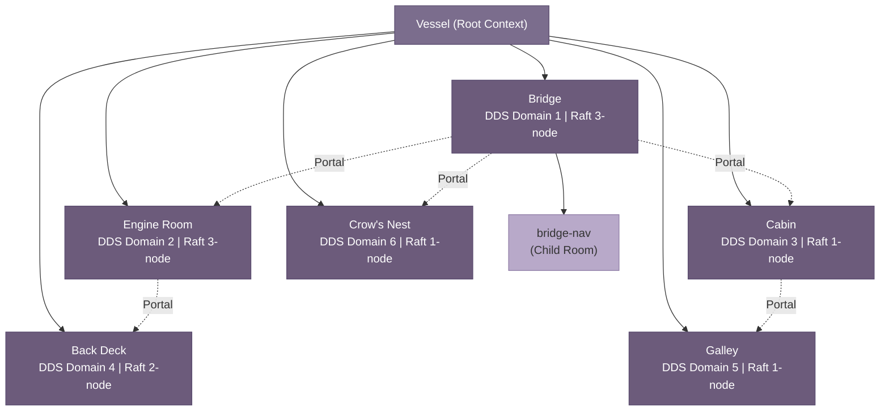
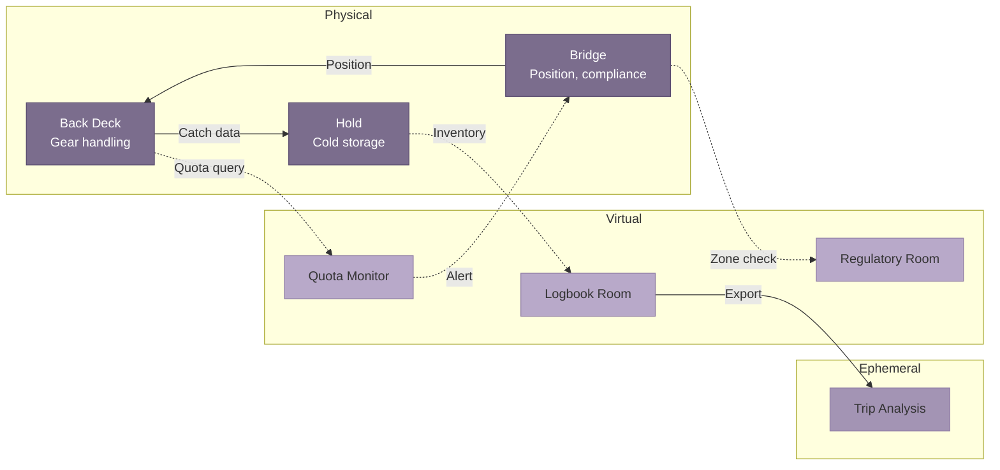

## 3. The Room Model

The central organizing abstraction of SuperInstance is the *room* — a bounded context container that simultaneously defines a physical space, a virtual knowledge environment, and a computational fault domain. An agent on the bridge exists within a room encompassing the GPS and VHF radios within arm's reach, the PLATO knowledge space containing navigation charts, and the DDS (Data Distribution Service) domain routing real-time messages among bridge-local processes. When that agent "walks" to the engine room, it crosses all three boundaries at once: physically relocating to the compute node near the engine sensors, joining a different DDS domain, and loading the engine room's knowledge context from PLATO [^1^]. This chapter defines the room taxonomy, state management mechanics, agent navigation protocols, and how applications decompose into room compositions.

### 3.1 Room Taxonomy

#### 3.1.1 Room Definition

A SuperInstance room is an encapsulated context with four properties: *boundaries*, *state*, *capabilities*, and *agent population*. Boundaries determine which sensors, actuators, and compute resources are "in" the room. State includes sensor values, agent conversation history, active tasks, and LLM routing policies. Capabilities are operations that agents may perform, expressed as tokens tied to the room's identity. Agent population is the set of agents currently registered, each advertising its capabilities via heartbeat [^2^].

This definition generalizes MUD (Multi-User Dungeon) spatial primitives, where rooms are first-class objects with exits, contents, and triggers [^5^]. Evennia, the Python MUD framework, uses a room-based model where each room maintains its own object set and event scope. SuperInstance extends this by binding each room to three simultaneous layers.

#### 3.1.2 Physical Rooms

Physical rooms map to vessel compartments: the *bridge* (navigation, communication), *engine room* (propulsion, power), *cabin* (crew interaction), *back deck* (gear handling), *galley* (food preparation), and *crow's nest* (observation). Each has a designated compute node — Jetson AGX Orin for sensor-heavy rooms, Raspberry Pi 5 for interaction, ESP32 for single-purpose sensors. Physical rooms define *hardware affinity*: the bridge Jetson hosts GPS, radar, and VHF; the engine room Jetson hosts temperature, pressure, and vibration sensors; the cabin Pi hosts the microphone array and display [^8^].

#### 3.1.3 Virtual Rooms

Virtual rooms are PLATO knowledge spaces where agents deliberate. The 41 `plato-*` repositories define this layer, with `plato-sdk` providing the agent interface [^5^]. Knowledge is represented as a *spectral graph* — weighted adjacency structure where nodes are concepts and edge weights represent belief strength. This enables a *failure-first reading model*: agents query for historically similar failures before reading successes, retrieving context via eigenvector-based similarity search in milliseconds on edge hardware [^1^]. Virtual rooms are independent of physical rooms — a single physical room may host multiple virtual spaces, and virtual rooms may span physical boundaries.

#### 3.1.4 Computational Rooms

Computational rooms define network and consensus boundaries via three mechanisms. **DDS Domains** assign each physical room a distinct domain for broker-less pub/sub, preventing sensor floods in one room from affecting another. **Raft Clusters** maintain local consensus for state updates and coordinator election; typical deployments use 3–5 nodes with O(n) message complexity [^4^]. **MQTT Topic Namespaces** scope topics by room under `/vessel/{room}/{device}/{metric}`, enabling room-selective subscriptions and natural access control [^7^].

#### 3.1.5 Room Taxonomy Table

| Type | Defining Property | Examples | Hardware Affinity | Agent Capacity |
|---|---|---|---|---|
| Physical | Sensor/actuator co-location | Bridge, engine room, cabin, back deck, galley, crow's nest | Jetson AGX (bridge, engine), RPi5 (cabin), ESP32 (sensors) | 1–5 concurrent agents |
| Virtual | Knowledge graph scope | Weather analysis, maintenance history, navigation charts | PLATO kernel (any compute) | Unlimited (compute-bound) |
| Computational | Network/consensus boundary | DDS domain, Raft cluster, MQTT namespace | Domain participant nodes | Equal to cluster size |

Physical rooms range from the bridge (Jetson AGX Orin, 275 TOPS INT8) to sensor nodes (ESP32-C3, 160 MHz). The 1–5 agent capacity reflects compute constraints and the practical limit of agents that can share one physical sensor context. Virtual rooms scale to PLATO kernel limits — a single Jetson hosts dozens of knowledge spaces. Computational rooms scale to Raft cluster size, typically kept at 3–7 nodes for O(n) efficiency [^4^]. All three types compose via the *room handle*, a URI such as `vessel://halibut/bridge` that resolves to all layers simultaneously.

### 3.2 Room Mechanics

#### 3.2.1 Room State Model

Each room maintains a *room state record* (RSR) with four fields: *contents* (agents, sensors, LLM instance), *permissions* (entry, sensor read, actuator execute), *routing policy* (local-only, cloud-preferred, edge-only), and *capability domain* (operations tokens may authorize). The RSR is stored in three places: a local SQLite database, a replicated Raft log for durability, and a cached PLATO object for sub-millisecond reads [^8^].

#### 3.2.2 Context Inheritance

Rooms form a DAG of inheritance relationships through two patterns. *Child rooms* inherit from parents via containment — the "vessel" room parents all physical rooms; the "bridge" may have a child "bridge-nav" for chart work. Children inherit parent capabilities by default but may restrict them; state changes propagate via lazy 30-second heartbeat subscription [^1^]. *Adjacent rooms* connect via *portals* — bidirectional pathways with explicit capability checks. The bridge is adjacent to the engine room and cabin, but galley agents cannot read engine state without transiting through intermediate rooms and their capability checks.

The following diagram shows the context inheritance structure for a vessel:

Solid edges denote parent-child containment with downward state inheritance. Dashed edges are portals requiring explicit capability verification. The galley has no direct portal to the engine room — an agent must transit through cabin and bridge, ensuring capability checks at each boundary.

#### 3.2.3 Context Carrying

When transitioning, agents carry a *serialized state bundle* with conversation history (last 20 turns), active task queue, capability tokens, and PLATO belief embeddings. This follows the *weak mobility* pattern: agent code (already present as WASM on all nodes) does not migrate, but execution context transfers as structured data [^3^]. The bundle is JSON with a standardized schema including `agentId`, `sourceRoom`, `targetRoom`, `serializedState`, and `capabilityTokens`. Upon arrival, the `onArrival(contextBundle)` hook replays history into the target LLM context, re-registers tasks, and presents tokens for *re-issuance* — tokens are recommendations, not guarantees, and the target room may accept, reject, or downgrade based on local policy [^7^].

#### 3.2.4 Room Lifecycle

Rooms progress through five states. **Creation** registers a room handle with the directory, allocates a DDS domain, initializes a PLATO space, and discovers sensors via mDNS. **Population** begins when the first agent enters; its tokens are validated and presence is published to the DDS domain. **Active** is normal operation — agents come and go, sensors publish, the Raft log grows. **Hibernation** triggers after 300 seconds unpopulated: DDS enters low-power, PLATO checkpoints to disk, Raft suspends, reducing Jetson power by ~40% [^8^]. **Dissolution** migrates all agents, archives state to cloud, revokes tokens, and terminates the room irreversibly.

### 3.3 Agent Navigation

#### 3.3.1 Presence Model

Presence uses three-phase registration: `REGISTER` message with agent ID and capabilities; directory validation and *presence token* issuance (room-bound JWT); heartbeat emission at 10-second intervals on the DDS liveness topic. Three missed heartbeats (30 seconds) trigger departure cleanup [^2^]. Capability advertisement follows the SwarmSys pattern: agents publish what they can do, current load, and specialization score, enabling collaboration without central coordination [^9^].

#### 3.3.2 Room Transitions as Atomic Operations

A transition is a five-sub-operation transaction: physical relocation (WASM activation on target), DDS domain change, MQTT re-subscription, PLATO context load, and capability re-issuance. All must succeed; partial failure rolls back to prevent split-brain states where an agent exists in two rooms [^1^]. Implementation uses two-phase commit: Phase 1 reserves resources and validates tokens at the target; Phase 2 executes all sub-operations within a 5-second timeout. Timeout or error releases the reservation and emits `TRANSITION_FAILED` with retry guidance [^10^].

#### 3.3.3 Cross-Room Coordination

Three patterns govern inter-room communication. *Direct messages* traverse portal connections between adjacent rooms with request-response semantics. *Broadcasts* propagate through gossip rumor mongering (SIR model): a "man overboard" broadcast originates on the bridge and reaches all physical rooms simultaneously, with each room forwarding to adjacent rooms until all neighbors acknowledge receipt [^2^]. *Delegation chains* traverse multiple portals when an agent needs a capability in a non-adjacent room — each room validates the delegation before forwarding. A bridge agent requesting engine maintenance history delegates through the bridge-engine portal, where the engine room validates `history.read` capability before servicing [^7^].

#### 3.3.4 Access Control

Entry requires capability-based verification with inheritance from parent rooms. Each room publishes a *capability manifest* listing operations it may grant. The bridge manifest might include `sensor.read.gps` and `actuator.write.vhf`. An agent presenting existing tokens receives the intersection of what it holds and what the room offers. Inheritance follows the parent-child DAG: an agent with `sensor.read.*` in the vessel parent receives `sensor.read.gps` in the bridge child automatically, but an agent with `actuator.write.*` does not receive `actuator.write.vhf` unless the bridge explicitly includes it. Portal traversal requires `portal.cross.{target}` capability that the source issues and target validates [^7^].

### 3.4 Rooms as Application Model

#### 3.4.1 Traditional Applications Decomposed into Room Compositions

Applications map to SuperInstance as *room compositions* — graphs of interconnected rooms with agents providing inter-room logic. Three patterns suffice. *Single-room*: all logic in one room, matching traditional embedded systems. *Hub-and-spoke*: a coordinator room at center with functional rooms radiating outward — the bridge as hub with navigation, weather, and engine rooms as spokes, simplifying routing at the cost of a bottleneck mitigated by PLATO caching [^5^]. *Federated mesh*: peer-connected rooms without a hub, used for multi-vessel fleet coordination where each bridge maintains portals to other vessels' bridges. Fleet-wide decisions use hierarchical consensus with local Raft delegates forming higher-level groups, reducing complexity from O(n²) to O(log n) [^9^].

#### 3.4.2 Persistent Rooms for Long-Lived Contexts

*Persistent* rooms maintain state across sessions: the *vessel state room* records position, heading, and speed that must survive restarts and failures; the *navigation history* room accumulates GPS fixes and depth soundings for retrospective analysis. These use full durability: Raft replication, PLATO checkpoints, and cloud backup. *Ephemeral* rooms exist only for task duration: a "price-comparison" room created for a voice query, populated with a research agent, dissolved upon completion. Ephemeral rooms skip Raft and PLATO persistence, achieving sub-200ms creation-to-dissolution on Jetson AGX Orin — agents creating "temporary conference rooms" for short-duration collaboration [^1^].

#### 3.4.3 Room Composition Diagram

The following diagram shows a catch processing workflow mapped to room composition:

Three physical rooms form the core: back deck agents weigh catch and publish to hold inventory; bridge agents track position and query the regulatory room for zone compliance; the logbook room accumulates records from all rooms and generates an ephemeral trip analysis room at voyage end. The portal graph enforces operational responsibility: deck agents cannot directly query regulations — they request through the bridge, which holds the `regulatory.read` capability. The room model encodes organizational structure, workflow, and authority not through policy documents but through capability tokens that the bridge issues and the regulatory room validates [^7^]. Applications are not installed on top of rooms — they are *composed from* rooms, with the room graph serving as both runtime architecture and declarative specification.

