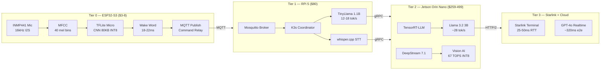
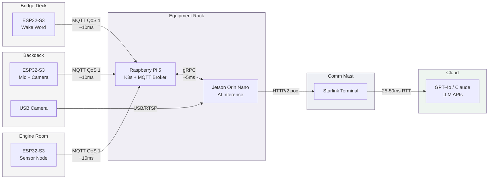
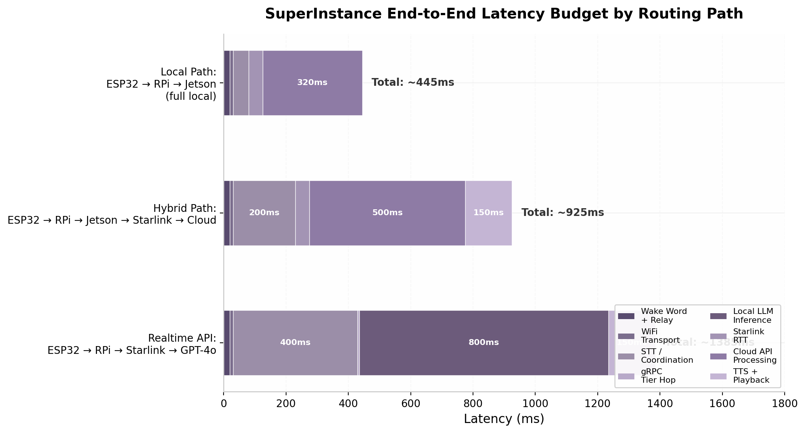
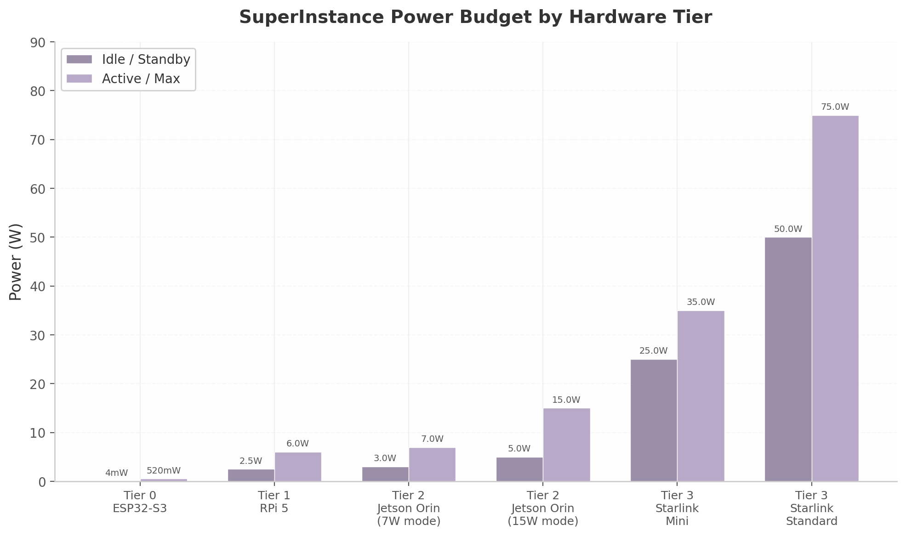

## 4. Hardware Tier Architecture

The SuperInstance compute substrate spans four hardware tiers that form a capability gradient: from sub-watt microcontrollers listening for wake words to satellite-connected cloud GPUs running large language models. Each tier occupies a distinct latency–cost–power envelope, and workloads migrate across tiers as connectivity, power availability, and task complexity change. This chapter defines the tiers, specifies the inter-tier communication topology, and establishes the placement rules that determine which inference executes where.

### 4.1 Tier Definitions

#### 4.1.1 Tier 0 — ESP32-S3: Wake Word Detection and Command Relay

The ESP32-S3 is the acoustic front-line. A dual-core Xtensa LX7 at 240 MHz with 512 KB SRAM and 8 MB PSRAM runs TensorFlow Lite Micro inference for wake word detection [^17^]. The pipeline — I2S sampling at 16 kHz, MFCC extraction across 40 mel bins, and an 80 KB INT8 CNN — completes single-window inference in 18–22 ms, with posterior smoothing over three windows suppressing false activations [^12^]. After wake word detection, the ESP32 activates WiFi, publishes the command via MQTT to the Tier 1 broker, and returns to deep sleep. Power spans three regimes: 0.8 mA in light sleep, 35 mA during the ~25 ms inference burst, and 160–260 mA with WiFi active [^18^]. A 2000 mAh cell supports approximately four months of continuous listening [^12^]. Unit cost is $3–8 [^17^].

#### 4.1.2 Tier 1 — Raspberry Pi 5 8GB: Coordination and Lightweight Inference

The Raspberry Pi 5 8GB serves as the vessel's edge coordinator, hosting K3s, the MQTT broker for ESP32 telemetry aggregation, and lightweight inference fallback [^48^]. On the Pi 5, `whisper.cpp` with `tiny.en` runs at 3.5x real-time, transcribing a 5-second utterance in ~1.4 seconds [^40^]. TinyLlama 1.1B (Q4_K_M) generates 12–18 tok/s for simple intent parsing [^36^]. An NVMe SSD via M.2 HAT reduces model load time from ~18 seconds (microSD) to ~3 seconds [^14^]. Active cooling is mandatory: sustained inference without a heatsink triggers 20–30% thermal throttling [^36^]. Power draw is 5–7 W active, 2–3 W idle. Cost is ~$80.

#### 4.1.3 Tier 2 — NVIDIA Jetson Orin Nano: AI Inference and Vision

The Jetson Orin Nano 8GB Super delivers 67 TOPS (INT8) at 7–15 W configurable TDP [^28^]. TensorRT-LLM achieves ~28 tok/s with Llama 3.2 3B (Q4_K_M, 2.0 GB) and ~15 tok/s with Llama 3.1 8B, both fitting within 8 GB unified LPDDR5 [^12^][^52^]. DeepStream 7.1 provides GPU-accelerated multi-stream video analytics supporting up to 30 concurrent camera feeds [^49^] — this is where backdeck camera processing (object detection, gear tracking, safety monitoring) executes in real time. The Jetson runs as a K3s worker node with the NVIDIA Container Runtime [^14^]. Cost is $259–499.

#### 4.1.4 Tier 3 — Starlink and Cloud: Satellite Connectivity

Tier 3 combines satellite connectivity with remote compute. Starlink Standard delivers 100–400 Mbps downstream with median RTT of 25–50 ms (99th percentile <65 ms) [^31^]. Satellite handoffs every ~15 seconds can inject 100–500 ms spikes, but packet loss stays below 1% under clear conditions [^49^]. Over this link, GPT-4o Realtime API achieves ~320 ms median end-to-end latency for native audio-to-audio conversation [^32^]. When Starlink is unavailable, the orchestration falls back to Tier 2 (Jetson) for local inference. Service cost is $75–120 per month.

*Figure 4.1 — Tier architecture diagram showing the four hardware tiers, primary compute functions, inter-tier protocols (MQTT, gRPC, HTTP/2), and annotated latencies. Arrows indicate the primary data flow for voice commands: ESP32 captures, RPi coordinates, Jetson infers, Starlink reaches cloud when needed.*

#### 4.1.5 Hardware Specifications Comparison

| Specification | Tier 0 ESP32-S3 | Tier 1 RPi 5 8GB | Tier 2 Jetson Orin Nano 8GB | Tier 3 Starlink + Cloud |
|---|---|---|---|---|
| **CPU** | Dual-core Xtensa LX7 @ 240 MHz | Quad-core Cortex-A76 @ 2.4 GHz | 6-core Cortex-A78AE @ 1.5 GHz | N/A (remote) |
| **GPU / AI** | Vector SIMD | VideoCore VII (~2 TOPS est.) | 1024 CUDA cores, 67 TOPS INT8 [^28^] | Cloud GPU (varies) |
| **RAM** | 512 KB SRAM + 8 MB PSRAM | 8 GB LPDDR4X | 8 GB LPDDR5 unified [^52^] | Elastic |
| **Storage** | 16 MB Flash | NVMe SSD (via HAT) | NVMe SSD (M.2) | Elastic |
| **Active Power** | 160–260 mA (~0.5 W) [^18^] | 5–7 W [^36^] | 7–15 W [^28^] | 25–75 W (terminal) |
| **Deep Sleep** | 0.8 mA [^12^] | 2–3 W idle | 3–5 W idle | N/A |
| **Network** | WiFi 4, BLE 5.0 | WiFi 5, GigE | WiFi 5, GigE | 100–400 Mbps [^31^] |
| **Unit Cost** | $3–8 [^17^] | ~$80 | $259–499 [^28^] | $75–120/mo |
| **OS** | FreeRTOS / ESP-IDF | Raspberry Pi OS 64-bit | JetPack 6.1 (Ubuntu) [^52^] | N/A |

*Table 4.1 — Hardware specifications across the four SuperInstance tiers. Jetson TOPS are INT8; power measured at device input. The three orders of magnitude from Tier 0 (0.5 W) to Tier 3 (75 W) create an intentional capability gradient that forces dynamic workload placement rather than fixed mapping.*

### 4.2 Inter-Tier Communication

#### 4.2.1 Topology and Protocol Selection

The data path follows the hardware hierarchy: ESP32 nodes publish to the Raspberry Pi MQTT broker; the Pi routes commands to the Jetson over gRPC for GPU inference; the Jetson reaches cloud APIs through Starlink over HTTP/2 with persistent connection pooling. The chain — ESP32 → MQTT → RPi → gRPC → Jetson → HTTP/2 → Starlink → Cloud — carries all voice commands, telemetry, and vision queries.

*Figure 4.2 — Hardware placement diagram showing ESP32 nodes distributed across physical vessel rooms, converging on the central RPi/Jetson hub, and reaching cloud APIs via Starlink. Latency annotations are typical values.*

Protocol selection is driven by payload size, latency tolerance, and device capability. **ESP32 → RPi** uses MQTT (QoS 1 for commands, QoS 0 for telemetry): its 2-byte minimum header and broker-based architecture minimize ESP32 energy use and handle intermittent WiFi gracefully, with topic namespacing by room (`/vessel/bridge/commands`, `/vessel/engine/telemetry`). **RPi → Jetson** uses gRPC with Protocol Buffers, delivering 50–70% lower latency and 5–10x smaller payloads than REST/JSON [^33^][^34^]; bidirectional streaming supports chunked audio for STT and token streaming from the LLM. **Jetson → Cloud** uses HTTP/2 with persistent connection pooling, eliminating the ~100–300 ms TLS handshake penalty that repeated negotiation would incur over Starlink [^49^]; WebSocket is used specifically for GPT-4o Realtime API streaming. **Fallback** for any tier pair falls back to MQTT QoS 1 with retained messages, allowing state recovery on reconnection.

#### 4.2.2 Latency Budgets and Fallback Chains

| Tier Pair | Protocol | Typical Latency | Timeout | Fallback Action |
|---|---|---|---|---|
| ESP32 → RPi | MQTT QoS 1 | 5–20 ms | 100 ms | Retry ×3, local buzzer |
| RPi → Jetson | gRPC | 2–5 ms | 50 ms | Route to RPi CPU (slower) |
| Jetson → Starlink | HTTP/2 | 25–50 ms RTT | 150 ms | Degrade to local Jetson LLM |
| Starlink → Cloud API | HTTP/2/WS | 100–300 ms TTFT | 2000 ms | Full offline, queue retry |

*Table 4.2 — Latency budgets and fallback chains between tier pairs. TTFT = Time To First Token. Thresholds are set at 2× typical latency to tolerate jitter without premature failover.*

The fallback chain mirrors the topology in reverse. If Starlink exceeds 2 seconds, the Jetson assumes primary LLM responsibility with Llama 3.2 3B. If the Jetson is unreachable, the Pi falls back to TinyLlama 1.1B — sufficient for command-and-control but inadequate for multi-turn reasoning. Cascading degradation ensures voice commands function even when two of three inference tiers are offline.

*Figure 4.3 — End-to-end latency budget by routing path. The local path (ESP32→RPi→Jetson) achieves ~445 ms total. The hybrid cloud path adds Starlink RTT for ~925 ms. GPT-4o Realtime API achieves ~320 ms e2e despite the satellite hop, by eliminating the cascaded STT→LLM→TTS pipeline in favor of native audio-to-audio inference [^32^].*

### 4.3 Workload Placement

#### 4.3.1 Placement Decision Matrix

The orchestration layer assigns each inference workload based on a five-factor scoring function: latency requirement, model size constraint, power availability, connectivity state, and task complexity. The heuristic is simple — execute as close to the edge as the model allows, escalating only when accuracy demands it.

| Workload | Default Tier | Model / Framework | Latency | Fallback Tier |
|---|---|---|---|---|
| Wake word detection | Tier 0 (ESP32-S3) | TFLite Micro, 80 KB INT8 | 18–22 ms [^12^] | None (always local) |
| STT (command) | Tier 1 (RPi 5) | whisper.cpp tiny.en | ~1.4x real-time [^40^] | Tier 2 (faster-whisper) |
| STT (long-form) | Tier 2 (Jetson) | faster-whisper medium | Sub-1s [^58^] | Tier 1 (slower) |
| LLM (simple intent) | Tier 1 (RPi 5) | TinyLlama 1.1B Q4 | 12–18 tok/s [^36^] | Tier 2 (Llama 3.2 3B) |
| LLM (complex reasoning) | Tier 2 (Jetson) | Llama 3.2 3B Q4 | ~28 tok/s [^12^] | Tier 3 (GPT-4o) |
| LLM (analysis, large ctx) | Tier 3 (Cloud) | GPT-4o Realtime | ~320 ms e2e [^32^] | Tier 2 (Llama 3.1 8B) |
| Text-to-speech | Tier 1 or 2 | Piper / Kokoro | 50–200 ms [^46^] | Tier 1 (Piper on CPU) |
| Vision (backdeck cam) | Tier 2 (Jetson) | DeepStream + TensorRT | Real-time [^52^] | Alert-only (no AI) |
| Orchestration | Tier 1 (RPi 5) | K3s master | N/A | Manual restart |

*Table 4.3 — Capability matrix mapping workloads to default execution tiers with measured latencies and fallback paths.*

#### 4.3.2 Migration Triggers

Workloads migrate in response to four event types. **Node failure** — detected via MQTT last-will messages and gRPC health checks — triggers immediate failover to the pre-configured fallback tier. **Load imbalance** — measured by MQTT queue depth and Jetson GPU utilization — reroutes STT and LLM requests to the less-loaded tier. **Power constraint** — when the 12 V bus drops below 11.2 V — forces the Jetson into 7 W mode and disables cloud offloading to conserve Starlink's 50 W draw. **Connectivity change** — when Starlink RTT exceeds 150 ms for 30+ seconds — switches all LLM traffic to the Jetson until recovery.

These triggers operate autonomously at each tier boundary. The RPi decides whether to route LLM calls to Jetson or cloud; the Jetson decides whether to process vision locally or drop to alert-only. No central controller is required for degradation, though K3s on the RPi coordinates containers during normal operation.

#### 4.3.3 Power Budgeting

| Device | Qty | Unit Power (active) | Combined Active | Annual Cost @$0.15/kWh |
|---|---|---|---|---|
| ESP32-S3 (deep sleep) | 6 | 0.52 W | 3.1 W | ~$4 |
| Raspberry Pi 5 8GB | 1 | 6.0 W | 6.0 W | ~$8 |
| Jetson Orin Nano (15W) | 1 | 15.0 W | 15.0 W | ~$20 |
| Starlink Standard | 1 | 75.0 W | 75.0 W | ~$99 |
| **System Total** | **9** | **~99 W** | **~99 W** | **~$131** |

*Table 4.4 — System power budget. ESP32 count assumes six distributed nodes. Annual cost at continuous operation. The Starlink terminal alone consumes 75% of the system power budget.*

*Figure 4.4 — Power consumption comparison across tiers. The Starlink terminal dominates at 50–75 W; all compute tiers combined (ESP32, RPi, Jetson) consume less than 25 W active — roughly one-third of the connectivity cost.*

The 99 W active total is within the capacity of a 300 W solar array with 2100 Wh LiFePO4 battery, a standard off-grid Starlink configuration. In power-constrained conditions (overcast, battery below 50% SoC), the degradation sequence is: duty-cycle Starlink to 4× 30-minute sessions daily (cutting 840 Wh to ~150 Wh), drop Jetson to 7 W mode, and disable cloud offloading. These three steps reduce draw from 99 W to ~35 W while preserving all local voice and vision capabilities.

The hardware tier architecture thus provides a performance gradient and a survival gradient: each step down in power preserves core functionality at the expense of cloud connectivity and inference speed. This aligns with the cross-dimensional finding that Starlink's predictable 25–50 ms RTT enables a "usually connected" design paradigm — but the architecture degrades gracefully when that assumption is violated.
