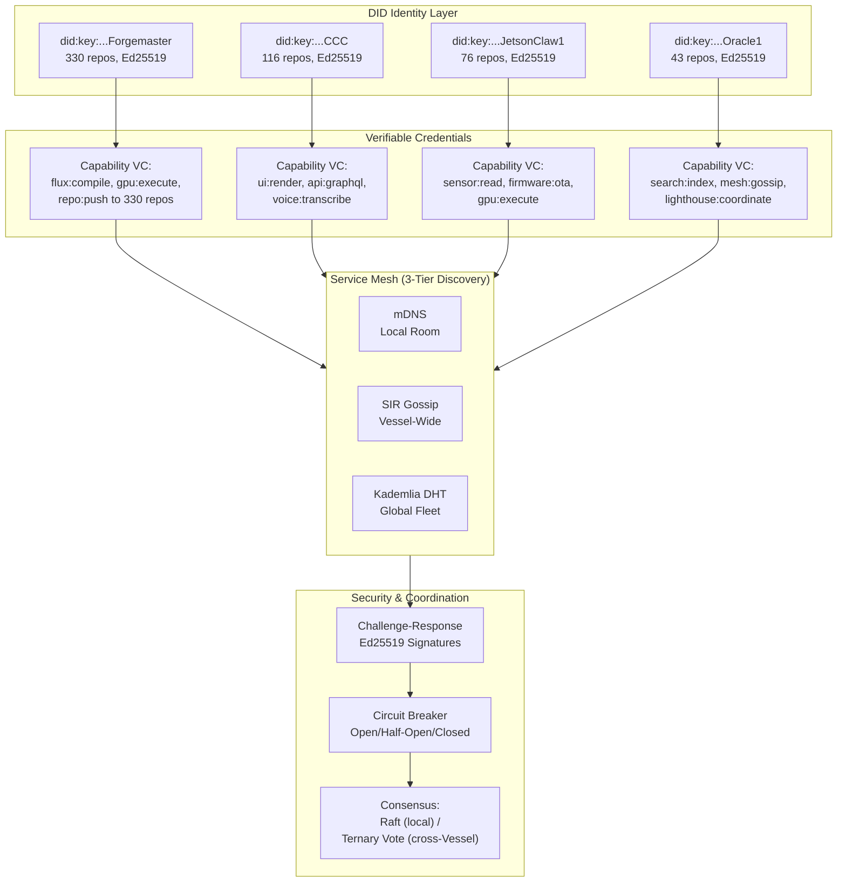

## 5. The Four Vessels — Identity and Service Mesh

The 3,200+ repositories of the SuperInstance ecosystem are partitioned into four sovereign identities — Forgemaster, CCC, JetsonClaw1, and Oracle1 — each functioning as a Decentralized Identifier (DID)-backed service node within a capability-based security mesh [^28^]. This chapter defines the Vessel identity model, specifies the decentralized identity infrastructure, describes service mesh dynamics, and establishes coordination protocols. The central claim, derived from cross-dimensional analysis, is that the four Vessels are not organizational labels but formal service identities where repository ownership constitutes capability scope and the git-agent lifecycle (`PULL→BOOT→WORK→LEARN→PUSH→SLEEP`) functions as an attested secure agent lifecycle [^28^].

### 5.1 Vessel Identity Model

#### 5.1.1 Vessel Definition: DID-Backed Service Identity

A Vessel is a self-sovereign software identity that owns a bounded set of repositories, advertises capabilities as JSON-LD descriptions, and authenticates via Ed25519 challenge-response. Each Vessel is identified by a `did:key` document — a W3C Decentralized Identifier whose public key is embedded in the identifier itself, eliminating the need for a blockchain or centralized registry [^28^]. This supports fully offline verification during Starlink outages. Capability advertisement follows the W3C Verifiable Credentials data model: each Vessel publishes a signed credential listing repositories owned, APIs exposed, and hardware tiers commanded. On every `BOOT` phase, the agent reads its DID document from the repository root, validates cryptographic material against the prior cycle's hash, and refreshes its capability token from the fleet issuer.

#### 5.1.2 Forgemaster: The Builder

Forgemaster owns 330 repositories spanning constraint theory, Eisenstein lattice mathematics, the FLUX compiler, GPU kernels, and formal proofs [^28^]. The five-layer stack (`open-parallel` → `pincher` → `flux-core` → `cuda-oxide` → `cudaclaw`) is primarily a Forgemaster concern. Hardware affinity is Tier 2 (Jetson Orin Nano, 67 TOPS INT8 at 15W [^28^]), with published crates (`pincher`, `constraint-theory-core`, `cudaclaw`) running across all tiers.

#### 5.1.3 CCC: The Interface

CCC (Cloud Computing Center) owns 116 repositories covering web UIs, browser agents, dashboards, and CopilotKit integration [^28^]. It renders fleet status through `cocapn-dashboard`, hosts the browser agent, and maintains the SuperInstance Fleet Copilot showcase. Running on Tier 1 (Raspberry Pi 5) and Tier 3 (cloud), CCC maps `useCopilotAction` hooks to Vessel capabilities, translating voice commands into structured tool calls [^28^].

#### 5.1.4 JetsonClaw1: The Hands

JetsonClaw1 owns 76 repositories for hardware edge deployment: Jetson packages, ESP32 firmware, marine sensors, sonar processing, and the OpenConstruct abstraction layer [^28^]. It executes Forgemaster's GPU kernels, manages ESP32 wake-word nodes across rooms, processes sonar via `sonar-vision`, and runs the `deckboss` edge OS. Hardware affinity is Tier 0 (ESP32) and Tier 2 (Jetson), with firmware published as OTA-updatable MQTT artifacts.

#### 5.1.5 Oracle1: The Memory

Oracle1 owns 43 repositories for core infrastructure, APIs, fleet coordination, lighthouse discovery, and search [^28^]. As the smallest Vessel by repository count but highest by coordination criticality, Oracle1 maintains the PLATO knowledge graph, the `cocapn-lighthouse` registry, message-in-a-bottle routing, and the `holodeck-session-manager` for observability. It runs on Tier 1 and Tier 3, serving as persistent memory that outlives any agent's `SLEEP→PULL` cycle.

#### 5.1.6 Vessel Capability Matrix

| Vessel | Repositories | Primary Responsibility | API Surface | Hardware Affinity | Published Packages | Failover Behavior |
|:---|:---|:---|:---|:---|:---|:---|
| **Forgemaster** | 330 [^28^] | Compilation, math, GPU kernels | FLUX bytecode, PTX, Rust crates | Jetson Orin Nano (Tier 2) | `pincher`, `constraint-theory-core`, `cudaclaw` (crates.io) [^28^] | Read-only: cached kernels on Jetson; no new compilation until recovery |
| **CCC** | 116 [^28^] | Human interface, web UI, CopilotKit | React components, GraphQL, AG-UI protocol | RPi 5 (Tier 1), Cloud (Tier 3) | `@superinstance/cocapn-lighthouse` (npm) [^28^] | Static dashboard fallback; voice commands queue for replay |
| **JetsonClaw1** | 76 [^28^] | Hardware edge, sensors, firmware | MQTT topics, DeepStream pipelines, NMEA 0183 | ESP32 (Tier 0), Jetson (Tier 2) | `plato-edge`, `tile-refiner` (PyPI) [^28^] | Sensor data buffered locally; reflex commands via `pincher` cache |
| **Oracle1** | 43 [^28^] | Infrastructure, search, coordination | REST API, PLATO SDK, lighthouse gossip | RPi 5 (Tier 1), Cloud (Tier 3) | `plato-sdk`, `fleet-homunculus` (PyPI) [^28^] | DHT cache survives outage; gossip maintains partial discovery |

The matrix reveals an asymmetry in failover resilience. Forgemaster and JetsonClaw1 — builder and hands — operate in degraded but functional modes because their outputs (kernels, sensor data) are cacheable locally. CCC and Oracle1 — interface and memory — are harder to replicate because they maintain soft state (human sessions, search indexes) degrading rapidly during outage. This asymmetry drives the circuit breaker patterns in Section 5.3.4.

### 5.2 Decentralized Identity

#### 5.2.1 DID Document Structure

Each Vessel's identity is anchored in a `did:key` document using the Ed25519 format. The `did:key` method is selected over `did:web` (requires DNS) and `did:ethr` (requires blockchain) because it supports fully offline verification during Starlink outages [^28^].

| Field | Description | Example Value |
|:---|:---|:---|
| `id` | The DID identifier | `did:key:z6MkhaXg...` |
| `verificationMethod` | Public key for signature verification | Ed25519 public key, multicodec-encoded |
| `authentication` | Reference to authentication key | `[#key-1]` |
| `assertionMethod` | Key used to sign capability VCs | `[#key-1]` |
| `service` | Service endpoint descriptors | MQTT broker, DDS domain, REST API |
| `service.type` | Protocol type | `MqttBroker`, `DdsDomain`, `HttpApi` |
| `service.serviceEndpoint` | Network location | `mqtt://pi5.local:1883/vessel/forgemaster` |
| `capabilityAssertion` | JSON-LD capability statement | Repositories owned, APIs exposed, room scope |
| `controller` | Controlling DID (self-sovereign) | Same as `id` |

The `capabilityAssertion` field is a SuperInstance-specific extension. It contains a machine-readable statement of repository ownership (e.g., `repo:superinstance/pincher`), API permissions (e.g., `api:flux/compile`), and authorized rooms. This assertion is signed by the Vessel's key at genesis and re-signed by the fleet issuer during attestation.

#### 5.2.2 Authentication Flow: Challenge-Response

Vessel-to-Vessel authentication uses a three-pass challenge-response protocol. The initiator (e.g., CCC requesting compilation from Forgemaster) generates a 256-bit nonce, signs it with Ed25519, and transmits `(initiator_did, nonce, signature)` over authenticated MQTT. The responder verifies the initiator's DID against its local cache, validates the signature, and returns `(responder_did, responder_nonce, responder_signature, initiator_nonce_echo)`. Mutual authentication completes in two round-trips — approximately 2–5 ms within the same room, 25–50 ms across rooms via Starlink [^31^].

#### 5.2.3 Capability Token Format

Capability tokens are JWT-style structures with SuperInstance-specific claims:

```json
{
  "iss": "did:key:z6MkhaXg...Forgemaster",
  "sub": "did:key:z6Mkj7yP...Agent-42",
  "aud": "device://jetson.orin.nano.001",
  "capabilities": ["flux:compile", "gpu:execute", "repo:push"],
  "room": "bridge",
  "nbf": 1700000000,
  "exp": 1700086400,
  "jti": "uuid-for-revocation"
}
```

The `room` claim scopes capabilities to a specific room — an agent with `gpu:execute` for "bridge" cannot use it in "engine room" without a separate token, containing blast radius if compromised [^28^]. Delegation follows a chain: Vessel Owner → Room Owners → Agents → Sub-agents, with each level delegating only a subset. Revocation propagates via gossip broadcast.

#### 5.2.4 Vessel Lifecycle

The lifecycle has five phases. **Genesis**: Ed25519 keypair generation, initial DID document construction, and `capabilityAssertion` registration. **Attestation**: Oracle1 validates claimed repositories against the GitHub organization, assigns room-level capabilities, and issues the initial token. **Operation**: The `PULL→BOOT→WORK→LEARN→PUSH→SLEEP` cycle with token refresh before each `BOOT`. **Retirement**: Token revocation, gossip broadcast, and DID archival to git. **Rebirth**: Reconstitution from archived DID and repository state with a new keypair but inherited capability log for forensic audit.

### 5.3 Service Mesh Dynamics

#### 5.3.1 Capability Advertisement

Each Vessel publishes capabilities as JSON-LD to three discovery layers. Local advertisement uses mDNS (RFC 6762) within the broadcast domain for room-level discovery without infrastructure [^28^]. Vessel-wide uses SIR (Susceptible-Infectious-Recovered) gossip for probabilistic propagation balancing bandwidth against reliability. Global uses a libp2p Kademlia DHT providing O(log n) lookups [^28^]. This three-tier approach, confirmed by cross-verification of distributed-patterns and ecosystem-map analyses, is optimal for maritime deployments with intermittent connectivity.

#### 5.3.2 Service Discovery

Discovery operates at three scopes. Local uses mDNS/Bonjour via Avahi with capability summaries in TXT fields. Vessel-wide uses gossip-based SWIM membership (HashiCorp Memberlist style) with suspicion tables for peer liveness. Global uses Kademlia DHT bootstrapped from Oracle1's lighthouse [^28^]. On boot, a Vessel performs all three in parallel: mDNS for immediate neighbors (sub-100 ms), gossip for fleet convergence (1–5 seconds), and DHT for global context (25–50 ms per Starlink hop) [^31^].

#### 5.3.3 Request Routing

Routing matches intent to capability. When CCC receives "compile the new constraint model," the CopilotKit tool router queries the mesh for `flux:compile`; Forgemaster's advertisement matches and the request routes to its MQTT topic. If multiple Forgemaster instances run (e.g., bridge and backdeck Jetsons), load distributes via weighted round-robin by queue depth. If Forgemaster is unavailable, the circuit breaker engages.

#### 5.3.4 Circuit Breaker Patterns

Each Vessel monitors peer health through gossip heartbeats. The breaker has three states: **Closed** (normal flow), **Open** (fail-fast to backup), and **Half-Open** (probe requests test recovery). After three missed heartbeats (30-second default), CCC's breaker for Forgemaster transitions to Open — compilation requests queue for replay or fall back to cached kernels from the last `PUSH`. Recovery probes transition through Half-Open on success. Per-path breaker state resides in Oracle1's distributed session cache.

### 5.4 Vessel Coordination

#### 5.4.1 Consensus Model

Two consensus mechanisms operate by trust boundary. Within a room — physically co-located, administratively trusted devices — Raft provides crash-fault tolerance with O(n) complexity [^28^]. Each room forms a small Raft cluster (3–5 nodes: ESP32, RPi coordinator, Jetson worker) electing a leader for local ordering. For cross-Vessel decisions — administratively distinct participants — a ternary voting protocol uses the `{-1, 0, +1}` logic native to SuperInstance's `open-parallel` layer. Each Vessel casts `-1` (disagree), `0` (abstain), or `+1` (agree); consensus requires `+1` from `2f+1` of `3f+1` voters, tolerating `f` Byzantine faults [^28^]. Ternary values require 2 bits versus 32+ bits for floating-point scores, with the 16x memory bandwidth savings from `open-parallel` applying equally to consensus state [^28^].

#### 5.4.2 Leader Election

Leader election is deterministic per room. A capability priority list defines which Vessel type leads: Forgemaster for GPU compilation rooms, JetsonClaw1 for sensing rooms, Oracle1 for coordination rooms, CCC for rooms with human presence. Within a Vessel type, the lowest lexicographic DID suffix wins, breaking ties without additional messaging — preserving safety by ensuring exactly one leader per room.

#### 5.4.3 Conflict Resolution

When Vessels propose conflicting actions — Forgemaster requesting 12 GB for a kernel while JetsonClaw1 reports only 8 GB available — priority-based resolution encoded in `pincher` applies: safety constraints override performance (thermal limits block compilation), memory overrides speed, and human commands (via CCC) override autonomous proposals. On deadlock, the ternary vote falls back to Oracle1 as tiebreaker. Resolution completes in sub-100 ms via the `pincher` reflex path, within the <1 ms safety-critical threshold for commands bypassing deliberation entirely [^28^].


