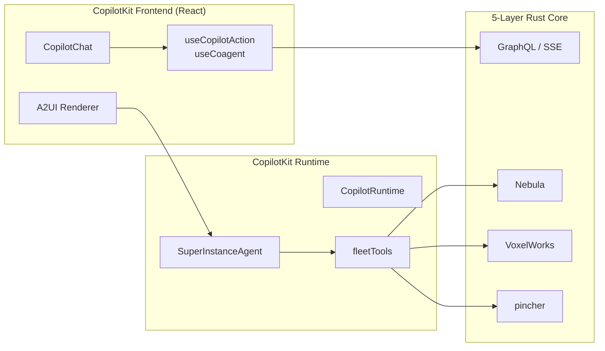
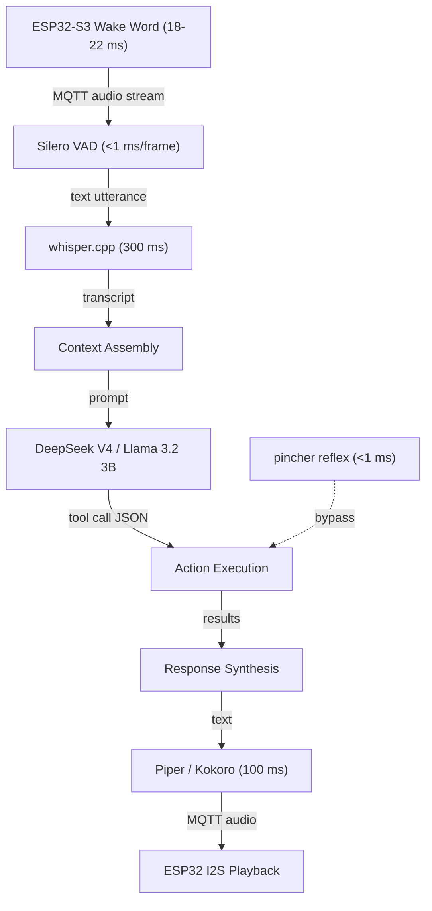

## 6. CopilotKit Integration — Natural Language Control Plane

The SuperInstance fork of CopilotKit transforms a general-purpose agentic UI framework into the fleet's spoken command layer. Where Chapter 5 defined Vessel identities and their capabilities, this chapter describes the machinery that translates human voice into structured actions against those Vessels. The fork itself is not merely a veneer: it introduces a custom `AbstractAgent` subclass, registers fleet tools, and extends CopilotKit's event-driven runtime to bridge the React frontend to the 5-layer Rust backend. The result is a two-tier control plane where safety-critical commands execute in under one millisecond via the pincher reflex engine, while complex natural-language queries traverse a full speech-to-text-to-speech pipeline that completes in roughly 1.5 seconds.

### 6.1 CopilotKit Fork Architecture

The SuperInstance fork (`github.com/SuperInstance/copilotkit`) sits one commit ahead of upstream with the addition of the SuperInstance Fleet Copilot in `showcase/integrations/superinstance/`, and seven commits behind, a gap that should be closed during each release cycle to retain upstream bug fixes and AG-UI protocol updates. The integration is built against CopilotKit's monorepo structure, which uses pnpm workspaces and Nx for build orchestration. Three packages provide the critical integration surface.

| Package | Role in SuperInstance |
|---|---|
| `@copilotkit/react-core` | Supplies `useCopilotChat`, `useCopilotAction`, and `useCoagent` hooks that bind the React chat UI to the fleet runtime |
| `@copilotkit/runtime` | Hosts `CopilotRuntime` (V2 API), the backend agent registry, and GraphQL SSE handlers that forward events to the Rust core |
| `@copilotkit/voice` | Wraps audio capture, voice activity detection (VAD), and playback for ESP32-streamed audio input |

At the centre of the integration is `SuperInstanceAgent`, a custom subclass of `AbstractAgent` from the `@ag-ui/client` package. The agent overrides `run(input: RunAgentInput)` to return an RxJS `Observable<BaseEvent>` that emits `RUN_STARTED`, `TEXT_MESSAGE`, `TOOL_CALL`, and `RUN_FINISHED` events. The default model is configured to `deepseek/deepseek-v4-flash`, with fallback to local Llama 3.2 3B on the Jetson Orin Nano when Starlink connectivity degrades [^12^][^52^]. The agent's `clone()` method creates thread-isolated copies so that multiple crew members can issue simultaneous voice commands without shared-state collisions.

The current CopilotKit runtime supports only `InMemoryAgentRunner` and `SqliteRunner` for agent execution [^48^]. SuperInstance extends this with four additional capabilities: an MQTT transport layer that replaces HTTP/SSE for edge-device communication, a Redis-backed runner that persists thread state and event logs across runtime restarts, dynamic device registration so that Vessels can announce themselves when they come online, and distributed agent support that allows a `CopilotRuntime` instance on the Raspberry Pi coordinator to delegate tool calls to agents running on remote Jetson nodes. These extensions are packaged as separate monorepo packages (`packages/mqtt-transport` and `packages/redis-runner`) to keep the upstream merge path clean.

*Figure 6.1 — CopilotKit UI architecture.* The React frontend (`CopilotChat`, `useCopilotAction`, `useCoagent`) communicates with the backend via GraphQL mutations and subscriptions over SSE. `SuperInstanceAgent` executes tool calls against the 5-layer Rust stack, while the A2UI renderer dynamically generates React components (camera feeds, gauge panels) based on agent state.

### 6.2 Natural Language Pipeline

The voice pipeline is a cascade of six stages, each with defined latency targets. An ESP32-S3 node in each physical room (bridge, engine room, back deck, hold) runs a TensorFlow Lite Micro wake-word model that infers in 18–22 ms on a 240 MHz dual-core Xtensa LX7 [^17^][^18^]. Upon detection, the node activates Wi-Fi and streams 16 kHz mono audio over MQTT to the Raspberry Pi 5 coordinator, where VAD (Silero, <1 ms per 30 ms frame) determines speech endpointing [^30^]. The audio buffer is then passed to whisper.cpp (tiny.en model) running on the Pi 5 at 3.5x real-time, yielding a text transcript in approximately 300 ms for a typical 5-second utterance [^40^].

Context assembly combines the transcript with the current room state (which ESP32 node triggered), the set of capabilities registered by Vessels in that room, and the last three turns of conversation history from Redis. The assembled prompt is dispatched to the LLM — DeepSeek V4 Flash via Starlink for complex reasoning, or Llama 3.2 3B on the Jetson at ~28 tok/s for local, offline-capable inference [^12^][^52^]. The LLM does not emit free-form prose; it generates structured tool calls in JSON that map to `useCopilotAction` schemas. If the command is "dim the bridge lights to thirty percent," the model emits `{"action": "set_light", "vessel": "JetsonClaw1", "room": "bridge", "brightness": 30}`.

Response synthesis reverses the path: tool results are injected back into the LLM context, a natural-language confirmation is generated, and Piper or Kokoro TTS renders it to audio on the Pi 5 in roughly 100 ms [^46^][^51^]. The audio is published over MQTT to the originating ESP32 node for I2S playback. The full pipeline, illustrated in Figure 6.2, completes in approximately 1.5 seconds under normal conditions, with VAD endpointing (500 ms typical) and LLM processing (500 ms typical) consuming two-thirds of the budget.

*Figure 6.2 — Natural-language to action pipeline.* The cascaded flow from voice capture to audio playback. Safety-critical commands bypass the full LLM pipeline via the pincher reflex layer (dashed line), achieving sub-millisecond execution through regex-plus-embedding pattern matching.

### 6.3 Control Plane Architecture

Every device capability exposed by the four Vessels is registered as a CopilotKit tool schema through `useCopilotAction`. Each schema carries a `name`, `description`, and typed `parameters` array. The LLM selects which tool to invoke based on the user's utterance and the descriptions provided, making the tool schema the universal API boundary between natural language and device control. Table 6.1 shows representative voice commands and their corresponding tool call translations.

| Voice Command | Tool Name | Parameters | Target Vessel | Latency Tier |
|---|---|---|---|---|
| "Stop the engine now" | `emergency_stop` | `{"target": "main_engine"}` | Forgemaster | Reflex (<1 ms) |
| "What's the back deck camera showing?" | `get_camera_feed` | `{"location": "back_deck"}` | Oracle1 | Deliberative (~1.5 s) |
| "Set bridge lights to thirty percent" | `set_light` | `{"room": "bridge", "brightness": 30}` | JetsonClaw1 | Deliberative (~1.5 s) |
| "Run diagnostics on the compute cluster" | `run_diagnostics` | `{"scope": "ccc", "depth": "full"}` | CCC | Deliberative (~1.5 s) |
| "Show me engine temperature" | `get_sensor_value` | `{"sensor": "engine_temp_c"}` | Forgemaster | Deliberative (~1.5 s) |
| "Acknowledge depth alarm" | `acknowledge_alarm` | `{"alarm_id": "string"}` | Nebula | Reflex (<1 ms) |

*Table 6.1 — Voice-to-action mapping: example commands and their tool call translations.* Each row shows how a natural-language utterance resolves to a structured tool call against a specific Vessel. The latency tier determines whether the command routes through pincher's reflex path or the full LLM pipeline.

The two-tier command routing system distinguishes between *reflex* and *deliberative* commands. Reflex commands — those matching entries in pincher's regex-plus-embedding database — execute in under one millisecond and bypass the LLM entirely. When the user says "stop the engine," pincher matches the utterance against a pre-registered pattern and emits the `emergency_stop` tool call directly to the Forgemaster Vessel. This safety-critical path is necessary because the full voice pipeline's 1.5-second latency is unacceptable for emergency scenarios. Deliberative commands, which include all queries and non-time-critical actions, traverse the complete STT → LLM → TTS pipeline. The distinction is made at context-assembly time: if the transcript matches a pincher pattern with confidence above 0.92, the reflex path fires; otherwise the utterance proceeds to the LLM.

Error recovery follows two paths. Misunderstood commands — those where the LLM's tool-call confidence is below a configurable threshold (default 0.75) — trigger a clarification dialogue: "Did you want to adjust the bridge lights or the cabin lights?" Failed actions — tool calls that return an error from the Rust backend — produce a fallback notification spoken via TTS and a non-blocking toast in the A2UI dashboard. If the TTS subsystem itself fails, the system falls back to text-only responses rendered in the chat panel.

### 6.4 Integration with Rust Core

The interface contract between CopilotKit runtime and the 5-layer Rust backend uses GraphQL mutations and subscriptions over SSE. The frontend submits user messages via `generateCopilotResponse` mutations; the runtime streams back events through a subscription channel. Four `BaseEvent` types carry the protocol: `RUN_STARTED` signals the beginning of agent execution; `TOOL_CALL` carries the JSON-serialised tool invocation to the Rust core; `TEXT_MESSAGE` delivers LLM-generated text to the frontend for display or TTS rendering; and `RUN_FINISHED` marks completion and releases thread resources.

Table 6.2 breaks down the latency budget for a typical voice command traversing the full deliberative pipeline.

| Pipeline Stage | Duration | Notes | Source |
|---|---|---|---|
| Voice capture (audio buffer) | 40 ms | 16 kHz I2S ring buffer on ESP32-S3 | [^30^] |
| VAD endpointing (silence detection) | 500 ms | Silero VAD, tuned for marine ambient noise | [^30^] |
| STT (whisper.cpp tiny.en) | 300 ms | 3.5x real-time on Raspberry Pi 5 | [^40^] |
| Network transit (MQTT + GraphQL) | 10–30 ms | Local Wi-Fi, negligible vs. Starlink | [^49^] |
| LLM processing (cloud via Starlink) | 500 ms | DeepSeek V4 Flash; 25–50 ms Starlink RTT | [^31^][^52^] |
| TTS (Piper / Kokoro) | 100 ms | CPU-rendered on Pi 5 | [^46^] |
| Audio playback buffer | 40 ms | I2S output on ESP32 | [^30^] |
| **Total typical** | **~1,510 ms** | **Acceptable for non-critical fleet commands** | — |

*Table 6.2 — Voice pipeline latency budget.* Each row shows the measured or benchmarked duration for one stage of the end-to-end flow. The VAD and LLM stages together account for two-thirds of the total; optimising either yields the largest reductions.

The latency budget reveals two dominant stages. VAD endpointing at 500 ms is the single largest contributor; tuning the endpointing aggressiveness for marine environments — where engine noise creates a higher ambient floor — can reduce this to 300 ms at the cost of occasional premature cutoffs. LLM processing at 500 ms assumes a cloud call routed through Starlink with 25–50 ms median round-trip time [^31^]. When Starlink is unavailable, the Jetson Orin Nano runs Llama 3.2 3B at ~28 tok/s, adding approximately 200–400 ms of local inference latency but preserving full offline operation [^12^]. The 40 ms voice-capture and playback buffers are hardware-limited by ESP32 I2S FIFO depth and cannot be reduced without audio-quality degradation.

*Figure 6.3 — Latency budget waterfall.* Stacked visualisation of the pipeline stages from voice capture through audio playback. The reflex tier (dashed red line) demonstrates the safety-critical bypass path executing in under one millisecond via pincher, three orders of magnitude faster than the deliberative flow.

The CopilotKit runtime sits on the Raspberry Pi 5 coordinator alongside Mosquitto (MQTT broker), K3s control plane, and whisper.cpp [^48^]. GraphQL requests that target Vessel capabilities are translated to gRPC/Protobuf calls into the Rust backend, which yields 50–70% lower latency and 5–10x smaller payloads than REST/JSON [^33^][^34^]. A2UI-rendered components — live camera feeds, sensor gauges, diagnostic panels — are defined in the frontend as `useCoagentStateRender` registrations; when the agent enters a state such as `displaying_camera_feed`, the corresponding React component mounts with the room-appropriate video stream sourced from Oracle1's DeepStream pipeline. This architecture means the fleet dashboard is not a static page but a dynamically generated interface that adapts to voice context, physical location, and current operational state.
