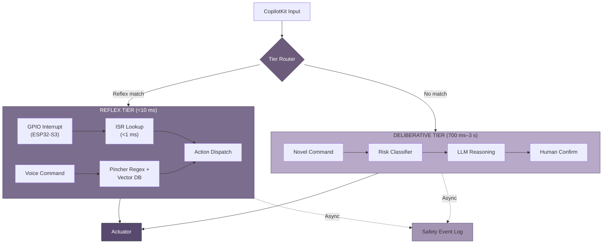
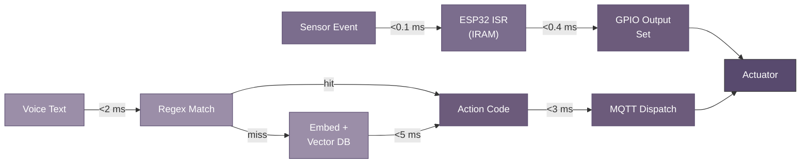

## 7. Two-Tier Safety Architecture

On a commercial fishing vessel, the gap between spoken command and physical action is measured in injuries prevented. This chapter defines the safety architecture separating reflex execution — hard real-time responses below one millisecond — from deliberative reasoning at 700 ms to 3 s. The two tiers never share a critical path: a reflex action completes before any deliberative process begins evaluating the same event.

### 7.1 Safety Design Overview

#### 7.1.1 Design Goal: Architectural Separation

The architecture targets three latency bounds. The ESP32-S3 microcontroller handles bare-metal reflex responses in under one millisecond for hardware safety events — emergency stop, collision proximity, fire sensor triggers, and bilge level thresholds. The Raspberry Pi coordinator running Pincher processes pattern-matched voice commands in under ten milliseconds using regex and embedding lookup against a predefined vector database [^10^]. The NVIDIA Jetson handles deliberative reasoning within three seconds via local TensorRT-LLM or cloud offloading through Starlink [^12^][^31^].

The critical constraint is mutual exclusion: the deliberative tier is architecturally prohibited from blocking, modifying, or confirming any reflex-tier action. When a safety event fires, the reflex tier executes unconditionally and reports the outcome asynchronously to the deliberative layer for logging. This mirrors the biological distinction between spinal reflex arcs and cortical deliberation.

#### 7.1.2 Fundamental Tension

Speed demands simplicity. A sub-millisecond response leaves no time for neural network inference or context evaluation. The ESP32 path is deterministic: interrupt triggered → lookup table consulted → GPIO output set. Intelligence requires complexity: a command like "adjust course to avoid that vessel" demands sensor fusion and planning spanning thousands of tokens. The Jetson achieves 28 tok/s for Llama 3.2 3B [^12^], but even minimal prompts take hundreds of milliseconds.

The architecture resolves this by partition, not compromise. Every command entering through CopilotKit (Chapter 6) is classified into exactly one tier before execution begins. Safety-critical commands are preregistered in Pincher's reflex database; novel commands route to deliberative. There is no dual-track evaluation and no time-pressured fallback from deliberation to reflex.

#### 7.1.3 Safety Invariants

Four categories are permanently bound to the reflex tier: **emergency stop** (all propulsion and winch systems), **collision avoidance** (proximity-triggered course or throttle adjustment), **fire suppression** (thermal/smoke sensor-triggered alarm and extinguisher), and **bilge pump activation** (water level-triggered pump engagement). These invariants are compiled into the ESP32 interrupt vector table and Pincher rule set at boot. They cannot be overridden by voice command, deferred to deliberative evaluation, or disabled without physical access.

#### 7.1.4 Timing Budget Allocation

The ESP32 tier uses GPIO interrupts with ISRs stored in internal RAM (`IRAM_ATTR`) to avoid flash cache latency [^114^]. The RPi tier leverages Pincher's vector database at 57 commits, Rust 76.6% [^10^]. The Jetson tier routes through TensorRT-LLM or Starlink at 25–50 ms RTT [^31^].

| Tier | Hardware | Trigger Type | Min Latency | Max Latency | Typical | Budget Source |
|---|---|---|---|---|---|---|
| Reflex (bare-metal) | ESP32-S3 | GPIO interrupt | 0.1 ms | 1.0 ms | 0.5 ms | ISR in IRAM [^114^] |
| Reflex (pattern-match) | RPi 5 | Pincher regex + embedding | 1.0 ms | 10 ms | 3.0 ms | Vector DB, no LLM path [^10^] |
| Deliberative (local) | Jetson Orin Nano | LLM (3B model) | 700 ms | 2,000 ms | 1,200 ms | TensorRT-LLM at 28 tok/s [^12^] |
| Deliberative (cloud) | Starlink + API | GPT-4o / Claude | 725 ms | 3,000 ms | 1,500 ms | 25–50 ms RTT + API TTFT [^31^] |

The 3,000× gap between reflex and deliberative maximums provides the non-overlapping separation that enforces tier independence. **Figure 7.1** visualizes this budget; the 1 ms safety boundary and 700 ms deliberative minimum create an architectural gap no execution path can cross.

*Figure 7.1 — Timing budget across safety tiers (log scale). The 1 ms safety boundary (red) and 700 ms deliberative minimum (yellow) enforce tier separation.*

*Figure 7.2 — Two-tier safety architecture. The Router classifies every command into exactly one tier. Reflex and deliberative paths converge only at the actuator layer; cross-tier communication is asynchronous via the safety event log.*

### 7.2 Reflex Tier

#### 7.2.1 Trigger Conditions

Reflex activation originates from three sources. **Hardware interrupts** on the ESP32-S3 respond to digital transitions from collision detectors, engine thermal cutoffs, bilge float switches, and the emergency stop button. **Threshold violations** fire when smoothed analog readings exceed bounds: engine temperature above 105 °C, battery below 11.5 V, hydraulic pressure outside 1,500–2,500 PSI. **Pattern matches** compare transcribed voice commands against Pincher's rule set: regex exact match first, then embedding similarity at a fixed 0.92 cosine threshold [^10^]. Commands below the threshold pass to deliberative.

#### 7.2.2 Pincher Reflex Engine

Pincher (Layer 2 of the five-layer stack, Chapter 2) operates on the model **vector database as runtime, LLM as compiler** [^10^]. Safety-critical commands are embedded and stored in the reflex database at configuration time with bound action codes. At runtime, incoming text undergoes regex matching; on miss, an embedding is computed and a nearest-neighbor lookup executed. The action code of the top match above threshold is dispatched to the actuator MQTT topic — no LLM inference in the hot path. Every operation is precomputed; only the embedding computation and vector search run at query time, completing in single-digit milliseconds on the RPi 5's Cortex-A76 cores.

#### 7.2.3 ESP32 Bare-Metal Reflex

For sub-millisecond events, the ESP32-S3 bypasses all software stacks. The path is **GPIO interrupt → ISR lookup → GPIO output** within the Xtensa LX7 CPU at 240 MHz without FreeRTOS task scheduling. The ISR uses `IRAM_ATTR` to execute from internal RAM, eliminating flash cache latency [^114^]. Measured interrupt-to-output latency is 0.5 ms typical (0.1 ms minimum, 1.0 ms worst-case) [^120^]. Bare-metal reflexes are limited to single-pin outputs — relay activation, PWM zeroing, alarm assertion — as multi-step actuation would exceed the one-millisecond budget.

#### 7.2.4 Reflex Action Set

The reflex tier recognizes five predefined primitives, stored in ESP32 firmware and the Pincher database at build time, never generated dynamically.

| Action Code | Name | Description | Hardware Target | Latency | Example Trigger |
|---|---|---|---|---|---|
| `R0` | HALT | Zero all propulsion PWM; assert hardware interlock | ESP32 GPIO → motor controller | <1 ms | Emergency stop, collision proximity |
| `R1` | RETREAT | Reverse propulsion at minimum power for 3 s | ESP32 GPIO → ESC reverse | <1 ms | Collision imminent (<5 m) |
| `R2` | ALERT | Sound horn + broadcast VHF safety call | RPi → horn relay + VHF PTT | <10 ms | Fire sensor, man-overboard |
| `R3` | ISOLATE | Disconnect battery from load bus | ESP32 GPIO → contactor | <1 ms | Battery thermal runaway |
| `R4` | ACTIVATE_BACKUP | Start backup bilge pump + log event | RPi → pump relay + MQTT | <10 ms | Bilge level >75% max |

Each action is idempotent with a defined safe default. HALT writes zero duty cycle and asserts an interlock requiring explicit human clearance. RETREAT has a hard-coded three-second duration after which propulsion returns to idle. No unsafe state is producible from any trigger input.

#### 7.2.5 Reflex Decision Tree

The reflex pipeline enforces a strict no-LLM-in-path policy. Neither the ESP32 ISR nor the Pincher lookup invokes a language model. Every branch is deterministic: given the same input, the system produces the same action code with variance below 0.1 ms.

*Figure 7.3 — Reflex decision pipeline with timing annotations. The hardware interrupt path (top) bypasses all software scheduling; the Pincher path (bottom) bypasses LLM inference. Both converge on actuator state change within budget.*

### 7.3 Deliberative Tier

#### 7.3.1 Activation

Commands not matching reflex triggers route to deliberative: utterances outside the reflex pattern set, commands requiring historical context ("what was the engine temperature an hour ago"), planning requests ("set course for the fishing grounds and alert me at five miles out"), and any interaction requiring natural language generation. The Jetson runs local TensorRT-LLM at 28 tok/s [^12^] or cloud offloading via Starlink at 25–50 ms RTT [^31^].

#### 7.3.2 Risk Assessment

Before executing any deliberative command with physical side effects, a lightweight 1B-parameter risk classifier scores the action across reversibility, immediacy, scope, and hazard level. The product of the four 0–1 scores yields a composite risk value. Actions above 0.7 require human confirmation; actions above 0.9 are blocked. The classifier completes within 100 ms and operates on structured representations (tool schema, target device, parameters) rather than raw text.

#### 7.3.3 Human-in-the-Loop

When risk exceeds 0.7, the system speaks a confirmation prompt: "Confirm: set main engine throttle to eighty percent." The operator must respond with a preregistered phrase ("confirmed", "yes", "go ahead") within 10 seconds, processed through Pincher's reflex tier. Any other response or silence cancels the action.

#### 7.3.4 Deliberative Fallback

If the deliberative tier fails within three seconds — Jetson throttling, Starlink outage, LLM timeout — control passes to the reflex tier. Motion commands pending → execute HALT; system queries → respond "system unavailable"; unknown failure → execute HALT and sound ALERT. The fallback timer is a hardware watchdog on the ESP32, ensuring a software crash on RPi or Jetson cannot prevent safety response.

### 7.4 Safety Monitoring

#### 7.4.1 Sentinel Vessel

The Sentinel Vessel is a dedicated agent on the RPi subscribing to all reflex activations, risk assessments, and sensor streams. It maintains a safety posture score from 0 (nominal) to 4 (maximum alert), published as a retained MQTT message on `vessel/safety/posture` and rendered on the bridge dashboard. The Sentinel enforces heartbeat monitoring: if any safety-critical node fails to report within 5 seconds, posture escalates automatically.

#### 7.4.2 Safety Event Log

Every reflex activation generates an immutable record containing: timestamp from `esp_timer_get_time()`, trigger source (GPIO pin, sensor ID, or voice text), action code (`R0`–`R4`), outcome confirmation via feedback sensor, and deliberative tier notification status. Records are append-only to an NVMe ring buffer with checksum verification, storing 30 days locally. Older records are compressed and uploaded via Starlink off-peak. No component can modify or delete a recorded event.

#### 7.4.3 Post-Incident Analysis

When a safety event reveals a reflex coverage gap — a dangerous situation handled by deliberation because no reflex matched — the incident transcript is packaged to the PLATO knowledge room for fleet-wide review (Chapter 8). Proposed new reflex rules require operator confirmation before addition to the Pincher database. This learning loop closes the gap between original configuration and evolving operational reality while preserving the invariant that no reflex is added without human review.
