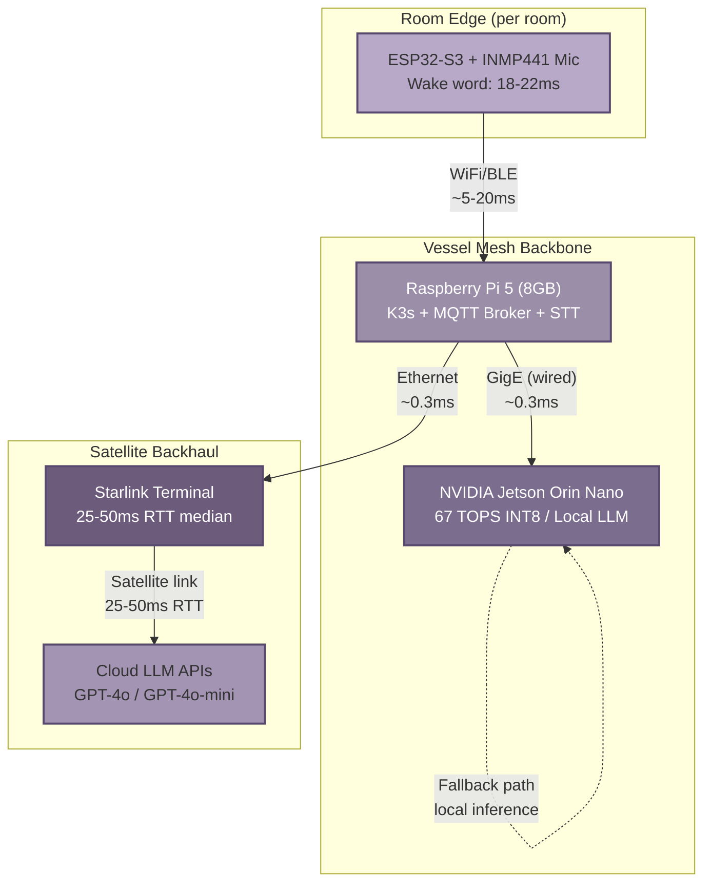

## 9. Network Architecture and Starlink Integration

SuperInstance operates from a moving vessel, which means its network fabric must bridge local mesh links inside the boat to a satellite backhaul that reaches cloud LLM APIs. This chapter defines that bridging architecture: the physical topology of devices across the vessel, the connectivity state machine that governs behaviour as Starlink quality shifts, and the data-synchronization protocols that keep state coherent when the edge-cloud boundary flickers. The design follows the "usually connected" principle established in Chapter 1 — the system assumes Starlink is present and routes the default inference path to cloud LLMs, treating local Jetson inference as a fallback rather than the primary mode [^31^].

### 9.1 Network Topology

#### 9.1.1 Local Mesh Hierarchy

The on-board network is organised in three hardware tiers with wired links preferred wherever physically possible. At the edge, ESP32-S3 nodes in each room (bridge, engine room, cabin, hold) capture voice via I2S microphones and run TensorFlow Lite Micro wake-word detection in 18–22 ms [^12^]. These nodes connect to the middle tier over WiFi 4 (802.11 b/g/n) or BLE 5.0 for low-power wake-word relay. The Raspberry Pi 5 (8 GB) sits at the centre of the middle tier, acting as MQTT broker, K3s coordinator, and local STT host; it joins the upper tier via Gigabit Ethernet to the NVIDIA Jetson Orin Nano, which provides 67 TOPS INT8 compute at 15 W for local LLM inference and vision workloads [^28^]. The Pi also bridges to the Starlink terminal, either directly or through the Jetson, depending on which device serves as the default gateway.

Wired Ethernet between Pi and Jetson eliminates the 2–15 ms jitter inherent in WiFi, a savings that matters when the LLM routing engine must decide within a tight window whether to send a query to the cloud [^49^]. The ESP32-to-Pi link remains wireless because pulling cable to every voice node on a vessel is impractical, but that hop is short-range and low-bandwidth (wake-word events are small MQTT payloads).

#### 9.1.2 Starlink Gateway and QoS

Either the Raspberry Pi or the Jetson can act as the default gateway to the Starlink terminal. The gateway node runs CAKE (Common Applications Kept Enhanced) or fq_codel Smart Queue Management (SQM) to prevent bufferbloat, a well-documented issue on Starlink where large queues in the terminal or downstream routers add 50–200 ms of spurious latency [^49^]. By shaping egress to roughly 80–85 % of measured Starlink throughput and applying CAKE with proper bandwidth and RTT parameters, the gateway keeps per-flow latency predictable even when telemetry uploads or log transfers saturate the link.

Voice traffic (STT streams, LLM API calls, TTS responses) is tagged with the highest DSCP priority; telemetry batches receive best-effort forwarding; compressed logs and non-urgent sync traffic are deprioritised. This three-class prioritisation maps directly to the bandwidth budgeting described in Section 9.3.3.

#### 9.1.3 Network Segmentation

Traffic is isolated by Virtual LAN (VLAN) per room and by functional class. Each room (bridge, engine, cabin, hold) receives its own VLAN so that broadcast traffic — mDNS discovery, DDS participant announcements, gossip heartbeat exchanges — stays scoped to the intended domain. A dedicated management VLAN carries SSH, Prometheus metrics, and K3s control-plane traffic, keeping administration packets separate from sensor and actuator data. The segmentation limits the blast radius of misbehaving devices: a flooded MQTT topic in the engine room cannot degrade voice latency on the bridge.

#### 9.1.4 Network Topology Diagram

The following Mermaid diagram illustrates the physical layout, link types, and annotated latencies for each hop.

The diagram shows the two gateway options (Pi or Jetson to Starlink) and highlights that the ESP32-to-Pi hop is the only wireless segment in the critical path for voice commands. All inter-node links between Pi and Jetson, and from gateway to Starlink terminal, are wired Ethernet.

### 9.2 Connectivity Management

#### 9.2.1 "Usually Connected" Design Paradigm

Most edge-AI architectures assume an offline-first model: local inference is the default, and cloud connectivity is a rare luxury. SuperInstance inverts that assumption. With Starlink delivering 25–50 ms median RTT and 99th-percentile latency below 65 ms, the edge-to-cloud roundtrip from a vessel is comparable to WiFi-to-cloud from many terrestrial locations [^31^]. The system therefore routes voice queries to cloud LLMs by default, using local Jetson inference (Llama 3.2 3B at ~28 tok/s [^12^]) only when the satellite link degrades or fails. This design choice has two consequences. First, the system can leverage GPT-4o-mini's lower latency for simple commands rather than loading a local model. Second, the fallback chain must be carefully engineered, because the user experience during a Starlink outage depends entirely on how quickly and gracefully the system switches to local inference.

#### 9.2.2 Connectivity State Machine

The gateway monitors link quality via periodic ICMP probes to 1.1.1.1 (Cloudflare) over the Starlink interface, measuring RTT, jitter, and packet loss over a 30-second sliding window. These samples drive a five-state machine that determines which inference path the orchestrator selects.

| State | Entry Condition | Inference Path | User Experience |
|---|---|---|---|
| **ONLINE** | RTT ≤ 65 ms, loss < 1 %, jitter < 20 ms | Cloud LLM via Starlink (default) | Full capability, lowest latency |
| **DEGRADED** | RTT 65–150 ms, loss 1–5 %, or jitter > 20 ms | GPT-4o-mini for simple commands; local Jetson for complex queries | Slightly slower; model automatically downgraded |
| **LOCAL_ONLY** | RTT > 150 ms or loss > 5 % for > 10 s | Jetson Orin Nano only (Llama 3.2 3B) | Local inference; no cloud access |
| **OFFLINE** | No ICMP replies for > 30 s | Cached responses + reflex-only mode | Pre-recorded answers; pincher reflex commands only |
| **RECOVERING** | ICMP resumes with RTT < 100 ms for > 15 s | Gradual ramp: cached → local → cloud | System probes cloud with batched health checks before promoting to ONLINE |

The state machine prevents flapping by requiring hysteresis: the gateway accumulates 15 consecutive seconds of healthy probes before transitioning from RECOVERING to ONLINE, and 10 seconds of sustained degradation before dropping from ONLINE to DEGRADED. The RECOVERING state's gradual ramp avoids overwhelming a freshly restored Starlink link with a backlog of queued LLM requests.

#### 9.2.3 Starlink Latency Profile

The following table consolidates measured Starlink network characteristics relevant to LLM API traffic. Values are drawn from multiple independent measurement studies conducted in 2024–2025.

| Metric | Typical Value | 99th Percentile / Extremes | Impact on LLM Calls |
|---|---|---|---|
| Round-trip time (RTT) | 25–50 ms [^31^] | < 65 ms normal; 100–500 ms during handoff [^49^] | Base network latency for every API request |
| Jitter | 5–20 ms [^51^] | Up to 50 ms in rough seas / antenna motion | Manageable with HTTP/2 multiplexing and retry |
| Satellite handoff spike | 15–100 ms interruption | 100–500 ms every ~15 s [^49^] | Affects streaming; mitigated by token-level streaming buffers |
| Download bandwidth | 100–400 Mbps [^31^] | Shared among all users on vessel | Not a constraint for LLM API traffic |
| Upload bandwidth | 10–40 Mbps [^31^] | Lower during congestion | Voice upload (Opus-encoded) is ~6–24 kbps; ample headroom |
| Packet loss | < 1 % [^31^] | 2–10 % during heavy rain or obstruction | TCP retransmit handles loss; QUIC preferred for 0-RTT recovery |
| Cold-start boot | 2–5 minutes [^25^] | N/A | Local LLM must handle voice commands during terminal boot |

The latency profile shows that Starlink's median RTT is not the limiting factor for voice AI — the 25–50 ms network roundtrip is a small fraction of the total end-to-end budget of 700–2 500 ms (see Chapter 4). The real challenge is the 100–500 ms handoff spikes that occur every ~15 seconds as the terminal switches between LEO satellites. These spikes are handled by two mechanisms: persistent HTTP/2 connections that absorb transient delay without re-establishing TLS handshakes, and token-level streaming from the LLM API that delivers partial responses even when a single packet is delayed.

#### 9.2.4 Fallback Chains

When the state machine transitions away from ONLINE, the system follows a strictly ordered fallback chain. **First fallback**: route all queries to the local Jetson Orin Nano running Llama 3.2 3B Q4_K_M at ~28 tok/s, sufficient for command-and-control tasks ("turn on the deck lights", "what is the engine temperature") but not for open-ended reasoning. **Second fallback**: if the Jetson is overloaded or unavailable, return cached responses for the 50 most common commands, stored in Redis on the Pi. **Third fallback**: enter reflex-only mode where only pincher-registered safety commands ("stop the engine", "emergency alert") execute via the < 1 ms reflex path; all other voice commands receive a spoken "connectivity limited" response. **Final fallback**: manual override where the crew switches to physical controls or a local touchscreen interface. The fallback chain is stateless across transitions; each level is verified independently so that a failure at one level automatically triggers the next without blocking.

### 9.3 Data Synchronization

#### 9.3.1 Local-First Data Model

All state changes — sensor readings, device commands, agent context updates — commit to local storage first. The Raspberry Pi 5 maintains a SQLite WAL (Write-Ahead Log) database that is the system of record for all vessel-local state. Asynchronous sync tasks, running as K3s CronJobs every 30 seconds when ONLINE and every 5 minutes when DEGRADED, push batched deltas to cloud storage. This local-first model ensures that voice commands always control local actuators regardless of Starlink availability, and it aligns with the Edge Digital Twin pattern where each device maintains a local shadow with reported/desired/delta semantics.

#### 9.3.2 CRDTs and Gossip for State Replication

For state that must remain consistent across multiple edge nodes — room occupancy, agent location, capability tokens — SuperInstance uses Conflict-free Replicated Data Types (CRDTs) layered atop the gossip protocol defined in Chapter 8. CRDTs guarantee that concurrent updates on the Pi and Jetson converge to the same value without coordination, which is essential when the Starlink partition leaves the two nodes communicating only over the local Ethernet link. Gossip dissemination (Rumor Mongering SIR model) propagates CRDT deltas vessel-wide at low bandwidth cost; each delta is typically < 200 bytes and reaches all nodes within O(log n) rounds.

#### 9.3.3 Bandwidth Budgeting

Starlink's upload bandwidth of 10–40 Mbps is ample for LLM API traffic but must be shared across telemetry, logs, firmware updates, and multi-user browsing. The gateway enforces strict traffic classes:

- **Priority 1 (Expedited Forwarding)**: Voice command audio (Opus, ~6–24 kbps per stream) and LLM API requests. Guaranteed 1 Mbps minimum.
- **Priority 2 (Assured Forwarding)**: Telemetry batches (MQTT, compressed JSON, ~50 kbps average) and sensor shadow sync.
- **Priority 3 (Best Effort)**: Compressed logs, CRDT gossip traffic, firmware OTA downloads.

Voice streams receive absolute priority because a 1-second LLM response requires only ~10–50 KB of request/response data, leaving the bulk of upload bandwidth for lower-priority batches. Telemetry data is aggregated on the Pi into 30-second windows and gzip-compressed before transmission, reducing payload size by 70–90 %.

#### 9.3.4 Starlink Optimisation

Four techniques reduce the effective latency of LLM API calls over Starlink. First, the gateway maintains **persistent HTTP/2 connections** to OpenAI's API endpoint, eliminating repeated TLS handshakes that each add 100–300 ms on a satellite link [^49^]. Second, a **connection pool** of 4–8 long-lived TCP connections handles concurrent voice sessions from different rooms, multiplexing requests over a single TLS context. Third, the Pi batches non-urgent telemetry and log uploads into larger payloads, reducing per-packet overhead and avoiding small-packet inefficiency on TCP over satellite. Fourth, simple commands ("lights on", "set throttle to 50 %") are routed to GPT-4o-mini rather than GPT-4o, cutting time-to-first-token from ~200 ms to ~100 ms [^32^]. For streaming audio responses, the system uses WebSocket connections that tolerate the 100–500 ms handoff spikes by buffering 2–3 seconds of audio tokens ahead of playback. gRPC with Protobuf is used for service-to-service communication within the edge cluster, delivering 50–70 % lower latency and 5–10× smaller payloads than REST/JSON [^33^][^34^], though the external LLM API calls remain HTTP/2 because the cloud providers do not expose gRPC endpoints for GPT-4o.
