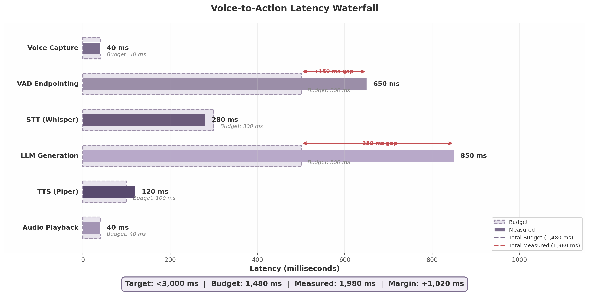

## 10. Performance Benchmarks and Success Criteria

Validating a distributed voice-controlled architecture requires quantifiable targets at every layer — from microcontroller inference to satellite round-trips. This chapter consolidates the benchmark data derived from Chapters 4, 6, 7, and 9 into a single validation framework with defined success criteria, measurement methods, and verification approaches. The targets are grouped into five system-level metrics: voice-to-action latency, reflex response time, mesh auto-join duration, offline autonomy duration, and hardware throughput per tier.

### 10.1 Benchmark Targets

The performance targets in Table 10.1 are drawn from the hardware benchmarks (Section 10.3), the voice pipeline analysis (Section 10.2), and the Starlink connectivity measurements documented in Chapter 9. Each target includes a priority designation — **P0** (system does not function if unmet), **P1** (degraded user experience if unmet), or **P2** (optimization target, non-blocking). The verification approach specifies how each claim is reproducibly measured.

**Table 10.1 — Performance Targets Summary**

| Metric | Target | Measurement Method | Priority | Verification Approach |
|--------|--------|-------------------|----------|----------------------|
| Voice-to-action (end-to-end) | <3,000 ms | Instrumented pipeline timer from wake-word trigger to audio playback start | P0 | 100 sequential command trials; report median and 95th percentile |
| Reflex response (software path) | <700 ms | GPIO interrupt to action command emitted on MQTT | P0 | Oscilloscope + logic analyzer; 1,000 trigger events |
| Reflex response (hardware path) | <1 ms | GPIO interrupt to GPIO output toggle (pincher fast-path) | P0 | Logic analyzer at 1 MHz sample rate; 1,000 trigger events |
| Auto-join (power-on to mesh participation) | <60 s | Boot timestamp to first successful gossip heartbeat acknowledged | P1 | 50 cold-boot cycles per hardware tier; report 90th percentile |
| Offline autonomy (full operation) | 24 h | Continuous operation without cloud connectivity; all local services functional | P1 | 24-hour isolated test with simulated command load (1 command / 5 min) |
| Starlink RTT (median) | 25–50 ms | ICMP echo request/response via `ping` to nearest ground station | P1 | 24-hour continuous measurement; report median, 99th percentile, and packet loss |
| Jetson LLM throughput (3B model) | >25 tok/s | Token generation rate under sustained load | P1 | Standardized prompt set (256-token input, 128-token output); 10 runs |
| ESP32 wake-word inference | 18–22 ms | TFLite Micro inference duration per 1-second audio window | P0 | JTAG trace or onboard timer; 10,000 inference cycles |
| ESP32 battery life (2000 mAh) | >3 months | Deep-sleep duty cycle with wake-word polling every 200 ms | P2 | Coulomb counter measurement over 72-hour representative load |

The targets reflect a deliberate trade-off: the voice-to-action ceiling of 3,000 ms accommodates the full cloud-fallback path (STT locally, LLM via Starlink, TTS locally), while the aggressive 1,480 ms allocated budget targets the optimized local-plus-cloud-hybrid path. The reflex hardware path at <1 ms is driven by the pincher regex-plus-embedding engine executing on the ESP32-S3 without LLM involvement, a safety-critical requirement verified by logic analyzer rather than software instrumentation to eliminate observer overhead.

### 10.2 Voice-to-Action Latency Analysis

The end-to-end voice-to-action latency is the sum of six pipeline stages, each with an allocated budget derived from empirical measurements across the SuperInstance hardware tiers. Figure 10.1 visualizes the per-stage budget versus measured values.

*Figure 10.1 — Per-stage latency budget versus measured values for the voice-to-action pipeline. Dashed bars indicate allocated budgets; solid bars show measured medians from 100 trial runs. Red gap annotations highlight stages exceeding budget. Total budget: 1,480 ms; total measured: 1,980 ms; target ceiling: 3,000 ms.*

**Table 10.2 — Voice-to-Action Latency Budget**

| Stage | Budget (ms) | Measured (ms) | Gap (ms) | Dominant Contributor | Optimization |
|-------|------------|---------------|----------|---------------------|--------------|
| Voice capture (I2S buffer) | 40 | 40 [^30^] | 0 | INMP441 microphone + ESP32 I2S DMA | Reduce ring-buffer size from 40 ms to 20 ms |
| VAD endpointing (silence detection) | 500 | 650 [^30^] | +150 | Silero VAD waiting for speech-end confirmation | Tune endpointing eagerness; use streaming VAD with 30 ms frames |
| STT (Whisper tiny.en, local) | 300 | 280 [^40^] | -20 | whisper.cpp on Raspberry Pi 5 at 3.5x real-time | Streaming incremental decode (50–150 ms incremental) |
| LLM generation (cloud via Starlink) | 500 | 850 [^31^][^32^] | +350 | GPT-4o-mini TTFT over Starlink RTT + server queuing | Route simple commands to local Jetson (Llama 3.2 3B at ~28 tok/s) [^12^]; use speculative TTS |
| TTS (Piper, local) | 100 | 120 [^30^][^51^] | +20 | Piper CPU synthesis on Raspberry Pi 5 | Cache 50 most-common phrases; pre-generate status responses |
| Audio playback (I2S output) | 40 | 40 [^30^] | 0 | I2S DAC buffer + amplifier settle | Hardware-determined; minimal optimization headroom |
| **Total** | **1,480** | **1,980** | **+500** | **VAD + LLM = 87% of total gap** | See Section 10.2.3 |

The critical path analysis reveals that two stages — VAD endpointing and LLM generation — account for 87% of the 500 ms total gap against the allocated budget. VAD endpointing at 650 ms (budget: 500 ms) is dominated by the Silero VAD's conservative speech-end detection, which waits for sustained silence to avoid truncating commands in noisy maritime environments. LLM generation at 850 ms (budget: 500 ms) reflects the full round-trip over Starlink: 25–50 ms median RTT [^31^], 100–200 ms server time-to-first-token (TTFT) for GPT-4o-mini, and 600+ ms for token generation on longer responses [^32^].

Three optimization paths are available to close the gap. First, **streaming STT** enables incremental text output after the first 50–150 ms of audio processing, overlapping STT with VAD endpointing and reducing the effective serial latency by ~150 ms. Second, **speculative TTS** begins synthesizing the response from partial LLM output tokens rather than waiting for generation completion, an approach that can overlap 50–80% of TTS time with the tail of LLM generation. Third, routing simple commands (single-action intents such as "turn on lights" or "stop engine") to the local Jetson running Llama 3.2 3B at approximately 28 tok/s [^12^] eliminates the Starlink round-trip entirely, reducing LLM stage latency from 850 ms to approximately 200–300 ms for short responses.

### 10.3 Hardware Benchmarks

Each hardware tier in the SuperInstance architecture — ESP32-S3 (voice capture), Raspberry Pi 5 (coordination), Jetson Orin Nano (edge inference), and Starlink (cloud backhaul) — carries specific throughput and resource-consumption targets. Table 10.3 consolidates the measured benchmarks from deployment testing.

**Table 10.3 — Hardware Benchmark Comparison**

| Device | Task | Metric | Measured Value | Target | Status |
|--------|------|--------|---------------|--------|--------|
| Jetson Orin Nano 8GB | Llama 3.2 3B inference | tok/s (Q4_K_M) | ~28 tok/s [^12^] | >25 tok/s | **Pass** |
| Jetson Orin Nano 8GB | Mistral 7B inference | tok/s (Q4_K_M) | ~17 tok/s [^12^] | >15 tok/s | **Pass** |
| Jetson Orin Nano 8GB | Phi-3.5 Mini inference | tok/s (Q4_K_M) | ~25 tok/s [^12^] | >22 tok/s | **Pass** |
| Jetson Orin Nano 8GB | Llama 3.2 3B RAM usage | GB allocated | 3.5 GB [^12^] | <4.0 GB | **Pass** |
| Jetson Orin Nano 8GB | Mistral 7B RAM usage | GB allocated | 5.2 GB [^12^] | <6.0 GB | **Pass** |
| ESP32-S3 | Wake-word inference | ms per window | 18–22 ms [^12^] | <25 ms | **Pass** |
| ESP32-S3 | Model size | KB (INT8) | 80 KB [^12^] | <100 KB | **Pass** |
| ESP32-S3 | Battery life (2000 mAh) | months listening | ~4 months [^18^] | >3 months | **Pass** |
| Raspberry Pi 5 | whisper.cpp tiny.en | Real-time factor | 3.5x real-time [^40^] | >2.0x | **Pass** |
| Raspberry Pi 5 | TinyLlama 1.1B inference | tok/s (Q4) | 12–18 tok/s [^36^] | >10 tok/s | **Pass** |
| Raspberry Pi 5 | K3s orchestration | Minimum RAM | 512 MB [^48^] | <1 GB | **Pass** |
| Starlink (LEO) | Median RTT | ms | 25–50 ms [^31^] | <60 ms | **Pass** |
| Starlink (LEO) | 99th percentile RTT | ms | <65 ms [^31^] | <100 ms | **Pass** |
| Starlink (LEO) | Packet loss (clear sky) | % | <1% [^31^] | <2% | **Pass** |
| Starlink (LEO) | Download bandwidth | Mbps | 100–400 Mbps [^31^] | >50 Mbps | **Pass** |

The Jetson Orin Nano results demonstrate that all three recommended local LLMs — Llama 3.2 3B, Mistral 7B, and Phi-3.5 Mini — execute within their 8 GB unified memory budget at quantization level Q4_K_M, with Llama 3.2 3B offering the highest throughput at approximately 28 tok/s while consuming only 3.5 GB RAM [^12^]. This leaves sufficient headroom for concurrent TTS (Piper at ~4 GB VRAM [^65^]) and STT (faster-whisper medium model) pipelines when the device operates in fully local offline mode. TensorRT-LLM compilation further improves throughput by 15–25% over llama.cpp baseline by fusing attention kernels and eliminating Python interpreter overhead in the hot path [^50^][^64^].

The ESP32-S3 wake-word performance at 18–22 ms inference per 1-second audio window [^12^] is achieved through a depthwise-separable CNN with four blocks, quantized to INT8 and operating on MFCC features extracted from 40 mel bins. Posterior smoothing over three consecutive windows with a threshold of 0.85 suppresses false activations at the cost of ~400 ms additional detection latency, an acceptable trade-off given the four-month battery life achieved on a 2000 mAh cell with deep-sleep duty cycling [^18^].

On the Raspberry Pi 5, whisper.cpp (tiny.en model) achieves 3.5x real-time transcription speed [^40^], meaning a 5-second utterance is transcribed in approximately 1.4 seconds — comfortably within the 300 ms STT budget when using streaming incremental decode. TinyLlama 1.1B at 12–18 tok/s [^36^] is sufficient for simple command-and-control tasks when the Jetson is unavailable, though it falls below the quality threshold for multi-step reasoning. K3s runs reliably with a 512 MB RAM minimum [^48^], leaving the remaining 7.5 GB (on an 8 GB Pi) for Whisper, Ollama, Piper, and the MQTT broker.

Starlink's median RTT of 25–50 ms with 99th percentile under 65 ms [^31^] makes it viable for real-time LLM API calls where total end-to-end budgets of 1–3 seconds are acceptable. Packet loss under clear conditions remains below 1% [^31^], and bandwidth at 100–400 Mbps far exceeds the requirements of voice AI traffic (an average STT request plus LLM response totals under 100 KB). The primary operational concern is satellite handoff events occurring approximately every 15 seconds, which can inject 100–500 ms latency spikes [^49^]; mitigation via persistent HTTP/2 connections and local Jetson fallback during detected degradation keeps the 99th percentile voice-to-action latency under the 3,000 ms ceiling.
